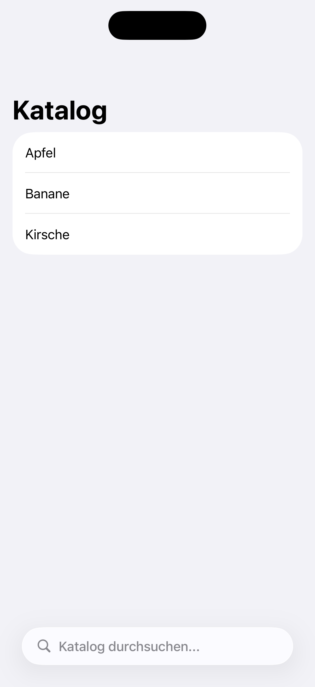
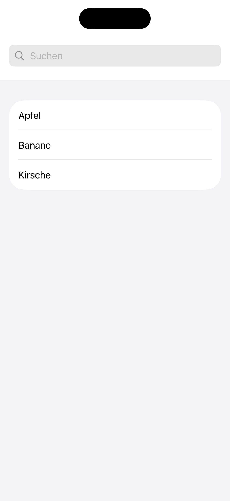

[← Zurück zur Übersicht](../README.md)

---

# 01: Suche

Ausgewählte Sprache: Deutsch

Andere Sprachen: [Englisch](01_search_en.md)

---

<details>
  <summary><b>Inhaltsverzeichnis Pattern</b> (Klicken zum Ausklappen)</summary>
  <br>

  * Suche <b>(Aktuell ausgewählt)</b>
  * [Fußzeile & Kopfzeile](02_footer_header_de.md)
  * [Popup](03_modals_de.md)
  * [Tabs](04_tabs_de.md)
  * [Cards](05_cards_de.md)
  * [Karussell](06_carousel_de.md)
  * [Gesten](07_gestures_de.md)
  * [Navigationsstruktur & Layout](08_navigation_layout_de.md)
  * [Filter](09_filtering_items_de.md)
  * [Eingabefehler](10_showing_input_error_de.md)

</details>

---

## 1. Kontext und Problemstellung

### Nutzungskontext
Die Suchfunktion ist eines der zentralen Navigationselemente in mobilen Apps. Sie ermöglicht Nutzenden den direkten, zielgerichteten Zugriff auf spezifische Inhalte, Produkte oder Funktionen, ohne komplexe hierarchische Menüstrukturen durchlaufen zu müssen. Im mobilen Kontext besteht eine Suche typischerweise aus einem Texteingabefeld, einem Element zum Löschen des Textes, einer Abbruchfunktion sowie einer dynamischen Ergebnisliste.

### Typische Barrieren in der Praxis
* **Fehlende semantische Auszeichnung:** Ohne ein explizites, programmatisch verknüpftes Label oder einen barrierefreien Namen wird das Eingabefeld von assistiven Technologien lediglich als unbeschriftetes Textfeld ausgegeben. Nutzende mit Sehbeeinträchtigungen können den Zweck des Feldes somit nicht identifizieren.
* **Fokusverlust und Desorientierung:** Bei der Aktivierung des Suchfelds öffnen sich in vielen Apps dynamisch neue Ansichten (z.B. Suchvorschläge) oder die Software-Tastatur blendet sich ein. Wird der Barrierefreiheits-Fokus in diesem Moment nicht explizit gesteuert, springt der Screenreader an eine unvorhersehbare Stelle. Dies führt zu kognitiver Desorientierung.
* **Unzureichende Touch-Targets:** Der integrierte „Löschen“-Button (X) sowie der „Abbrechen“-Button sind visuell oft sehr filigran gestaltet. Für Menschen mit motorischen Einschränkungen sind diese essenziellen Steuerelemente dadurch schwer oder gar nicht präzise zu aktivieren.
* **Fehlendes Feedback bei Live-Ergebnissen:** Verändern sich Suchergebnisse dynamisch während der Eingabe, verbleibt der Fokus meist im Textfeld. Ohne Feedback bleibt die Aktualisierung der Trefferliste für blinde und sehbehinderte Nutzende unbemerkt.

---

## 2. Relevante Richtlinien und Standards

Die folgende Tabelle zeigt den Zusammenhang zwischen technischen Erfolgskriterien der **WCAG 2.2** und der Regelung innerhalb von Kapitel 11 der **EN 301 549**.

| Barrierefreiheits-Anforderung | WCAG 2.2 Kriterium | EN 301 549 | Relevanz für das Such-Pattern |
| :--- | :--- | :--- | :--- |
| **Informationen & Beziehungen** | 1.3.1 Info and Relationships | 11.1.3.1 | Eindeutige programmatische Strukturierung der Beziehung zu anderen Feldern, |
| **Bedeutungsvolle Reihenfolge** | 1.3.2 Meaningful Sequence | 11.1.3.2 | Logischer, linearer Lesefluss vom Suchfeld zu den Ergebnissen. |
| **Kontrast (Minimum)** | 1.4.3 Contrast (Minimum) | 11.1.4.3 | Text und Platzhalter müssen sich scharf vom Hintergrund abheben. |
| **Tastatur-Bedienbarkeit** | 2.1.1 Keyboard | 11.2.1.1 | Volle Funktionalität bei Nutzung externer Hardware-Tastaturen. |
| **Fokus-Reihenfolge** | 2.4.3 Focus Order | 11.2.4.3 | Der Fokuspfad muss logisch durch das Such-Interface leiten. |
| **Fokus sichtbar** | 2.4.7 Focus Visible | 11.2.4.7 | Deutlicher visueller Rahmen um das Feld bei Tastaturnavigation. |
| **Bei Fokus** | 3.2.1 On Focus | 11.3.2.1 | Die bloße Fokussierung darf keinen unerwarteten Kontextwechsel auslösen. |
| **Bei Eingabe** | 3.2.2 On Input | 11.3.2.2 | Texteingabe darf die App-Struktur nicht unangekündigt verändern. |
| **Beschriftungen/Anweisungen** | 3.3.2 Labels or Instructions | 11.3.3.2 | Bereitstellung klarer, permanenter Hilfestellungen (z.B. Suchkontext). |
| **Name, Rolle, Wert** | 4.1.2 Name, Role, Value | 11.4.1.2 | Eindeutige Zuteilung von Name, Rolle und Status. |
| **Assistive Technologien** | - | 11.5.2.4 / 11.5.2.5 | Korrekte Übermittlung der Steuerelement-Typen an die Accessibility-API. |


---

## 3. Design-Spezifikationen (UI/UX)

### Visuelle Gestaltung und Kontraste
* **Mehr als nur Icons:** Ein reines Lupen-Symbol ist für die Barrierefreiheit nicht ausreichend, da es kognitive Hürden aufwirft. Das Suchfeld muss permanent durch ein lesbares Text-Label (z.B. „Suche“) oder einen eindeutigen Platzhalter (z.B. „Katalog durchsuchen...“) definiert sein.
* **Kontrastverhältnisse:** Der eingegebene Text sowie der Platzhalter-Text müssen ein Kontrastverhältnis von mindestens **4,5:1** zum direkten Hintergrund des Suchfelds aufweisen. Die visuelle Begrenzung (Rahmen/Hintergrundfläche) des Suchfelds muss ein Kontrastverhältnis von mindestens **3:1** zum umgebenden Hintergrund des Screens besitzen, um als interaktives Element erkennbar zu sein.

### Interaktionsdesign und Touch-Targets
* **44pt-Mindestgröße:** Das Eingabefeld muss eine vertikale Mindesthöhe von **44 Pixel** aufweisen.
* **Eingebettete Steuerelemente:** Der innerhalb des Textfelds platzierte „Clear“-Button (X) sowie der primäre „Abbrechen“-Button daneben müssen eine barrierefreie Klick- und Touch-Fläche von mindestens **44 x 44 Pixel** aufweisen, unabhängig von der tatsächlichen visuellen Icon-Größe.
* **Systemkonforme Tastatursteuerung:** Bei der Aktivierung des Suchfelds muss programmatisch der korrekte virtuelle Tastatur-Typ aufgerufen werden. Die Aktionstaste unten rechts auf der Software-Tastatur muss als „Suchen“ konfiguriert sein, anstatt als standardmäßiger Zeilenumbruch.

### Empfohlene Fokus-Reihenfolge (Screenreader / Tastatur)
* **Fokus 1 (Suchfeld):** Das Suchfeld (TextField). Sprachausgabe: *„Suche, Textfeld, Bearbeiten möglich. [Platzhalter-Text].“*
* **Fokus 2 (Löschbutton):** Der „Clear“-Button (wird erst aktiv, sobald Text existiert). Sprachausgabe: *„Text löschen, Button.“*
* **Fokus 3 (Ergebnisse):** Die dynamisch geladene Liste der Suchergebnisse oder Suchvorschläge, linear von oben nach unten navigierbar.

---

## 4. Implementierung (SwiftUI)

### Good Pattern (Positivbeispiel)
Dieses Beispiel zeigt eine empfohlene, barrierefreie Implementierung einer Suchleiste, welche native Komponenten nach den Apple Human Interface Guidelines verwendet.

<figure>
  
  <figcaption>Abb. 1.1: Barrierefreie Implementierung der Suchfunktion in SwiftUI.</figcaption>
</figure>

#### SwiftUI-Code:

```swift
import SwiftUI

struct GoodNativeSearchView: View {
    @State private var searchText = ""
    @State private var allItems = ["Apfel", "Banane", "Kirsche"]
    
    var filteredItems: [String] {
        searchText.isEmpty ? allItems : allItems.filter { $0.localizedCaseInsensitiveContains(searchText) }
    }
    
    var body: some View {
        NavigationStack {
            List {
                ForEach(filteredItems, id: \.self) { item in
                    Text(item)
                }
            }
            .navigationTitle("Katalog")
            
            // BEST PRACTICE: Der native Modifier erfüllt automatisch entsprechende Richtlinien. Touch-Targets (44pt) und Fokus-Management werden vom System garantiert.
            // Hinweis: Das System nutzt den 'prompt'-Parameter ("Katalog durchsuchen...") automatisch als Accessibility-Label für VoiceOver. Ein manuelles Label ist nicht nötig.
            .searchable(text: $searchText, prompt: "Katalog durchsuchen...")
        }
    }
}
```

### Bad Pattern (Negativbeispiel)
Dieses Beispiel zeigt eine typisch fehlerhafte Implementierung einer Suchleiste. Sie ignoriert zentrale Vorgaben bezüglich Semantik, Tastatursteuerung und Mindestgrößen für Touch-Ziele.

<figure>
  
  <figcaption>Abb. 1.2: Barrierebehaftete Implementierung der Suchfunktion in SwiftUI.</figcaption>
</figure>

#### SwiftUI-Code:

```swift
import SwiftUI

struct BadSearchView: View {
    @State private var searchText = ""
    @State private var items = ["Apfel", "Banane", "Kirsche"]
    
    var body: some View {
        VStack {
            // BARRIERE: Keine semantische Gruppierung. VoiceOver liest Lupe, Textfeld 
            // und Löschen-Button als völlig separate, unzusammenhängende Elemente vor.
            HStack {
                Image(systemName: "magnifyingglass")
                    .foregroundColor(.gray)
                
                // BARRIERE: Kein explizites Accessibility-Label.
                // BARRIERE: Falscher Tastatur-Typ. Es wird standardmäßig "Return" statt "Suchen" angezeigt.
                TextField("Suchen", text: $searchText)
                    .textFieldStyle(PlainTextFieldStyle())
                
                if !searchText.isEmpty {
                    // BARRIERE: Touch-Target viel zu klein (ca. 15x15pt statt der geforderten 44x44pt).
                    // BARRIERE: onTapGesture statt Button. VoiceOver erkennt es nicht als klickbares Steuerelement
                    Image(systemName: "xmark.circle.fill")
                        .resizable()
                        .frame(width: 15, height: 15)
                        .foregroundColor(.gray)
                        .onTapGesture {
                            searchText = ""
                        }
                }
            }
            .padding(8)
            .background(Color.gray.opacity(0.2))
            .cornerRadius(8)
            .padding()
            
            List {
                ForEach(items.filter { searchText.isEmpty ? true : $0.contains(searchText) }, id: \.self) { item in
                    Text(item)
                }
            }
        }
    }
}
```

---

## 5. Implementierung (Kotlin)
Wird noch erstellt...

---

## 6. Quellen und weiterführende Links

* **Internationale Standards:**
  * [WCAG 2.2 Richtlinien (W3C)](https://www.w3.org/TR/WCAG2) – Web Content Accessibility Guidelines
  * [EN 301 549 Standard (ETSI)](https://www.etsi.org/deliver/etsi_en/301500_301599/301549/03.02.01_60/en_301549v030201p.pdf) – Europäische Norm für Barrierefreiheitsanforderungen

* **Apple Human Interface Guidelines (HIG):**
  * [Apple HIG – Accessibility](https://developer.apple.com/design/human-interface-guidelines/accessibility) – Grundlagen für inklusive und intuitive Plattform-Interaktionen
  * [Apple HIG – Searching](https://developer.apple.com/design/human-interface-guidelines/searching) – Übergreifende Design-Prinzipien und Platzierung von Suchfunktionen in iOS
  * [Apple HIG – Search fields](https://developer.apple.com/design/human-interface-guidelines/search-fields) – Spezifikationen für die visuelle Gestaltung, Platzhalter und Interaktion von Suchfeldern

* **Pattern-Referenz:**
  * https://www.checklist.design - Hauptseite
  * https://www.checklist.design/mobile/search - Search Pattern

---

[← Zurück zur Übersicht](../README.md) | [↑ Nach oben springen](#01_suche)
  
