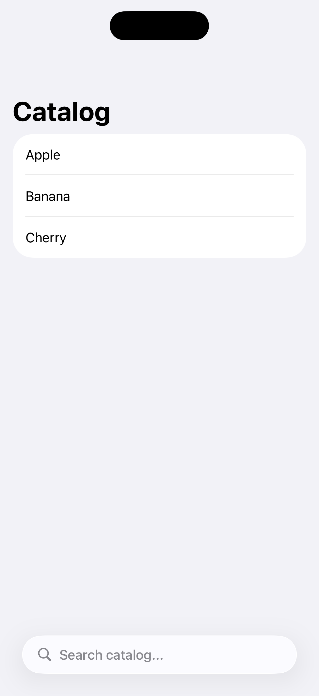
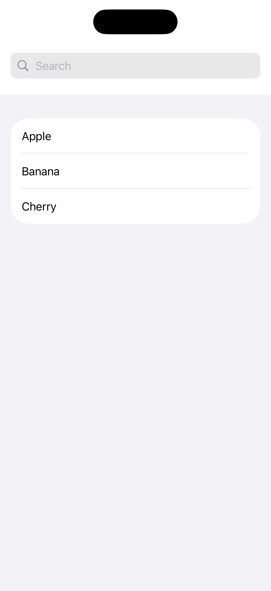

[← Back to Overview](../README_en.md)

---

# 01: Search

Selected Language: English

Other Languages: [German](01_search_de.md)

---

<details>
  <summary><b>Table of Content: Pattern</b> (Click to expand)</summary>
  <br>

  * Search <b>(Currently selected)</b>
  * [Footer & Header](02_footer_header_en.md)
  * [Popup](03_modals_en.md)
  * [Tabs](04_tabs_en.md)
  * [Cards](05_cards_en.md)
  * [Carousel](06_carousel_en.md)
  * [Gestures](07_gestures_en.md)
  * [Navigation Structure & Layout](08_navigation_layout_en.md)
  * [Filter](09_filtering_items_en.md)
  * [Input Errors](10_showing_input_error_en.md)

</details>

---

## 1. Context and Problem Statement

### Usage Context
The search function is one of the central navigation elements in mobile apps. It enables users to directly and targetedly access specific content, products, or features without having to navigate through complex hierarchical menu structures. In a mobile context, a search typically consists of a text input field, an element to clear the text, a cancel function, and a dynamic results list.

### Typical Barriers in Practice
* **Missing semantic markup:** Without an explicit, programmatically linked label or an accessible name, the input field is read out by assistive technologies merely as an unlabeled text field. Users with visual impairments are thus unable to identify the purpose of the field.
* **Loss of focus and disorientation:** When activating the search field, many apps dynamically open new views (e.g., search suggestions) or display the software keyboard. If the accessibility focus is not explicitly managed at this moment, the screen reader jumps to an unpredictable location. This leads to cognitive disorientation.
* **Insufficient touch targets:** The integrated "Clear" button (X) and the "Cancel" button are often visually delicate. For people with motor impairments, these essential controls are hard or impossible to activate precisely.
* **Missing feedback for live results:** If search results update dynamically during input, the focus usually remains in the text field. Without feedback, the update of the results list goes unnoticed by blind and visually impaired users.

---

## 2. Relevant Guidelines and Standards

The following table shows the relationship between technical success criteria of **WCAG 2.2** and the regulations within Chapter 11 of **EN 301 549**.

| Accessibility Requirement | WCAG 2.2 Criterion | EN 301 549 | Relevance for the Search Pattern |
| :--- | :--- | :--- | :--- |
| **Information and Relationships** | 1.3.1 Info and Relationships | 11.1.3.1 | Clear programmatic structuring of the relationship to other fields. |
| **Meaningful Sequence** | 1.3.2 Meaningful Sequence | 11.1.3.2 | Logical, linear reading order from the search field to the results. |
| **Contrast (Minimum)** | 1.4.3 Contrast (Minimum) | 11.1.4.3 | Text and placeholders must contrast sharply with the background. |
| **Keyboard** | 2.1.1 Keyboard | 11.2.1.1 | Full functionality when using external hardware keyboards. |
| **Focus Order** | 2.4.3 Focus Order | 11.2.4.3 | The focus path must guide logically through the search interface. |
| **Focus Visible** | 2.4.7 Focus Visible | 11.2.4.7 | Clear visual indicator around the field during keyboard navigation. |
| **On Focus** | 3.2.1 On Focus | 11.3.2.1 | Simply receiving focus must not trigger an unexpected change of context. |
| **On Input** | 3.2.2 On Input | 11.3.2.2 | Text input must not change the app structure without warning. |
| **Labels or Instructions** | 3.3.2 Labels or Instructions | 11.3.3.2 | Provision of clear, permanent assistance (e.g., search context). |
| **Name, Role, Value** | 4.1.2 Name, Role, Value | 11.4.1.2 | Unambiguous assignment of name, role, and value/status. |
| **Assistive Technologies** | - | 11.5.2.4 / 11.5.2.5 | Correct transmission of control element types to the Accessibility API. |

---

## 3. Design Specifications (UI/UX)

### Visual Design and Contrasts
* **More than just icons:** A standalone magnifying glass icon is not sufficient for accessibility, as it introduces cognitive barriers. The search field must be permanently defined by a readable text label (e.g., "Search") or a clear placeholder (e.g., "Search catalog...").
* **Contrast ratios:** The entered text as well as the placeholder text must have a contrast ratio of at least **4.5:1** against the direct background of the search field. The visual boundary (border/background area) of the search field must have a contrast ratio of at least **3:1** against the surrounding background of the screen to be recognizable as an interactive element.

### Interaction Design and Touch Targets
* **44pt minimum size:** The input field must have a minimum vertical height of **44 points/pixels**.
* **Embedded controls:** The "Clear" button (X) placed inside the text field as well as the adjacent primary "Cancel" button must have an accessible click/touch target area of at least **44 x 44 points/pixels**, regardless of the actual visual icon size.
* **System-compliant keyboard control:** When activating the search field, the correct virtual keyboard type must be invoked programmatically. The action key at the bottom right of the software keyboard must be configured as "Search" instead of a standard line break/return.

### Recommended Focus Order (Screen Reader / Keyboard)
* **Focus 1 (Search field):** The search field (TextField). Speech output: *"Search, text field, editing available. [Placeholder text]."*
* **Focus 2 (Clear button):** The "Clear" button (only active once text exists). Speech output: *"Clear text, button."*
* **Focus 3 (Results):** The dynamically loaded list of search results or search suggestions, navigable linearly from top to bottom.


---

## 4. Implementation (SwiftUI)

### Good Pattern
This example shows a recommended accessible implementation of a search bar using native components according to the Apple Human Interface Guidelines.

<figure>
  
  <figcaption>Fig. 1.1: Accessible implementation of the search function in SwiftUI.</figcaption>
</figure>

#### SwiftUI Code:

```swift
import SwiftUI

struct GoodNativeSearchView: View {
    @State private var searchText = ""
    @State private var allItems = ["Apple", "Banana", "Cherry"]
    
    var filteredItems: [String] {
        searchText.isEmpty ? allItems : allItems.filter { $0.localizedCaseInsensitiveContains(searchText) }
    }
    
    var body: some View {
        NavigationStack {
            List {
                ForEach(filteredItems, id: \.self) { item in
                    Text(item)
                }
            }
            .navigationTitle("Catalog")
            
            // BEST PRACTICE: The native modifier automatically satisfies relevant guidelines. Touch targets (44pt) and focus management are guaranteed by the system.
            // Note: The system automatically uses the 'prompt' parameter ("Search catalog...") as the Accessibility Label for VoiceOver. A manual label is not necessary.
            .searchable(text: $searchText, prompt: "Search catalog...")
        }
    }
}
```

### Bad Pattern
This example shows a typical flawed implementation of a search bar. It ignores key requirements regarding semantics, keyboard control, and minimum sizes for touch targets.

<figure>
  
  <figcaption>Fig. 1.2: Implementation of the search function in SwiftUI with accessibility issues.</figcaption>
</figure>

#### SwiftUI-Code:

```swift
import SwiftUI

struct BadSearchView: View {
    @State private var searchText = ""
    @State private var items = ["Apple", "Banana", "Cherry"]
    
    var body: some View {
        VStack {
            // BARRIER: No semantic grouping. VoiceOver reads magnifying glass, text field, 
            // and clear button as completely separate, unrelated elements.
            HStack {
                Image(systemName: "magnifyingglass")
                    .foregroundColor(.gray)
                
                // BARRIER: No explicit accessibility label.
                // BARRIER: Incorrect keyboard type. By default, "Return" is displayed instead of "Search".
                TextField("Search", text: $searchText)
                    .textFieldStyle(PlainTextFieldStyle())
                
                if !searchText.isEmpty {
                    // BARRIER: Touch target is much too small (approx. 15x15pt instead of the required 44x44pt).
                    // BARRIER: onTapGesture instead of Button. VoiceOver does not recognize it as a clickable control element.
                    Image(systemName: "xmark.circle.fill")
                        .resizable()
                        .frame(width: 15, height: 15)
                        .foregroundColor(.gray)
                        .onTapGesture {
                            searchText = ""
                        }
                }
            }
            .padding(8)
            .background(Color.gray.opacity(0.2))
            .cornerRadius(8)
            .padding()
            
            List {
                ForEach(items.filter { searchText.isEmpty ? true : $0.contains(searchText) }, id: \.self) { item in
                    Text(item)
                }
            }
        }
    }
}
```

---

## 5. Implementation (Kotlin)
To be added...

---

## 6. Sources and Further Reading

* **International Standards:**
  * [WCAG 2.2 Guidelines (W3C)](https://www.w3.org/TR/WCAG2) – Web Content Accessibility Guidelines.
  * [EN 301 549 Standard (ETSI)](https://www.etsi.org/deliver/etsi_en/301500_301599/301549/03.02.01_60/en_301549v030201p.pdf) – European standard for accessibility requirements.

* **Apple Human Interface Guidelines (HIG):**
  * [Apple HIG – Accessibility](https://developer.apple.com/design/human-interface-guidelines/accessibility) – Fundamentals for inclusive and intuitive platform interactions.
  * [Apple HIG – Searching](https://developer.apple.com/design/human-interface-guidelines/searching) – Overarching design principles and placement of search features in iOS.
  * [Apple HIG – Search fields](https://developer.apple.com/design/human-interface-guidelines/search-fields) – Specifications for visual design, placeholders, and search field interaction.

* **Pattern Reference:**
  * https://www.checklist.design - Main page
  * https://www.checklist.design/mobile/search - Search Pattern

---

[← Back to overview](../README_en.md) | [↑ Jump to top](#01_search)
  
