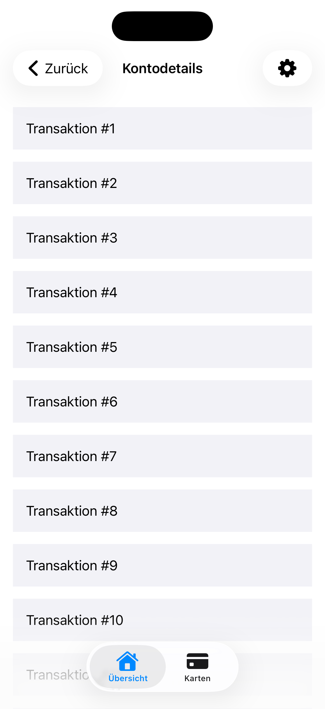
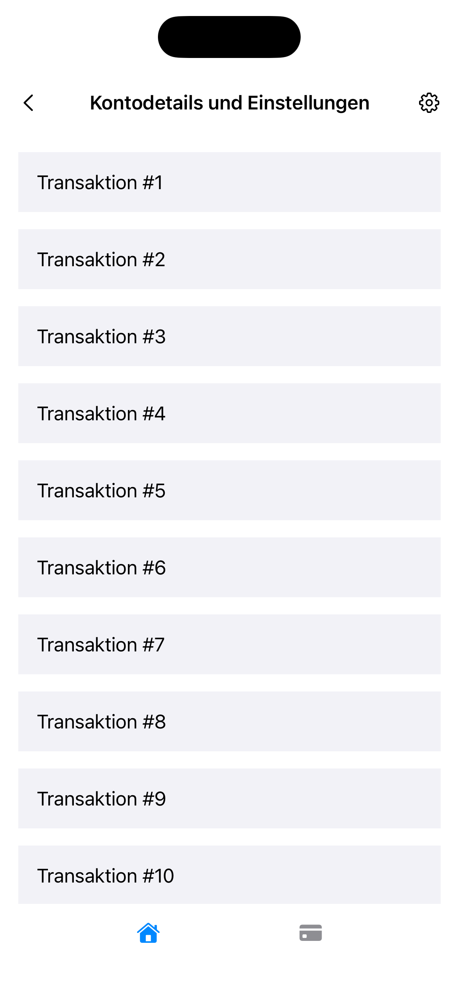

[← Back to overview](../README.md)

---

# 02: Footer & Header

Selected Language: English

Other Languages: [German](02_footer_header_de.md)

---

<details>
  <summary><b>Pattern Table of Contents</b> (Click to expand)</summary>
  <br>

  * [Search](01_search_en.md)
  * Footer & Header <b>(Currently selected)</b>
  * [Popup](03_modals_en.md)
  * [Tabs](04_tabs_en.md)
  * [Cards](05_cards_en.md)
  * [Carousel](06_carousel_en.md)
  * [Gestures](07_gestures_en.md)
  * [Navigation Structure & Layout](08_navigation_layout_en.md)
  * [Filter](09_filtering_items_en.md)
  * [Input Errors](10_showing_input_error_en.md)

</details>

---

## 1. Context and Problem Statement

### Usage Context
Footer and header form the structural framework of an app. The header usually serves for orientation (displaying the current screen name, back button, profile, or settings icons). The footer anchors the app's primary navigation targets at the top level or offers contextual actions at the bottom edge of the screen. Because these elements are permanently visible, they must guarantee maximum consistency and error-free accessibility.

### Typical Barriers in Practice
* **Layout breakage during text enlargement**: When users significantly increase the system font size (Dynamic Type), statically programmed titles and icons in the header collide. Text is illegibly truncated or controls overlap, making key functions unusable.
* **Cognitive hurdles due to icon-only navigation**: For space reasons, text labels under navigation icons in the footer are often omitted. For blind, visually impaired, or cognitively impaired individuals, abstract symbols without clear text descriptions are difficult to interpret without error.
* **Unreachable touch targets at screen edges**: Because the header is placed at the very top and the footer at the very bottom, interactive buttons slide dangerously close to the physical display edges. Without a generous, invisible click area of at least 44x44 pt, they are extremely difficult to activate for users with motor impairments.
* **Illogical focus order and navigation traps**: When content areas are scrollable, apps often lose control over the screen reader's linear reading flow. When swiping, users get trapped in infinite loops within the main content and cannot reach the footer or tab bar at all.

---

## 2. Relevant Guidelines and Standards

The following table shows the relationship between technical success criteria of **WCAG 2.2** and the regulations within Chapter 11 of **EN 301 549**.

| Accessibility Requirement | WCAG 2.2 Criterion | EN 301 549 | Relevance for the Footer/Header Pattern |
| :--- | :--- | :--- | :--- |
| **Information and Relationships** | 1.3.1 Info and Relationships | 11.1.3.1 | Programmatic markup of headers and footers as structural containers. |
| **Meaningful Sequence** | 1.3.2 Meaningful Sequence | 11.1.3.2 | Logical, linear reading order (Header -> Main Content -> Footer) without navigation traps. |
| **Contrast (Minimum)** | 1.4.3 Contrast (Minimum) | 11.1.4.3 | Text, icons, and visual separators must contrast sharply with the background. |
| **Resize Text** | 1.4.4 Resize Text | 11.1.4.4 | Bars must scale with enlarging text (Dynamic Type) without clipping content. |
| **Keyboard** | 2.1.1 Keyboard | 11.2.1.1 | Full accessibility and usability of tabs and header buttons via external keyboard. |
| **Focus Order** | 2.4.3 Focus Order | 11.2.4.3 | The focus path must not be trapped in scrollable content, but must reach the footer. |
| **Focus Visible** | 2.4.7 Focus Visible | 11.2.4.7 | Clear visual focus indicator around selected tabs or header actions during keyboard navigation. |
| **Target Size (Minimum)** | 2.5.8 Target Size (Min) | 11.2.5.8 | Every icon at critical screen edges requires a touch target of at least 44x44 pt. |
| **On Focus** | 3.2.1 On Focus | 11.3.2.1 | Simply moving focus to a tab via screen reader must not trigger an automatic screen change. |
| **Consistent Navigation** | 3.2.3 Consistent Navigation | - | The arrangement and position of the footer must remain identical across every hierarchy level of the app. |
| **Consistent Identification** | 3.2.4 Consistent Identification | - | System-wide symbols (e.g., Profile, Home) must carry the same name on every screen. |
| **Name, Role, Value** | 4.1.2 Name, Role, Value | 11.4.1.2 | Clear assignment of the role "Tab" and correct reporting of status ("selected" vs. "not selected"). |
| **Assistive Technologies** | - | 11.5.2.4 / 11.5.2.5 | Correct transmission of bar and container types to the OS's native Accessibility API. |

---

## 3. Design Specifications (UI/UX)

### Visual Design and Contrasts
* **Dynamic Type Support**: Header and footer must not have a fixed, static height in points. They must grow dynamically when users change system font size. Text labels in the TabBar may become two lines or switch to a vertical stack layout at maximum magnification.
* **Mandatory Text Combination**: Every icon in the footer must be accompanied by a permanent, clearly legible text label. Icon-only navigation is insufficient.
* **Contrast Lines**: Since header and footer often visually blend with the main content, a visual separator line with a contrast of at least 3:1 against the background is strictly required to cognitively delineate the app's structural zones clearly.

### Interaction Design and Touch Targets
* **Safe Area Embedding**: Elements in the header and footer must remain strictly within the system-defined Safe Area to prevent overlaps with the status bar (top) or home indicator (bottom).
* **Touch Targets**: Every interactive element (e.g., the "Edit" button in the header or a tab in the footer) must guarantee a physical touch area of at least 44 x 44 pt. With 4–5 tabs in the footer, the width is usually divided automatically, but the height must be strictly maintained.

### Recommended Focus Order (Screen Reader / Keyboard)
* **Focus 1 (Header Title):** The header title (declared as a heading). Screen reader reads: "*[Title], heading*".
* **Focus 2 (Header Buttons):** Optional function buttons in the header (left/right) ordered from left to right.
* **Focus 3 (Content):** The main content of the screen.
* **Focus 4 (Footer):** The tab bar in the footer. When moving to an element, the screen reader reads: "*Home, tab, 1 of 4, selected*". The selected status is essential!

---

## 4. Implementation (SwiftUI)

### Good Pattern
This example shows a recommended, accessible implementation of a footer and header using native components according to the Apple Human Interface Guidelines.

<figure>
  
  <figcaption>Fig. 2.1: Accessible implementation of footer/header in SwiftUI.</figcaption>
</figure>

#### SwiftUI Code:

```swift
import SwiftUI

struct GoodHeaderFooterView: View {
    @State private var selectedTab = 0
    
    var body: some View {
        // Native TabView for the correct role
        TabView(selection: $selectedTab) {
            
            // Main area with integrated header
            NavigationStack {
                ScrollView {
                    VStack(spacing: 15) {
                        ForEach(1...30, id: \.self) { index in
                            Text("Transaction #\(index)")
                                .frame(maxWidth: .infinity, alignment: .leading)
                                .padding()
                                .background(Color(.secondarySystemBackground))
                        }
                    }
                    .padding()
                }
                // The native NavigationBar automatically scales with Dynamic Type and wraps text accessibly to the next line.
                .navigationTitle("Account Details")
                .navigationBarTitleDisplayMode(.inline)
                .toolbar {
                    // Left: Back button
                    ToolbarItem(placement: .navigationBarLeading) {
                        Button(action: { /* Back action */ }) {
                            HStack(spacing: 4) {
                                Image(systemName: "chevron.left")
                                    .bold()
                                Text("Back")
                                    .fixedSize(horizontal: true, vertical: false)
                            }
                            .padding(.vertical, 11)
                            .padding(.horizontal, 8)
                            // This invisible background ensures that the touch target is ALWAYS at least 44x44 pt, even if the content is smaller.
                            .background(
                                Color.clear
                                    .frame(minWidth: 44, minHeight: 44)
                            )
                        }
                    }
                    
                    // Right: Settings button
                    ToolbarItem(placement: .navigationBarTrailing) {
                        Button(action: { /* Settings action */ }) {
                            Image(systemName: "gearshape.fill")
                                .padding(11)
                                .background(
                                    Color.clear
                                        .frame(minWidth: 44, minHeight: 44)
                                )
                        }
                        // Clear accessible name for screen readers
                        .accessibilityLabel("Open settings")
                    }
                }
            }
            // Text and icon combination in the footer.
            // The system automatically reports status ("selected") and index ("1 of 2") to VoiceOver.
            .tabItem {
                Image(systemName: "house.fill")
                Text("Overview")
            }
            .tag(0)
            
            // SECOND TAB
            Text("Cards View")
                .tabItem {
                    Image(systemName: "creditcard.fill")
                    Text("Cards")
                }
                .tag(1)
        }
        // Visual contrast line (separator) to main content.
        // Native system tab bars provide this separation with sufficient contrast out of the box.
        .accentColor(.blue) // Clearly highlights the active tab for accessibility
    }
}
```

### Bad Pattern
This example shows a typical flawed implementation of a footer and header. It ignores key guidelines regarding button heights, native syntax implementation, and screen reader focus management.

<figure>
  
  <figcaption>Fig. 2.2: Inaccessible implementation of footer/header in SwiftUI.</figcaption>
</figure>

#### SwiftUI Code:

```swift
import SwiftUI

struct BadHeaderFooterView: View {
    @State private var selectedTab = 0
    
    var body: some View {
        VStack(spacing: 0) {
            // Custom header
            // BARRIER: Fixed height of 55 pt. When Dynamic Type increases text size, the layout breaks.
            HStack {
                // BARRIER: Not a native button, but only an Image with a gesture. No visual or auditory feedback for screen readers.
                Image(systemName: "chevron.left")
                    .font(.body)
                    .frame(width: 20, height: 20) // Touch target much too small (< 44x44 pt)!
                    .onTapGesture { /* Back action */ }
                
                Spacer()
                
                // BARRIER: Text is not declared as a heading. A screen reader cannot recognize the structural hierarchy.
                Text("Account Details and Settings")
                    .font(.headline)
                    .lineLimit(1) // Mercilessly cuts off text with "..."
                
                Spacer()
                
                Image(systemName: "gearshape")
                    .frame(width: 20, height: 20)
                    .onTapGesture { /* Settings action */ }
            }
            .padding(.horizontal)
            .frame(height: 55) 
            .background(Color(.systemBackground))
            
            // --- MAIN CONTENT ---
            // BARRIER: An infinite ScrollView without focus management. VoiceOver users can get lost in data and struggle to reach the footer.
            ScrollView {
                VStack(spacing: 15) {
                    ForEach(1...30, id: \.self) { index in
                        Text("Transaction #\(index)")
                            .frame(maxWidth: .infinity, alignment: .leading)
                            .padding()
                            .background(Color(.secondarySystemBackground))
                    }
                }
                .padding()
            }
            
            // Custom footer
            // BARRIER: Icon-only navigation without text labels.
            HStack {
                Spacer()
                Image(systemName: "house.fill")
                    .foregroundColor(selectedTab == 0 ? .blue : .gray)
                    .onTapGesture { selectedTab = 0 }
                Spacer()
                Image(systemName: "creditcard.fill")
                    .foregroundColor(selectedTab == 1 ? .blue : .gray)
                    .onTapGesture { selectedTab = 1 }
                Spacer()
            }
            .frame(height: 50) // Collides with the Home Indicator (no Safe Area)!
            .background(Color(.systemBackground))
        }
    }
}
```

---

## 5. Implementation (Kotlin)
To be added...

---

## 6. Sources and Further Reading

* **International Standards:**
  * [WCAG 2.2 Guidelines (W3C)](https://www.w3.org/TR/WCAG2) – Web Content Accessibility Guidelines.
  * [EN 301 549 Standard (ETSI)](https://www.etsi.org/deliver/etsi_en/301500_301599/301549/03.02.01_60/en_301549v030201p.pdf) – European standard for accessibility requirements.

* **Apple Human Interface Guidelines (HIG):**
  * [Apple HIG – Accessibility](https://developer.apple.com/design/human-interface-guidelines/accessibility) – Fundamentals for inclusive and intuitive platform interactions.
  * [Apple HIG – Tab bars](https://developer.apple.com/design/human-interface-guidelines/tab-bars) – Guidelines for structuring, item count, and placement of main navigation in the footer.
  * [Apple HIG – Navigation bars](https://developer.apple.com/design/human-interface-guidelines/navigation-bars) – Specifications for headers, title states (Large vs. Inline), and back button behavior.

* **Pattern Reference:**
  * https://www.checklist.design - Main page
  * https://www.checklist.design/components/footer - Footer Pattern

---

[← Back to overview](../README.md) | [↑ Jump to top](#02_footer_header)
