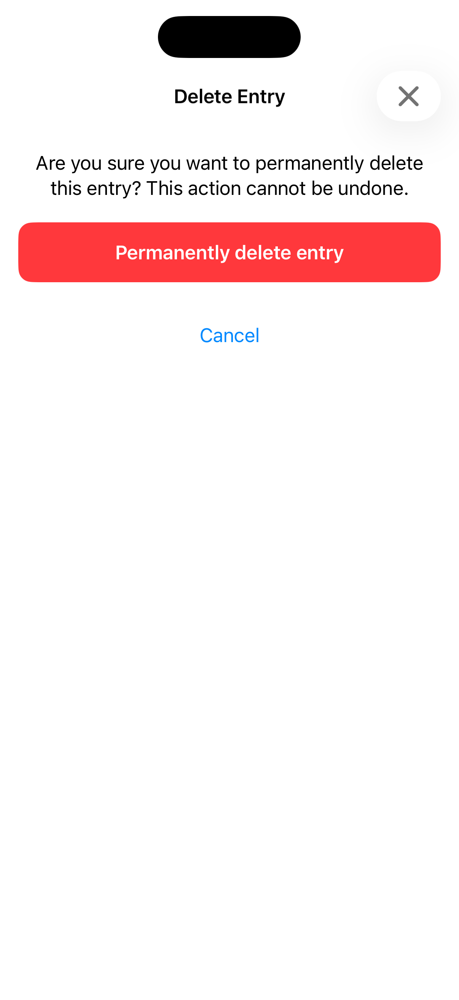
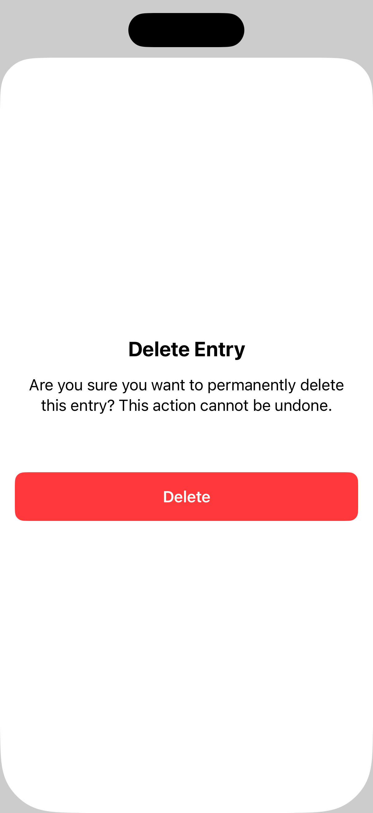

[← Back to overview](../README_en.md)

---

# 03: Popup

Selected Language: English

Other Languages: [German](03_modals_de.md)

---

<details>
  <summary><b>Pattern Table of Contents</b> (Click to expand)</summary>
  <br>

  * [Search](01_search_en.md)
  * [Footer & Header](02_footer_header_en.md)
  * Popup <b>(Currently selected)</b>
  * [Tabs](04_tabs_en.md)
  * [Cards](05_cards_en.md)
  * [Carousel](06_carousel_en.md)
  * [Gestures](07_gestures_en.md)
  * [Navigation Structure & Layout](08_navigation_layout_en.md)
  * [Filter](09_filtering_items_en.md)
  * [Input Errors](10_showing_input_error_en.md)

</details>

---

## 1. Context and Problem Statement

### Usage Context
Popups – often also referred to as modals, bottom sheets, or dialog windows – interrupt the regular app flow to direct users' undivided attention to a critical action or piece of information.
They are frequently used for confirmations (e.g., deletion processes), data input (e.g., "Create new entry"), or important system messages. Because they visually overlay existing content, they represent a significant context change and must be implemented unambiguously for assistive technologies.

### Typical Barriers in Practice
* **Screen reader trap**: When a popup opens, the invisible focus of screen readers often remains in the underlying main content. Blind users then get "lost" in elements that are no longer visually visible or interactive, completely missing the opened popup.
* **Missing or unclear dismiss options**: Popups are often designed to close by tapping the dimmed background. Without an explicit, accessible "Close" button (or an "X"), keyboard users or individuals with motor or cognitive impairments become trapped in the dialog.
* **Layout collapse with Dynamic Type**: Because popups by design have less space than full-screen mode, increasing the system font size quickly leads to text being pushed out of the visible area, or the "Cancel" and "Confirm" buttons overlapping the text and making it unreadable.
* **Unexpected context change without warning**: When popups open automatically and without direct user interaction (e.g., cookie banners, in-app ads, or sudden system alerts), this disorients individuals with cognitive impairments or screen reader users when the current focus changes abruptly.

---

## 2. Relevant Guidelines and Standards

The following table shows the relationship between technical success criteria of **WCAG 2.2** and the regulations within Chapter 11 of **EN 301 549**.

| Accessibility Requirement | WCAG 2.2 Criterion | EN 301 549 | Relevance for the Popup Pattern |
| :--- | :--- | :--- | :--- |
| **Information and Relationships** | 1.3.1 Info and Relationships | 11.1.3.1 | The popup must be structured as an independent, self-contained container. |
| **Meaningful Sequence** | 1.3.2 Meaningful Sequence | 11.1.3.2 | The reading flow must strictly remain within the popup and must not break out to the background content. |
| **Contrast (Minimum)** | 1.4.3 Contrast (Minimum) | 11.1.4.3 | The dialog background must contrast sharply with the underlying (dimmed) content. |
| **Resize Text** | 1.4.4 Resize Text | 11.1.4.4 | The content in the popup must be scrollable if text no longer fits on the screen due to Dynamic Type. |
| **Keyboard** | 2.1.1 Keyboard | 11.2.1.1 | The popup must be fully operable via keyboard (e.g., closing via the `Esc` key). |
| **No Keyboard Trap** | 2.1.2 No Keyboard Trap | 11.2.1.2 | The focus must not leave the popup until it is explicitly closed (Focus Trap). |
| **Focus Order** | 2.4.3 Focus Order | 11.2.4.3 | Upon opening, focus MUST move directly to the first element in the popup (not remain in the background). |
| **Focus Visible** | 2.4.7 Focus Visible | 11.2.4.7 | Interactive elements in the popup (buttons, fields) require a clearly visible focus indicator. |
| **Target Size (Minimum)** | 2.5.8 Target Size (Min) | 11.2.5.8 | The close button ("X") and all action buttons require a touch target of at least 44x44 pt. |
| **Name, Role, Value** | 4.1.2 Name, Role, Value | 11.4.1.2 | The element must have the role "Dialog" or "Popup"; state ("opened") must be clear. |
| **Assistive Technologies** | - | 11.5.2.4 / 11.5.2.5 | The background must be temporarily declared as "invisible" to the Accessibility API. |

---

## 3. Design Specifications (UI/UX)

### Visual Design and Contrasts
* **Dynamic Type & Scrollability**: Popups must never have a fixed vertical height that restricts content. As soon as text expands due to system font sizing, the popup's content area must automatically convert into a ScrollView so that all text and buttons remain accessible.
* **Background Dimming**: To visually signal the context change, the background behind the popup must be dimmed.
* **Explicit Close Button**: Every popup requires a clearly recognizable button to close it in the top-right or top-left corner (text "Close" or a valid close icon). Closing solely by tapping outside the modal is insufficient.

### Interaction Design and Touch Targets
* **Focus Trap**: As long as the popup is open, the background is blocked. Screen reader swipe gestures or keyboard tab navigation must exclusively loop within the popup.
* **Touch Targets**: Buttons like "Cancel", "Save", or the close icon must feature a physical touch target of at least 44 x 44 pt.

### Recommended Focus Order (Screen Reader / Keyboard)
* **Focus 1 (Title):** The popup title (declared as heading). The screen reader reads immediately upon opening: "*[Popup Title], heading*". This provides orientation.
* **Focus 2 (Content):** The body text or input fields within the popup (from top to bottom).
* **Focus 3 (Action Buttons):** The action buttons at the bottom of the popup (e.g., *left "Cancel", right "Confirm"*).
* **Focus 4 (Close Button):** The close button (if placed at the top as a separate icon). *Alternatively, the close button can also be targeted as Focus 2 directly after the heading.*

---

## 4. Implementation (SwiftUI)

### Good Pattern
This example shows a recommended accessible implementation of a popup using native components according to the Apple Human Interface Guidelines.

<figure>
  
  <figcaption>Fig. 3.1: Accessible implementation of the popup in SwiftUI.</figcaption>
</figure>

#### SwiftUI Code:

```swift
import SwiftUI

struct GoodModalView: View {
    @Binding var isPresented: Bool
    
    var body: some View {
        NavigationView {
            // ScrollView prevents layout collapse with large system fonts
            ScrollView {
                VStack(alignment: .center, spacing: 20) {
                    
                    Text("Are you sure you want to permanently delete this entry? This action cannot be undone.")
                        .font(.body)
                        .multilineTextAlignment(.center)
                        .padding(.horizontal)
                    
                    // Main action button
                    Button(action: {
                        isPresented = false
                    }) {
                        Text("Permanently delete entry")
                            .font(.headline)
                            .foregroundColor(.white)
                            .padding()
                            .frame(maxWidth: .infinity)
                            .minTouchTargetSize() // Ensures touch target size
                            .background(Color.red)
                            .cornerRadius(12)
                    }
                    .padding(.horizontal)
                    
                    // Alternative cancel button.
                    Button(action: { isPresented = false }) {
                        Text("Cancel")
                            .font(.body)
                            .foregroundColor(.accentColor)
                            .padding()
                            .minTouchTargetSize()
                    }
                }
                .padding(.vertical)
            }
            // Set title of the popup as navigation title (read natively as header).
            .navigationTitle("Delete Entry")
            .navigationBarTitleDisplayMode(.inline)
            // Close button in the toolbar
            .toolbar {
                ToolbarItem(placement: .navigationBarTrailing) {
                    Button(action: { isPresented = false }) {
                        Image(systemName: "xmark")
                            .font(.body.weight(.bold))
                            .foregroundColor(.secondary)
                            // Minimum size of 44x44pt.
                            .frame(width: 44, height: 44) 
                    }
                    // Prevents reading out "xmark" and provides clear instruction
                    .accessibilityLabel("Close")
                }
            }
        }
    }
}

// Helpful ViewModifier to consistently enforce touch targets of 44pt
extension View {
    func minTouchTargetSize() -> some View {
        self.frame(minWidth: 44, minHeight: 44)
    }
}
```

**How the popup is invoked:**
SwiftUI's native `.sheet` automatically encapsulates the view so screen reader users cannot accidentally activate elements in the background (Focus Trap):

```swift
struct MainContentViewGood: View {
    @State private var showModal = false
    
    var body: some View {
        VStack {
            Button("Show Modal") {
                showModal = true
            }
        }
        // Native .sheet automatically handles background accessibility
        .sheet(isPresented: $showModal) {
            GoodModalView(isPresented: $showModal)
                // Prevents dismiss via simple "swipe-down" to prevent accidental actions.
                .interactiveDismissDisabled(true) 
        }
    }
}
```

### Bad Pattern
This example shows a typical flawed implementation of a popup. It ignores key guidelines regarding accessibility labels, focus trap management, and a missing close button.

<figure>
  
  <figcaption>Fig. 3.2: Inaccessible implementation of the popup in SwiftUI.</figcaption>
</figure>

#### SwiftUI Code:

```swift
import SwiftUI

struct BadModalView: View {
    @Binding var isPresented: Bool
    
    var body: some View {
        VStack(spacing: 15) {
            
            // BARRIER: No heading declaration for the screen reader
            Text("Delete Entry")
                .font(.title2)
                .bold()
                .padding(.top, 20)
            
            Text("Are you sure you want to permanently delete this entry? This action cannot be undone.")
                .font(.body)
                .multilineTextAlignment(.center)
            
            Spacer()
            
            // BARRIER: There is no visible "Cancel" or "Close" button.
            Button(action: { isPresented = false }) {
                Text("Delete")
                    .bold()
                    .frame(maxWidth: .infinity)
                    .padding()
                    .background(Color.red)
                    .foregroundColor(.white)
                    .cornerRadius(10)
            }
        }
        .padding()
        // BARRIER: Fixed height leads to layout issues with Dynamic Type.
        .frame(height: 250) 
        .background(Color(.systemBackground))
    }
}
```

**How the popup is invoked:**
The Bad Pattern popup is invoked by the following view:

```swift
import SwiftUI

struct MainContentViewBad: View {
    @State private var showBadModal = false
    
    var body: some View {
        VStack(spacing: 20) {
            Text("Accessibility Test Environment")
                .font(.title)
                .bold()
            
            Button(action: {
                showBadModal = true
            }) {
                Text("Open Bad Pattern Modal")
                    .foregroundColor(.white)
                    .padding()
                    .background(Color.orange)
                    .cornerRadius(10)
            }
        }
        // Here the flawed popup is invoked
        .sheet(isPresented: $showBadModal) {
            BadModalView(isPresented: $showBadModal)
        }
    }
}
```

---

## 5. Implementation (Kotlin)
To be added...

---

## 6. Sources and Further Reading

* **International Standards:**
  * [WCAG 2.2 Guidelines (W3C)](https://www.w3.org/TR/WCAG2) – Web Content Accessibility Guidelines
  * [EN 301 549 Standard (ETSI)](https://www.etsi.org/deliver/etsi_en/301500_301599/301549/03.02.01_60/en_301549v030201p.pdf) – European standard for accessibility requirements

* **Apple Human Interface Guidelines (HIG):**
  * [Apple HIG – Accessibility](https://developer.apple.com/design/human-interface-guidelines/accessibility) – Fundamentals for inclusive and intuitive platform interactions
  * [Apple HIG – Modality](https://developer.apple.com/design/human-interface-guidelines/modality) – Overarching design philosophy for temporary contexts and when modals should be used
  * [Apple HIG – Sheets](https://developer.apple.com/design/human-interface-guidelines/sheets) – Guidelines for bottom sheets, sizing, and dismissal behavior
  * [Apple HIG – Alerts](https://developer.apple.com/design/human-interface-guidelines/alerts) – Specifications for critical two-button dialogs for errors or irreversible user actions

* **Pattern Reference:**
  * https://www.checklist.design - Main page
  * https://www.checklist.design/design-system/modal - Modal Pattern

---

[← Back to overview](../README_en.md) | [↑ Jump to top](#03_popup)
