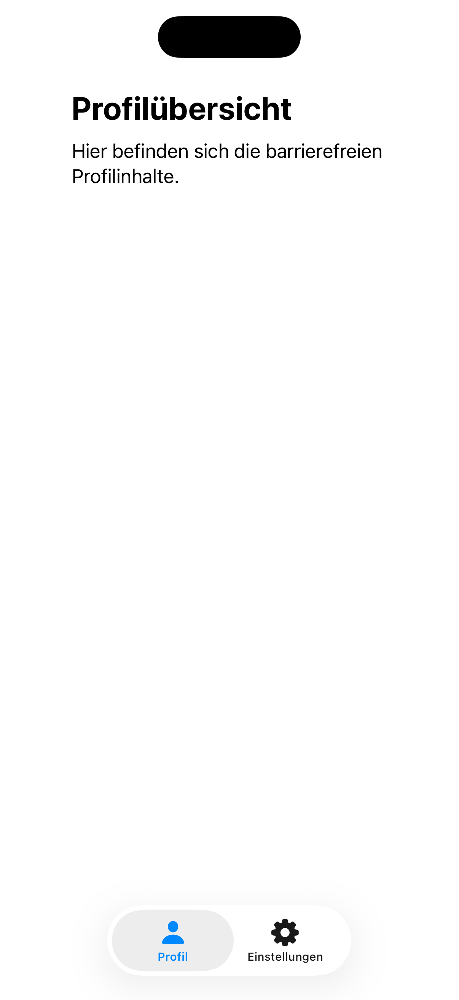
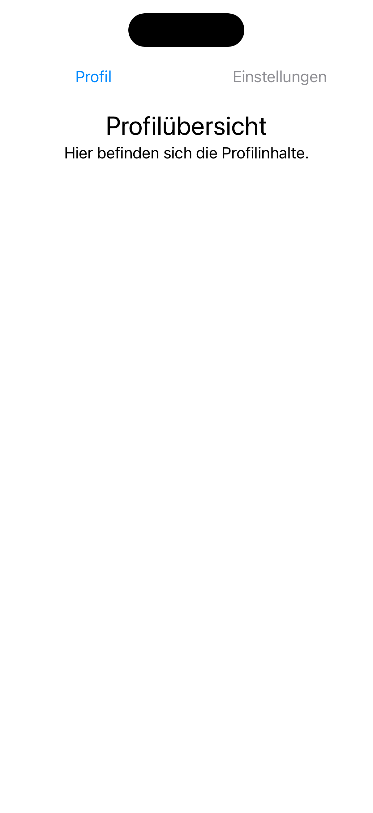

# 04: Tabs

[← Zurück zur Übersicht](../README.md)

Ausgewählte Sprache: Deutsch

Andere Sprachen: tbd

---

<details>
  <summary><b>Inhaltsverzeichnis Pattern</b> (Klicken zum Ausklappen)</summary>
  <br>

  * [Suche](01_search_de.md)
  * [Fußzeile & Kopfzeile](02_footer_header_de.md)
  * [Popup](03_modals_de.md)
  * Tabs <b>(Aktuell ausgewählt)</b>
  * [Cards](05_cards_de.md)
  * [Karussel](06_carousel_de.md)
  * [Gesten](07_gestures_de.md)
  * [Navigationsstruktur & Layout](08_navigation_layout_de.md)
  * [Filter](09_filtering_items_de.md)
  * [Eingabefehler](10_showing_input_error_de.md)

</details>

---

## 1. Kontext und Problemstellung

### Nutzungskontext
Tabs – oft auch als Registerkarten oder Tab-Bars bezeichnet – dienen der Strukturierung und hierarchischen Aufteilung von Inhalten auf einer gemeinsamen Ebene.
Nutzer können zwischen verschiedenen Ansichten oder Datensätzen wechseln (z.B. "Profil", "Einstellungen", "Sicherheit"), ohne den aktuellen Kontext einer Seite oder App-Sektion vollständig zu verlassen.
Da Tabs zu den am häufigsten genutzten Navigationselementen gehören, ist ihre fehlerfreie Bedienung durch assistive Technologien und alternative Eingabemethoden äußerst wichtig.

### Typische Barrieren in der Praxis
* **Fehlender Zustandsstatus**: Blinde oder sehbehinderte Nutzende können visuell hervorgehobene Tabs oft nicht als "aktiviert" wahrnehmen. Wenn die Barrierefreiheits-API den Zustand nicht explizit als „ausgewählt“ an assistive Technologien übergibt, bleibt unklar, welcher Inhalt gerade auf dem Bildschirm dargestellt wird.
* **Unklare Rollenverteilung**: Häufig werden Tabs technisch als einfache Aneinanderreihung von Standard-Buttons implementiert. Für Screenreader-Nutzende geht dadurch der semantische Zusammenhang verloren; sie erkennen nicht, dass diese Steuerelemente eine zusammengehörige Gruppe bilden und exklusiv den darunterliegenden Inhalt steuern.
* **Tastatur-Navigations-Sackgasse**: Bei der Bedienung mit externen Tastaturen werden Tabs oft fälschlicherweise so programmiert, dass man jeden einzelnen Tab per `Tab`-Taste anspringen muss, statt die standardisierte Navigation über die Pfeiltasten zu ermöglichen. Dies verlangsamt den Bedienfluss.
* **Fehlende Fokusüberführung**: Beim Aktivieren eines Tabs wird der Inhalt darunter dynamisch ausgetauscht. Verbleibt der Fokus nach dem Klick starr auf dem Tab-Element, ohne dass Screenreader das Laden des neuen Inhalts signalisieren, merken Nutzende oft nicht, dass sich die angezeigten Daten geändert haben.
---

## 2. Relevante Richtlinien und Standards

Die folgende Tabelle zeigt den Zusammenhang zwischen technischen Erfolgskriterien der **WCAG 2.2** und der Regelung innerhalb von Kapitel 11 der **EN 301 549**.

| Barrierefreiheits-Anforderung | WCAG 2.2 Kriterium | EN 301 549 | Relevanz für das Tabs-Pattern |
| :--- | :--- | :--- | :--- |
| **Informationen & Beziehungen** | 1.3.1 Info and Relationships | 11.1.3.1 | Die Tab-Leiste und die zugehörigen Inhaltsbereiche müssen logisch miteinander verknüpft sein. |
| **Bedeutungsvolle Reihenfolge** | 1.3.2 Meaningful Sequence | 11.1.3.2 | Der Lesefluss muss logisch vom ausgewählten Tab direkt in den dazugehörigen Inhaltscontainer führen. |
| **Nutzunv von Farbe** | 1.4.1 Use of Color | 11.1.4.1 | Der aktive Tab darf nicht nur durch Farbe als aktiver Tab gekennzeichnet sein. |
| **Kontrast (Minimum)** | 1.4.3 Contrast (Minimum) | 11.1.4.3 | Sowohl der Text der Tabs als auch die visuelle Markierung des aktiven Zustands benötigen ausreichenden Kontrast zum Hintergrund. |
| **Text vergrößern** | 1.4.4 Resize Text | 11.1.4.4 | Bei Dynamic Type müssen Tabs lesbar bleiben, dürfen Text nicht abschneiden und bei Bedarf horizontal scrollen. |
| **Tastatur-Bedienbarkeit** | 2.1.1 Keyboard | 11.2.1.1 | Tabs müssen vollständig per Tastatur (z.B. Wechsel via Pfeiltasten) bedienbar sein. |
| **Fokus-Reihenfolge** | 2.4.3 Focus Order | 11.2.4.3 | Nach dem Verlassen der Tab-Leiste muss der Fokus direkt auf das erste interaktive Element des *aktiven* Tab-Inhalts springen. |
| **Fokus sichtbar** | 2.4.7 Focus Visible | 11.2.4.7 | Der aktuell fokussierte Tab benötigt einen deutlich sichtbaren und kontrastreichen Fokusrahmen. |
| **Zielgröße (Minimum)** | 2.5.8 Target Size (Min) | 11.2.5.8 | Jedes einzelne Tab-Element benötigt eine physische Klick- und Touchfläche von mindestens 44x44pt. |
| **Name, Rolle, Wert** | 4.1.2 Name, Role, Value | 11.4.1.2 | Jedes Tab muss die Rolle „Registerkarte“ (tab) und den Zustand „ausgewählt“ (falls ausgewählt) korrekt mitsenden. |
| **Statusmeldung** | 4.1.3 Status Messages | 11.4.1.3 | Falls im Hintergrund Informationen neu geladen werden, muss dies der assistiven Technologie mitgeteilt werden. |

---

## 3. Design-Spezifikationen (UI/UX)

### Visuelle Gestaltung und Kontraste
* **Kennzeichnung des aktiven Zustands**: Der ausgewählte Tab darf sich nicht ausschließlich durch eine Farbänderung vom inaktiven Tab unterscheiden. Es muss zusätzlich eine visuelle Formkomponente genutzt werden, wie z.B. eine dicke Unterstreichung, ein kontraststarker Rahmen oder eine gefüllte Hintergrundform.
* **Dynamic Type & Überlauf-Verhalten**: Tab-Leisten dürfen Text niemals hart abschneiden oder mittels `...` (Ellipse) unleserlich machen, wenn die Systemschriftart vergrößert wird. Bei Platzmangel muss die Tab-Leiste automatisch zu einem horizontal wisch- und scrollbaren Element werden.

### Interaktionsdesign und Touch-Targets
* **Touch-Flächen**: Jedes Tab stellt ein eigenständiges Steuerelement dar. Die Berührungsfläche muss, selbst wenn der Text kurz ist (z.B. "Info"), künstlich durch Padding auf mindestens 44 x 44 pt ausgedehnt werden, um Fehlbedienungen bei motorischen Einschränkungen zu minimieren.
* **Tastatur-Verhalten**: Die Tab-Leiste als Ganzes nimmt genau einen Stopp in der normalen Tab-Reihenfolge ein. Befindet sich der Tastaturfokus auf der Tab-Leiste, wechseln Nutzende den aktiven Tab mithilfe der `Pfeiltaste Links` und `Pfeiltaste Rechts`. Ein Druck auf die `Tab`-Taste springt direkt am Ende der Tab-Leiste vorbei hinein in den Inhalt des aktuell ausgewählten Tabs.

### Empfohlene Fokus-Reihenfolge (Screenreader / Tastatur)
* **Fokus 1 (Tab-Element):** Das aktuell ausgewählte Tab-Element in der Tab-Leiste. Der Screenreader liest sofort: „[Name des Tabs], Registerkarte, ausgewählt, [Index] von [Gesamtanzahl]“ (z.B. *„Einstellungen, Registerkarte, ausgewählt, 2 von 3“*).
* **Fokus 2 (Nächste Element):** Beim Weiterwischen/Weitertabben springt der Fokus direkt auf das erste Element (Überschrift, Text oder Button) innerhalb des dazugehörigen, neu geladenen Inhaltsbereichs.
* **Fokus 3 (Weiterer Inhaltsbereich):** Weitere Elemente innerhalb des Inhaltsbereichs von oben nach unten, bevor der Fokus den gesamten Tab-Container verlässt.

---

## 4. Implementierung (SwiftUI)

### Good Pattern (Positivbeispiel)
Dieses Beispiel zeigt die empfohlene, barrierefreie Implementierung unter Verwendung der nativen TabView. Sie erfüllt automatisch alle Anforderungen an Rolle, Wert, Tastaturfokus und Dynamic Type.

<figure>
  
  <figcaption>Abb. 4.1: Barrierefreie Implementierung der Tabs.</figcaption>
</figure>

#### SwiftUI-Code:

```swift
import SwiftUI

struct GoodTabsView: View {
    @State private var selectedTab = 0
    
    var body: some View {
        // Die native TabView weist Steuerelementen automatisch die Rolle "Registerkarte" zu
        TabView(selection: $selectedTab) {
            TabOneContentView()
                .tabItem {
                    // Native Tab-Icons erfüllen die Target-Size von 44x44pt und signalisieren den aktiven Zustand barrierefrei (gefülltes Icon & Text)
                    Label("Profil", systemImage: selectedTab == 0 ? "person.fill" : "person")
                }
                .tag(0)
            
            TabTwoContentView()
                .tabItem {
                    Label("Einstellungen", systemImage: selectedTab == 1 ? "gearshape.fill" : "gearshape")
                }
                .tag(1)
        }
    }
}

struct TabOneContentView: View {
    var body: some View {
        ScrollView { // ScrollView verhindert Layout-Kollaps bei Dynamic Type
            VStack(alignment: .leading, spacing: 10) {
                Text("Profilübersicht")
                    .font(.title)
                    .bold()
                    .accessibilityAddTraits(.isHeader) // Fokus: Direkt als Überschrift angesagt
                
                Text("Hier befinden sich die barrierefreien Profilinhalte.")
                    .font(.body)
            }
            .padding()
        }
    }
}

struct TabTwoContentView: View {
    var body: some View {
        Text("Einstellungs-Inhalte")
            .font(.body)
    }
}
```


### Bad Pattern (Negativbeispiel)
Dieses Beispiel zeigt eine fehlerhafte Eigenbau-Variante mittels einer HStack und Standard-Buttons. Sie erzeugt massive Barrieren für Tastatur- und Screenreader-Nutzende.

<figure>
  
  <figcaption>Abb. 4.2: Barrierebehaftete Implementierung der Tabs</figcaption>
</figure>

#### SwiftUI-Code:

```swift
import SwiftUI

struct BadTabsView: View {
    @State private var selectedTab = 0
    
    var body: some View {
        VStack(spacing: 0) {
            // BARRIERE: Ein einfaches HStack besitzt für Screenreader keine Gruppe/Rolle als "Tab-Leiste"
            HStack(spacing: 0) {
                // Tab 1
                Button(action: { selectedTab = 0 }) {
                    VStack {
                        Text("Profil")
                            .font(.body)
                            // BARRIERE: Zustand "ausgewählt" wird NUR durch Farbe kommuniziert
                            .foregroundColor(selectedTab == 0 ? .blue : .gray)
                    }
                    .frame(maxWidth: .infinity)
                    // BARRIERE: Fehlendes Padding. Die Klickfläche ist kleiner als 44x44pt
                }
                
                // Tab 2
                Button(action: { selectedTab = 1 }) {
                    VStack {
                        Text("Einstellungen")
                            .font(.body)
                            .foregroundColor(selectedTab == 1 ? .blue : .gray)
                    }
                    .frame(maxWidth: .infinity)
                }
            }
            .frame(height: 40) // BARRIERE: Feste Höhe führt bei großer Systemschrift zum Abschneiden des Textes
            
            Divider()
            
            // Inhaltsbereich
            if selectedTab == 0 {
                // BARRIERE: Keine ScrollView. Große Texte werden nach unten hin abgeschnitten
                VStack {
                    Text("Profilübersicht")
                        .font(.title) // BARRIERE: Keine explizite Überschriften-Rolle für VoiceOver
                    Text("Hier befinden sich die Profilinhalte.")
                }
                .padding()
            } else {
                Text("Einstellungs-Inhalte")
                    .padding()
            }
            Spacer()
        }
    }
}
```

---

## 5. Implementierung (Kotlin)
Wird noch erstellt...

---

## 6. Quellen und weiterführende Links

* **Internationale Standards:**
  * [WCAG 2.2 Richtlinien (W3C)](https://www.w3.org/TR/WCAG2) – Web Content Accessibility Guidelines.
  * [EN 301 549 Standard (ETSI)](https://www.etsi.org/deliver/etsi_en/301500_301599/301549/03.02.01_60/en_301549v030201p.pdf) – Europäische Norm für Barrierefreiheitsanforderungen.

* **Apple Human Interface Guidelines (HIG):**
  * [Apple HIG – Accessibility](https://developer.apple.com/design/human-interface-guidelines/accessibility) – Grundlagen für inklusive und intuitive Plattform-Interaktionen.
  * [Apple HIG – Segmented controls](https://developer.apple.com/design/human-interface-guidelines/segmented-controls) – Richtlinien für die Segmentierung und das Umschalten von Inhalten innerhalb eines Screens.
  * [Apple HIG – Tab bars](https://developer.apple.com/design/human-interface-guidelines/tab-bars) – Abgrenzung zur In-Page-Navigation: Spezifikationen für die primäre App-Navigation am unteren Rand.

---

[← Zurück zur Übersicht](../README.md) | [↑ Nach oben springen](#01_suche)
