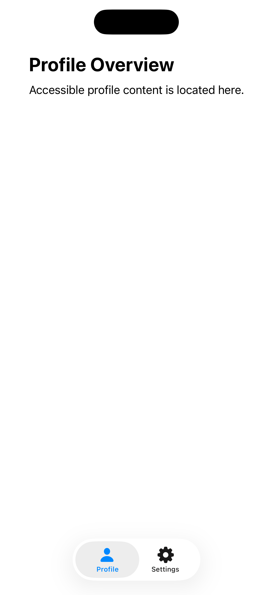
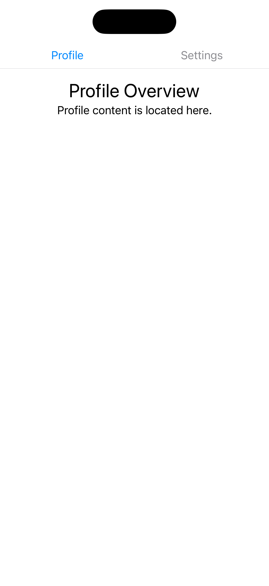

[← Back to overview](../README_en.md)

---

# 04: Tabs

Selected Language: English

Other Languages: [German](04_tabs_de.md)

---

<details>
  <summary><b>Pattern Table of Contents</b> (Click to expand)</summary>
  <br>

  * [Search](01_search_en.md)
  * [Footer & Header](02_footer_header_en.md)
  * [Popup](03_modals_en.md)
  * Tabs <b>(Currently selected)</b>
  * [Cards](05_cards_en.md)
  * [Carousel](06_carousel_en.md)
  * [Gestures](07_gestures_en.md)
  * [Navigation Structure & Layout](08_navigation_layout_en.md)
  * [Filter](09_filtering_items_en.md)
  * [Input Errors](10_showing_input_error_en.md)

</details>

---

## 1. Context and Problem Statement

### Usage Context
Tabs – often referred to as tab bars or tab controls – serve to structure and hierarchically divide content on a shared level.
Users can switch between different views or datasets (e.g., "Profile", "Settings", "Security") without completely leaving the current context of a page or app section.
Because tabs are among the most frequently used navigation elements, their error-free operation by assistive technologies and alternative input methods is extremely important.

### Typical Barriers in Practice
* **Missing State Information**: Blind or visually impaired users often cannot perceive visually highlighted tabs as "activated". If the accessibility API does not explicitly pass the state as "selected" to assistive technologies, it remains unclear which content is currently displayed on the screen.
* **Unclear Role Assignment**: Tabs are frequently implemented technically as a simple sequence of standard buttons. For screen reader users, the semantic context is lost; they do not recognize that these control elements form a coherent group and exclusively control the content underneath.
* **Keyboard Navigation Dead End**: When using external keyboards, tabs are often incorrectly programmed so that users must navigate to every single tab using the `Tab` key, rather than enabling standard navigation via arrow keys. This slows down interaction flow.
* **Missing Focus Transfer**: Upon activating a tab, the content below is dynamically replaced. If focus remains rigidly on the tab element after clicking without a screen reader signaling the loading of new content, users often fail to notice that the displayed data has changed.

---

## 2. Relevant Guidelines and Standards

The following table shows the relationship between technical success criteria of **WCAG 2.2** and regulations within Chapter 11 of **EN 301 549**.

| Accessibility Requirement | WCAG 2.2 Criterion | EN 301 549 | Relevance for the Tabs Pattern |
| :--- | :--- | :--- | :--- |
| **Information and Relationships** | 1.3.1 Info and Relationships | 11.1.3.1 | The tab bar and associated content areas must be logically linked with one another. |
| **Meaningful Sequence** | 1.3.2 Meaningful Sequence | 11.1.3.2 | The reading flow must logically lead from the selected tab directly into the corresponding content container. |
| **Use of Color** | 1.4.1 Use of Color | 11.1.4.1 | The active tab must not be identified solely through color. |
| **Contrast (Minimum)** | 1.4.3 Contrast (Minimum) | 11.1.4.3 | Both the text of the tabs and the visual indicator of the active state require sufficient contrast against the background. |
| **Resize Text** | 1.4.4 Resize Text | 11.1.4.4 | With Dynamic Type, tabs must remain readable, must not truncate text, and must scroll horizontally if necessary. |
| **Keyboard Accessibility** | 2.1.1 Keyboard | 11.2.1.1 | Tabs must be fully operable via keyboard (e.g., switching via arrow keys). |
| **Focus Order** | 2.4.3 Focus Order | 11.2.4.3 | After leaving the tab bar, focus must move directly to the first interactive element of the *active* tab content. |
| **Focus Visible** | 2.4.7 Focus Visible | 11.2.4.7 | The currently focused tab requires a clearly visible and high-contrast focus indicator. |
| **Target Size (Minimum)** | 2.5.8 Target Size (Min) | 11.2.5.8 | Each individual tab element requires a physical click and touch area of at least 44x44 pt. |
| **Name, Role, Value** | 4.1.2 Name, Role, Value | 11.4.1.2 | Each tab must correctly transmit the "tab" role and the "selected" state (if selected). |
| **Status Messages** | 4.1.3 Status Messages | 11.4.1.3 | If information is reloaded in the background, this must be communicated to assistive technology. |

---

## 3. Design Specifications (UI/UX)

### Visual Design and Contrast
* **Indication of Active State**: The selected tab must not differ from inactive tabs solely through a color change. An additional visual shape component must be used, such as a thick underline, a high-contrast border, or a filled background shape.
* **Dynamic Type & Overflow Behavior**: Tab bars must never truncate text or render it unreadable using `...` (ellipsis) when system font size is increased. If space is insufficient, the tab bar must automatically become a horizontally swipeable and scrollable element.

### Interaction Design and Touch Targets
* **Touch Targets**: Each tab represents an independent control element. Even if the text is short (e.g., "Info"), the touch target must be artificially extended to at least 44 x 44 pt using padding to minimize accidental operations for users with motor impairments.
* **Keyboard Behavior**: The tab bar as a whole occupies exactly one stop in the normal tab sequence. When keyboard focus is on the tab bar, users switch active tabs using the `Left Arrow` and `Right Arrow` keys. Pressing the `Tab` key skips directly past the end of the tab bar into the content of the currently selected tab.

### Recommended Focus Order (Screen Reader / Keyboard)
* **Focus 1 (Tab Element):** The currently selected tab element in the tab bar. The screen reader immediately announces: "[Tab Name], tab, selected, [Index] of [Total Count]" (e.g., *"Settings, tab, selected, 2 of 3"*).
* **Focus 2 (Next Element):** Upon swiping/tabbing forward, focus jumps directly to the first element (heading, text, or button) within the corresponding, newly loaded content area.
* **Focus 3 (Further Content Area):** Subsequent elements within the content area from top to bottom before focus leaves the overall tab container.

---

## 4. Implementation (SwiftUI)

### Good Pattern
This example demonstrates the recommended, accessible implementation using the native `TabView`. It automatically meets all requirements for role, value, keyboard focus, and Dynamic Type.

<figure>
  
  <figcaption>Fig. 4.1: Accessible implementation of tabs.</figcaption>
</figure>

#### SwiftUI Code:

```swift
import SwiftUI

struct GoodTabsView: View {
    @State private var selectedTab = 0
    
    var body: some View {
        // Native TabView automatically assigns the "tab" role to control elements
        TabView(selection: $selectedTab) {
            TabOneContentView()
                .tabItem {
                    // Native tab items meet the target size of 44x44 pt and signal active state accessibly (filled icon & text)
                    Label("Profile", systemImage: selectedTab == 0 ? "person.fill" : "person")
                }
                .tag(0)
            
            TabTwoContentView()
                .tabItem {
                    Label("Settings", systemImage: selectedTab == 1 ? "gearshape.fill" : "gearshape")
                }
                .tag(1)
        }
    }
}

struct TabOneContentView: View {
    var body: some View {
        ScrollView { // ScrollView prevents layout collapse with Dynamic Type
            VStack(alignment: .leading, spacing: 10) {
                Text("Profile Overview")
                    .font(.title)
                    .bold()
                    .accessibilityAddTraits(.isHeader) // Focus: Directly announced as a heading
                
                Text("Accessible profile content is located here.")
                    .font(.body)
            }
            .padding()
        }
    }
}

struct TabTwoContentView: View {
    var body: some View {
        Text("Settings Content")
            .font(.body)
    }
}
```

### Bad Pattern
This example demonstrates a flawed custom implementation using an `HStack` and standard buttons. It creates massive accessibility barriers for keyboard and screen reader users.

<figure>
  
  <figcaption>Fig. 4.2: Accessibility-impaired implementation of tabs.</figcaption>
</figure>

#### SwiftUI Code:

```swift
import SwiftUI

struct BadTabsView: View {
    @State private var selectedTab = 0
    
    var body: some View {
        VStack(spacing: 0) {
            // BARRIER: A simple HStack has no group/role as a "tab bar" for screen readers
            HStack(spacing: 0) {
                // Tab 1
                Button(action: { selectedTab = 0 }) {
                    VStack {
                        Text("Profile")
                            .font(.body)
                            // BARRIER: "Selected" state is communicated ONLY through color
                            .foregroundColor(selectedTab == 0 ? .blue : .gray)
                    }
                    .frame(maxWidth: .infinity)
                    // BARRIER: Missing padding. Touch target is smaller than 44x44 pt
                }
                
                // Tab 2
                Button(action: { selectedTab = 1 }) {
                    VStack {
                        Text("Settings")
                            .font(.body)
                            .foregroundColor(selectedTab == 1 ? .blue : .gray)
                    }
                    .frame(maxWidth: .infinity)
                }
            }
            .frame(height: 40) // BARRIER: Fixed height leads to text truncation when system font size is increased
            
            Divider()
            
            // Content area
            if selectedTab == 0 {
                // BARRIER: No ScrollView. Large text gets cut off vertically
                VStack {
                    Text("Profile Overview")
                        .font(.title) // BARRIER: No explicit heading role for VoiceOver
                    Text("Profile content is located here.")
                }
                .padding()
            } else {
                Text("Settings Content")
                    .padding()
            }
            Spacer()
        }
    }
}
```

---

## 5. Implementation (Kotlin)
To be created...

---

## 6. Sources and Further Reading

* **International Standards:**
  * [WCAG 2.2 Guidelines (W3C)](https://www.w3.org/TR/WCAG2) – Web Content Accessibility Guidelines
  * [EN 301 549 Standard (ETSI)](https://www.etsi.org/deliver/etsi_en/301500_301599/301549/03.02.01_60/en_301549v030201p.pdf) – European standard for accessibility requirements for ICT products and services

* **Apple Human Interface Guidelines (HIG):**
  * [Apple HIG – Accessibility](https://developer.apple.com/design/human-interface-guidelines/accessibility) – Fundamentals for inclusive and intuitive platform interactions
  * [Apple HIG – Segmented controls](https://developer.apple.com/design/human-interface-guidelines/segmented-controls) – Guidelines for segmenting and switching content within a screen
  * [Apple HIG – Tab bars](https://developer.apple.com/design/human-interface-guidelines/tab-bars) – Distinction from in-page navigation: Specifications for primary app navigation at the bottom
  * [Apple HIG – Pickers](https://developer.apple.com/design/human-interface-guidelines/pickers) – Various picker layouts, including representation of tabs

* **Pattern Reference:**
  * https://www.checklist.design – Main page
  * https://www.checklist.design/design-system/tabs – Tabs Pattern

---

[← Back to overview](../README_en.md) | [↑ Jump to top](#04-tabs)
