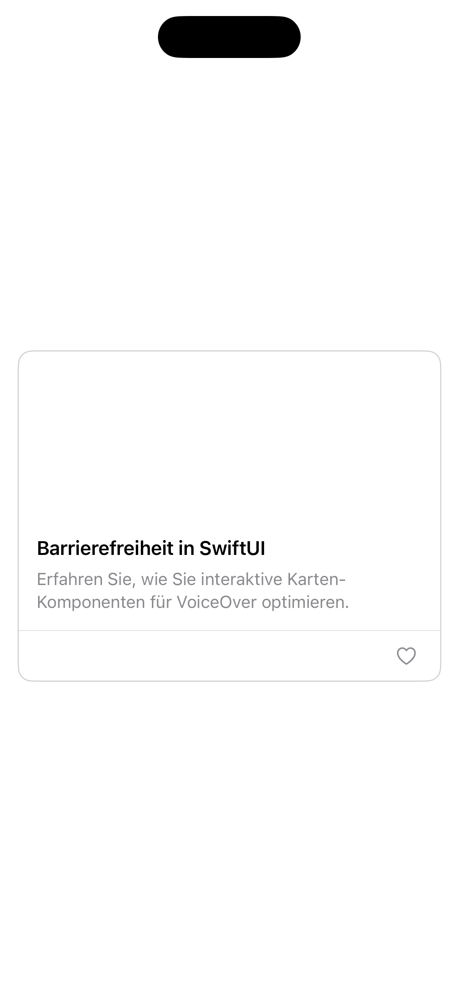
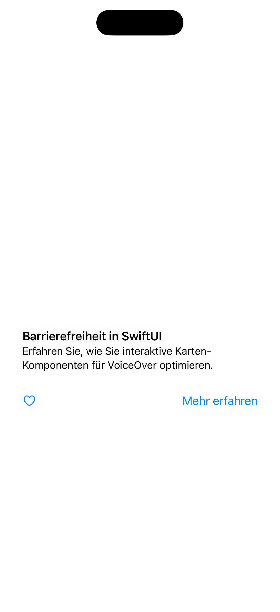

[← Zurück zur Übersicht](../README.md)

---

# 05: Cards

Ausgewählte Sprache: Deutsch

Andere Sprachen: tbd

---

<details>
  <summary><b>Inhaltsverzeichnis Pattern</b> (Klicken zum Ausklappen)</summary>
  <br>

  * [Suche](01_search_de.md)
  * [Fußzeile & Kopfzeile](02_footer_header_de.md)
  * [Popup](03_modals_de.md)
  * [Tabs](04_tabs_de.md)
  * Cards <b>(Aktuell ausgewählt)</b>
  * [Karussel](06_carousel_de.md)
  * [Gesten](07_gestures_de.md)
  * [Navigationsstruktur & Layout](08_navigation_layout_de.md)
  * [Filter](09_filtering_items_de.md)
  * [Eingabefehler](10_showing_input_error_de.md)

</details>

---

## 1. Kontext und Problemstellung

### Nutzungskontext
Cards gehören zu den flexibelsten und am häufigsten verwendeten UI-Design-Mustern in modernen Applikationen. Sie dienen als visuelle Container, die zusammengehörige Informationen zu einem einzigen Thema gruppieren – beispielsweise ein Produkt in einem Onlineshop, einen Artikel in einem News-Feed oder ein Dashboard-Element. Cards enthalten meist eine Kombination aus Bildern, Überschriften, Beschreibungstexten und interaktiven Elementen (wie Buttons oder Links). Da sie oft als kompakte Einstiegspunkte zu tiefergehenden Inhalten dienen, müssen sie für assistive Technologien strukturell starr zusammengehalten und eindeutig lesbar sein.

### Typische Barrieren in der Praxis
* **Fokus-Fragmentierung**: Wenn eine Card nicht als zusammenhängendes Element deklariert ist, zerlegt ein Screenreader sie in ihre Einzelteile. Der Screenreader springt dann separat auf das Bild, die Überschrift, den Text und den Button. Blinde Nutzende müssen sich mühsam durch mehrere Einzelstopps wischen, um den Inhalt einer einzigen Karte zu verstehen.
* **Redundante Textansagen**: Oft ist die gesamte Card klickbar und führt zum selben Ziel wie ein integrierter „Mehr erfahren“-Button oder ein verlinkter Titel. Ohne Optimierung liest ein Screenreader bei einer einzigen Card den Titel und den Button-Text doppelt vor.
* **Barrierefreie Klick-Falle bei Bildern**: Cards nutzen häufig großflächige Hintergrundbilder oder Produktfotos. Besitzen diese Bilder keine oder unvollständige Alternativtexte, scheitert die Orientierung. Ist das Bild zudem separat klickbar, geraten Tastatur- und Screenreader-Nutzende in unnötige Zusatzschleifen.
* **Fehlende Gruppen-Semantik bei Listen**: Cards treten selten allein auf, sondern meistens in Rastern oder Listen. Wenn diese Card-Sammlungen nicht semantisch als zusammengehörige Liste deklariert werden, fehlt Screenreader-Nutzenden die Orientierung, wie viele Elemente vorhanden sind (z.B. fehlt die Ansage „*Element 1 von 12*“).

---

## 2. Relevante Richtlinien und Standards

Die folgende Tabelle zeigt den Zusammenhang zwischen technischen Erfolgskriterien der **WCAG 2.2** und der Regelung innerhalb von Kapitel 11 der **EN 301 549**.

| Barrierefreiheits-Anforderung | WCAG 2.2 Kriterium | EN 301 549 | Relevanz für das Cards-Pattern |
| :--- | :--- | :--- | :--- |
| **Alternativtext** | 1.1.1 Non-text Content | 11.1.1.1 | Bilder innerhalb einer Card müssen ein prägnantes Accessibility-Label erhalten oder als dekorativ ausgeblendet werden. |
| **Informationen & Beziehungen** | 1.3.1 Info and Relationships | 11.1.3.1 | Die Card muss als zusammengehöriges Element (Gruppe) strukturiert sein und der Titel zwingend als Überschrift deklariert werden. |
| **Bedeutungsvolle Reihenfolge** | 1.3.2 Meaningful Sequence | 11.1.3.2 | Der Lesefluss innerhalb der Karte muss logisch sein (z.B. erst die Überschrift, dann der Text, dann die Aktion). |
| **Kontrast (Minimum)** | 1.4.3 Contrast (Minimum) | 11.1.4.3 | Der Text auf der Card muss sich vom Card-Hintergrund abheben (mind. 4,5:1). Text auf Bild-Overlays benötigt oft schattierte Hintergründe. |
| **Text vergrößern** | 1.4.4 Resize Text | 11.1.4.4 | Cards dürfen keine feste Höhe haben. Bei Dynamic Type muss die Card vertikal mitwachsen, ohne Text abzuschneiden oder zu überlagern. |
| **Nicht-Text-Kontrast** | 1.4.11 Non-Text Contrast | 11.1.4.11 | Der Kontrast der Rahmenlinien der Cards zum Hintergrund muss mindestens 3:1 betragen. |
| **Tastatur-Bedienbarkeit** | 2.1.1 Keyboard | 11.2.1.1 | Ist die Card interaktiv, muss sie per Tastatur auslösbar sein. |
| **Fokus-Reihenfolge** | 2.4.3 Focus Order | 11.2.4.3 | Eine interaktive Card sollte idealerweise als *ein einziger* Fokus-Stopp angesteuert werden, statt in Text, Bild und Button zu zerfallen. |
| **Fokus sichtbar** | 2.4.7 Focus Visible | 11.2.4.7 | Beim Fokussieren einer Card per Tastatur muss die gesamte Card einen deutlich erkennbaren Fokusrahmen erhalten. |
| **Zielgröße (Minimum)** | 2.5.8 Target Size (Min) | 11.2.5.8 | Interaktive Elemente innerhalb der Card (z.B. ein eigenständiger "Favoriten"-Button) benötigen eine Klickfläche von mind. 44x44pt. |
| **Name, Rolle, Wert** | 4.1.2 Name, Role, Value | 11.4.1.2 | Die Card muss dem Screenreader ihre Rolle (z.B. als Button/Link, wenn sie komplett klickbar ist) und ihren Zustand mitteilen. |

---

## 3. Design-Spezifikationen (UI/UX)

### Visuelle Gestaltung und Kontraste
* **Flexibles Layout (Dynamic Type)**: Cards dürfen niemals eine feste vertikale Höhe besitzen. Der Container muss sich nach unten ausdehnen können, sobald Texte durch vergrößerte Systemschriften mehr Zeilen beanspruchen. 
* **Kontrast bei Text-auf-Bild**: Wenn Text direkt über ein Hintergrundbild gelegt wird, muss durch ein halbtransparentes, dunkles Overlay oder eine solide Text-Box sichergestellt werden, dass der Kontrast von 4,5:1 an jeder Stelle des Textes eingehalten wird.
* **Eindeutiger Fokusrahmen**: Interaktive Cards benötigen im fokussierten Zustand einen deutlich sichtbaren Rahmen, der die gesamte Karte umschließt. Ein reiner Farbwechsel der Karte oder ein sanfter Schatten-Effekt reicht als Fokus-Indikator nicht aus.

### Interaktionsdesign und Touch-Targets
* **Kombiniertes Touch-Target**: Führt das Tippen auf eine Card zum selben Ziel wie der darin verbaute Textlink, sollte die gesamte Card als ein einziges, interaktives Element gestaltet werden. Das Padding der Karte dient dann gleichzeitig als Vergrößerung der Touch-Fläche (weit über den Mindeststandard von 44x44 pt hinaus).
* **Verschachtelte Interaktionen**: Enthält eine Karte mehrere unabhängige Aktionen (z.B. die Karte öffnet den Artikel, aber ein kleines Icon-Button speichert ihn als Favorit), müssen diese Elemente visuell und technisch klar separiert werden. Der Favoriten-Button benötigt eine eigene physische Touch-Fläche von mindestens 44 x 44 pt und darf sich nicht mit dem Klickbereich der restlichen Karte überschneiden.

### Empfohlene Fokus-Reihenfolge (Screenreader / Tastatur)
* **Fokus 1 (Die gesamte Card als Einheit):** Der Screenreader erfasst die Card als ein einziges Element. Der Screenreader liest den gesamten Inhalt in einer logischen, zusammenhängenden Kette vor: „*[Titel des Artikels], Überschrift. [Kurzbeschreibung]. Taste/Link.*“ 
* **Fokus 2 (Optionale Zusatzaktionen):** Nur wenn die Card verschachtelte, sekundäre Elemente besitzt (z.B. einen separaten „Löschen“- oder „Favorit“-Button), springt der Fokus als nächstes exakt auf dieses Steuerelement.
* **Fokus 3 (Nächste Card):** Der Fokus verlässt die Card vollständig und springt zur nächsten Card in der Liste. Redundante Zwischenstopps auf Texten oder dekorativen Bildern innerhalb der ersten Karte werden übersprungen.

---

## 4. Implementierung (SwiftUI)

### Good Pattern (Positivbeispiel)
Dieses Beispiel zeigt eine barrierefreie Implementierung. Die gesamte Karte ist ein einziges Touch-Target. Die inneren Texte werden für den Screenreader kombiniert, das Bild wird als dekorativ ausgeblendet, und der Favoriten-Button ist als separates Element sauber zugänglich.

<figure>
  
  <figcaption>Abb. 5.1: Barrierefreie Implementierung der Card</figcaption>
</figure>

#### SwiftUI-Code:

```swift
import SwiftUI

struct GoodCardView: View {
    @State private var isFavorite = false
    
    var body: some View {
        VStack(alignment: .leading, spacing: 0) {
            // Haupt-Interaktionsbereich der Card
            Button(action: { /* Artikel öffnen */ }) {
                VStack(alignment: .leading, spacing: 12) {
                    // Bild für Screenreader ausblenden, da es rein dekorativ ist
                    Image("article_cover")
                        .resizable()
                        .aspectRatio(contentMode: .fill)
                        .frame(height: 150)
                        .clipped()
                        .accessibilityHidden(true)
                    
                    VStack(alignment: .leading, spacing: 8) {
                        Text("Barrierefreiheit in SwiftUI")
                            .font(.headline)
                            .foregroundColor(.primary)
                            // Deklariert den Titel für Screenreader als Überschrift
                            .accessibilityAddTraits(.isHeader)
                        
                        Text("Erfahren Sie, wie Sie interaktive Karten-Komponenten für VoiceOver optimieren.")
                            .font(.subheadline)
                            .foregroundColor(.secondary)
                            .multilineTextAlignment(.leading)
                    }
                    .padding([.horizontal, .bottom])
                }
            }
            // Kombiniert alle inneren Texte zu einer einzigen, logischen Screenreader-Ansage
            .accessibilityElement(children: .combine)
            
            Divider()
            
            // Verschachtelte Interaktion
            HStack {
                Spacer()
                Button(action: { isFavorite.toggle() }) {
                    Image(systemName: isFavorite ? "heart.fill" : "heart")
                        .foregroundColor(isFavorite ? .red : .gray)
                        // Garantiert die Mindestzielgröße von 44x44pt
                        .frame(width: 44, height: 44) 
                }
                // Verhindert das Vorlesen des Icon-Namens und gibt eindeutigen Kontext
                .accessibilityLabel(isFavorite ? "Aus Favoriten entfernen" : "Zu Favoriten hinzufügen")
            }
            .padding(.horizontal, 8)
        }
        .background(Color(.systemBackground))
        .cornerRadius(12)
        // Barrierefreier Nicht-Text-Kontrast für die Card-Begrenzung (mind. 3:1)
        .overlay(
            RoundedRectangle(cornerRadius: 12)
                .stroke(Color(.systemGray4), lineWidth: 1)
        )
        .padding()
    }
}
```


### Bad Pattern (Negativbeispiel)
Dieses Beispiel zeigt eine mangelhafte Implementierung mittels starrer Container, nicht deklarierter Bild-Alternativtexte und fehlender Fokus-Kombination.

<figure>
  
  <figcaption>Abb. 5.2: Barrierebehaftete Implementierung der Card</figcaption>
</figure>

#### SwiftUI-Code:

```swift
import SwiftUI

struct BadCardView: View {
    @State private var isFavorite = false
    
    var body: some View {
        // BARRIERE: Ein ZStack/VStack-Konstrukt hat für Screenreader keine inhärente Rolle (z.B. Button)
        VStack(alignment: .leading, spacing: 0) {
            
            // BARRIERE: Screenreader liest den reinen Dateinamen vor (z.B. "article_cover, Bild")
            Image("article_cover")
                .resizable()
                .frame(height: 150)
            
            VStack(alignment: .leading) {
                // BARRIERE: Titel ist nicht als Überschrift deklariert
                Text("Barrierefreiheit in SwiftUI")
                    .font(.headline)
                
                Text("Erfahren Sie, wie Sie interaktive Karten-Komponenten für VoiceOver optimieren.")
                    .font(.subheadline)
            }
            .padding()
            
            HStack {
                // BARRIERE: Kleine Klickfläche (unter 44x44pt)
                Button(action: { isFavorite.toggle() }) {
                    Image(systemName: isFavorite ? "heart.fill" : "heart")
                }
                // BARRIERE: Fehlendes Label. VoiceOver liest nur kryptisch "heart" oder "heart.fill, Taste"
                
                Spacer()
                
                // BARRIERE: Redundanter Link, der zum selben Ziel führt wie die Karte selbst
                Button("Mehr erfahren") { /* Artikel öffnen */ }
            }
            .padding()
        }
        // BARRIERE: Feste Höhe führt bei Dynamic Type (großer Schrift) zum Layout-Kollaps und Abschneiden von Text
        .frame(height: 320)
        // BARRIERE: Der graue Schatten hat zu wenig Kontrast zum Hintergrund (unter 3:1), Card-Grenze ist unsichtbar
        .shadow(color: .gray.opacity(0.2), radius: 5)
        .padding()
        // BARRIERE: Ein Tastaturnutzer muss 4-mal tabben (Bild, Titel, Herz, Button), um diese eine Karte zu passieren
    }
}
```

---

## 5. Implementierung (Kotlin)
Wird noch erstellt...

---

## 6. Quellen und weiterführende Links

* **Internationale Standards:**
  * [WCAG 2.2 Richtlinien (W3C)](https://www.w3.org/TR/WCAG2) – Web Content Accessibility Guidelines.
  * [EN 301 549 Standard (ETSI)](https://www.etsi.org/deliver/etsi_en/301500_301599/301549/03.02.01_60/en_301549v030201p.pdf) – Europäische Norm für Barrierefreiheitsanforderungen.

* **Apple Human Interface Guidelines (HIG):**
  * [Apple HIG – Accessibility](https://developer.apple.com/design/human-interface-guidelines/accessibility) – Grundlagen für inklusive und intuitive Plattform-Interaktionen.
  * [Apple HIG – Layout](https://developer.apple.com/design/human-interface-guidelines/layout) – Spezifikationen zu Platzierung, Abständen und dem Umbruchverhalten von Rastern und Listen auf iOS-Geräten.

---

[← Zurück zur Übersicht](../README.md) | [↑ Nach oben springen](#01_suche)
