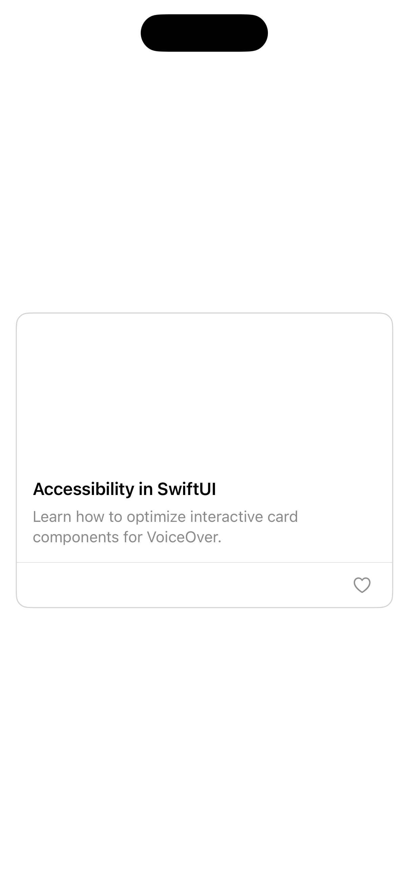
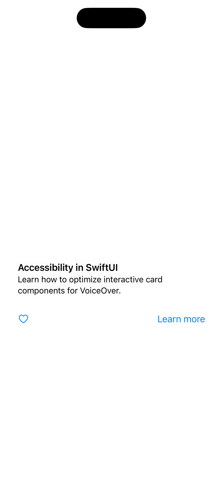

[← Back to overview](../README_en.md)

---

# 05: Cards

Selected Language: English

Other Languages: [German](05_cards_de.md)

---

<details>
  <summary><b>Pattern Table of Contents</b> (Click to expand)</summary>
  <br>

  * [Search](01_search_en.md)
  * [Footer & Header](02_footer_header_en.md)
  * [Popup](03_modals_en.md)
  * [Tabs](04_tabs_en.md)
  * Cards <b>(Currently selected)</b>
  * [Carousel](06_carousel_en.md)
  * [Gestures](07_gestures_en.md)
  * [Navigation Structure & Layout](08_navigation_layout_en.md)
  * [Filter](09_filtering_items_en.md)
  * [Input Errors](10_showing_input_error_en.md)

</details>

---

## 1. Context and Problem Statement

### Usage Context
Cards are among the most flexible and frequently used UI design patterns in modern applications. They serve as visual containers that group related information around a single topic – for example, a product in an online store, an article in a news feed, or a dashboard element. Cards usually contain a combination of images, headings, descriptive text, and interactive elements (such as buttons or links). Because they often serve as compact entry points to deeper content, they must be structurally kept together and clearly readable for assistive technologies.

### Typical Barriers in Practice
* **Focus Fragmentation**: When a card is not declared as a cohesive element, a screen reader breaks it into its individual parts. The screen reader then jumps separately to the image, the heading, the text, and the button. Blind users must tediously swipe through multiple individual stops to understand the content of a single card.
* **Redundant Text Announcements**: Often, the entire card is clickable and leads to the same destination as an integrated "Learn more" button or a linked title. Without optimization, a screen reader reads out the title and button text twice for a single card.
* **Accessible Click Trap with Images**: Cards frequently use large background images or product photos. If these images lack alt text or have incomplete alt text, orientation fails. Furthermore, if the image is separately clickable, keyboard and screen reader users get caught in unnecessary additional focus loops.
* **Missing Group Semantics in Lists**: Cards rarely appear alone; they mostly appear in grids or lists. If these card collections are not semantically declared as a cohesive list, screen reader users lack context regarding how many elements are present (e.g., missing the announcement "*Item 1 of 12*").

---

## 2. Relevant Guidelines and Standards

The following table shows the relationship between technical success criteria of **WCAG 2.2** and regulations within Chapter 11 of **EN 301 549**.

| Accessibility Requirement | WCAG 2.2 Criterion | EN 301 549 | Relevance for the Cards Pattern |
| :--- | :--- | :--- | :--- |
| **Alternative Text** | 1.1.1 Non-text Content | 11.1.1.1 | Images inside a card must receive a concise accessibility label or be hidden as decorative. |
| **Information and Relationships** | 1.3.1 Info and Relationships | 11.1.3.1 | The card must be structured as a cohesive element (group), and the title must be explicitly declared as a heading. |
| **Meaningful Sequence** | 1.3.2 Meaningful Sequence | 11.1.3.2 | The reading flow within the card must be logical (e.g., heading first, then text, then action). |
| **Contrast (Minimum)** | 1.4.3 Contrast (Minimum) | 11.1.4.3 | The text on the card must contrast with the card background (at least 4.5:1). Text on image overlays often requires shaded backgrounds. |
| **Resize Text** | 1.4.4 Resize Text | 11.1.4.4 | Cards must not have a fixed height. With Dynamic Type, the card must grow vertically without clipping or overlapping text. |
| **Non-Text Contrast** | 1.4.11 Non-Text Contrast | 11.1.4.11 | The contrast ratio of the card borders against the background must be at least 3:1. |
| **Keyboard Accessibility** | 2.1.1 Keyboard | 11.2.1.1 | If the card is interactive, it must be operable via keyboard. |
| **Focus Order** | 2.4.3 Focus Order | 11.2.4.3 | An interactive card should ideally be targeted as *a single* focus stop rather than breaking down into text, image, and button. |
| **Focus Visible** | 2.4.7 Focus Visible | 11.2.4.7 | When focusing a card via keyboard, the entire card must receive a clearly visible focus indicator. |
| **Target Size (Minimum)** | 2.5.8 Target Size (Min) | 11.2.5.8 | Interactive elements within the card (e.g., an independent "Favorite" button) require a click/touch target of at least 44x44 pt. |
| **Name, Role, Value** | 4.1.2 Name, Role, Value | 11.4.1.2 | The card must communicate its role (e.g., button/link if completely clickable) and state to the screen reader. |

---

## 3. Design Specifications (UI/UX)

### Visual Design and Contrast
* **Flexible Layout (Dynamic Type)**: Cards must never have a fixed vertical height. The container must be able to expand downward as text occupies more lines due to increased system font sizes. 
* **Contrast in Text-on-Image**: When text is laid directly over a background image, a semi-transparent dark overlay or a solid text box must ensure that the contrast ratio of 4.5:1 is maintained at every part of the text.
* **Clear Focus Indicator**: Interactive cards require a clearly visible border encompassing the entire card when focused. A mere color shift of the card or a soft shadow effect is not sufficient as a focus indicator.

### Interaction Design and Touch Targets
* **Combined Touch Target**: If tapping a card leads to the same destination as an embedded text link, the entire card should be designed as a single interactive element. The card's padding then simultaneously serves to enlarge the touch target (well beyond the minimum standard of 44x44 pt).
* **Nested Interactions**: If a card contains multiple independent actions (e.g., tapping the card opens the article, but a small icon button saves it as a favorite), these elements must be visually and technically separated clearly. The favorite button requires its own physical touch target of at least 44 x 44 pt and must not overlap with the touch target of the rest of the card.

### Recommended Focus Order (Screen Reader / Keyboard)
* **Focus 1 (The entire card as a unit):** The screen reader captures the card as a single element. The screen reader reads the entire content in a logical, cohesive chain: "*[Article Title], heading. [Short description]. Button/Link.*"
* **Focus 2 (Optional secondary actions):** Only if the card has nested secondary elements (e.g., a separate "Delete" or "Favorite" button) does focus jump directly to this control element next.
* **Focus 3 (Next card):** Focus completely leaves the card and jumps to the next card in the list. Redundant intermediate stops on texts or decorative images within the first card are skipped.

---

## 4. Implementation (SwiftUI)

### Good Pattern
This example demonstrates an accessible implementation. The entire card is a single touch target. Inner text elements are combined for the screen reader, the image is hidden as decorative, and the favorite button is cleanly accessible as a separate element.

<figure>
  
  <figcaption>Fig. 5.1: Accessible implementation of the card.</figcaption>
</figure>

#### SwiftUI Code:

```swift
import SwiftUI

struct GoodCardView: View {
    @State private var isFavorite = false
    
    var body: some View {
        VStack(alignment: .leading, spacing: 0) {
            // Main interaction area of the card
            Button(action: { /* Open article */ }) {
                VStack(alignment: .leading, spacing: 12) {
                    // Hide image from screen reader as it is purely decorative
                    Image("article_cover")
                        .resizable()
                        .aspectRatio(contentMode: .fill)
                        .frame(height: 150)
                        .clipped()
                        .accessibilityHidden(true)
                    
                    VStack(alignment: .leading, spacing: 8) {
                        Text("Accessibility in SwiftUI")
                            .font(.headline)
                            .foregroundColor(.primary)
                            // Declares title as a heading for screen readers
                            .accessibilityAddTraits(.isHeader)
                        
                        Text("Learn how to optimize interactive card components for VoiceOver.")
                            .font(.subheadline)
                            .foregroundColor(.secondary)
                            .multilineTextAlignment(.leading)
                    }
                    .padding([.horizontal, .bottom])
                }
            }
            // Combines all inner text elements into a single, logical screen reader announcement
            .accessibilityElement(children: .combine)
            
            Divider()
            
            // Nested interaction
            HStack {
                Spacer()
                Button(action: { isFavorite.toggle() }) {
                    Image(systemName: isFavorite ? "heart.fill" : "heart")
                        .foregroundColor(isFavorite ? .red : .gray)
                        // Ensures minimum target size of 44x44 pt
                        .frame(width: 44, height: 44) 
                }
                // Prevents reading icon name and provides clear context
                .accessibilityLabel(isFavorite ? "Remove from favorites" : "Add to favorites")
            }
            .padding(.horizontal, 8)
        }
        .background(Color(.systemBackground))
        .cornerRadius(12)
        // Accessible non-text contrast for card boundary (at least 3:1)
        .overlay(
            RoundedRectangle(cornerRadius: 12)
                .stroke(Color(.systemGray4), lineWidth: 1)
        )
        .padding()
    }
}
```

### Bad Pattern
This example demonstrates a flawed implementation using rigid containers, undeclared image alternative text, and a lack of focus combination.

<figure>
  
  <figcaption>Fig. 5.2: Accessibility-impaired implementation of the card.</figcaption>
</figure>

#### SwiftUI Code:

```swift
import SwiftUI

struct BadCardView: View {
    @State private var isFavorite = false
    
    var body: some View {
        // BARRIER: A ZStack/VStack construct has no inherent role (e.g., button) for screen readers
        VStack(alignment: .leading, spacing: 0) {
            
            // BARRIER: Screen reader reads raw filename (e.g., "article_cover, image")
            Image("article_cover")
                .resizable()
                .frame(height: 150)
            
            VStack(alignment: .leading) {
                // BARRIER: Title is not declared as a heading
                Text("Accessibility in SwiftUI")
                    .font(.headline)
                
                Text("Learn how to optimize interactive card components for VoiceOver.")
                    .font(.subheadline)
            }
            .padding()
            
            HStack {
                // BARRIER: Small touch target (below 44x44 pt)
                Button(action: { isFavorite.toggle() }) {
                    Image(systemName: isFavorite ? "heart.fill" : "heart")
                }
                // BARRIER: Missing label. VoiceOver reads cryptically "heart" or "heart.fill, button"
                
                Spacer()
                
                // BARRIER: Redundant link leading to the same destination as the card itself
                Button("Learn more") { /* Open article */ }
            }
            .padding()
        }
        // BARRIER: Fixed height leads to layout collapse and text truncation with Dynamic Type (large text)
        .frame(height: 320)
        // BARRIER: The grey shadow has insufficient contrast against background (below 3:1), card boundary is invisible
        .shadow(color: .gray.opacity(0.2), radius: 5)
        .padding()
        // BARRIER: A keyboard user must tab 4 times (image, title, heart, button) to pass this single card
    }
}
```

---

## 5. Implementation (Kotlin)
To be created...

---

## 6. Sources and Further Reading

* **International Standards:**
  * [WCAG 2.2 Guidelines (W3C)](https://www.w3.org/TR/WCAG2) – Web Content Accessibility Guidelines.
  * [EN 301 549 Standard (ETSI)](https://www.etsi.org/deliver/etsi_en/301500_301599/301549/03.02.01_60/en_301549v030201p.pdf) – European standard for accessibility requirements for ICT products and services.

* **Apple Human Interface Guidelines (HIG):**
  * [Apple HIG – Accessibility](https://developer.apple.com/design/human-interface-guidelines/accessibility) – Fundamentals for inclusive and intuitive platform interactions.
  * [Apple HIG – Layout](https://developer.apple.com/design/human-interface-guidelines/layout) – Specifications for placement, spacing, and reflow behavior of grids and lists on iOS devices.

* **Pattern Reference:**
  * https://www.checklist.design – Main page
  * https://www.checklist.design/design-system/card – Card Pattern

---

[← Back to overview](../README_en.md) | [↑ Jump to top](#05-cards)
