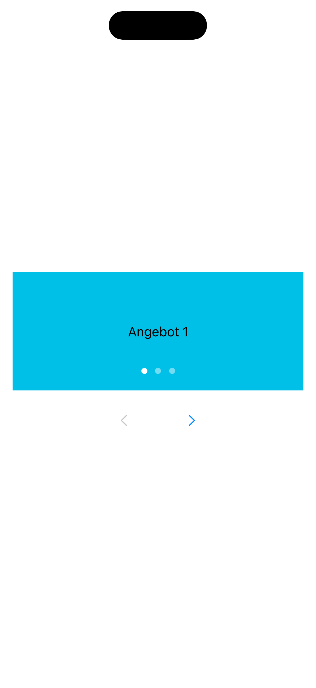
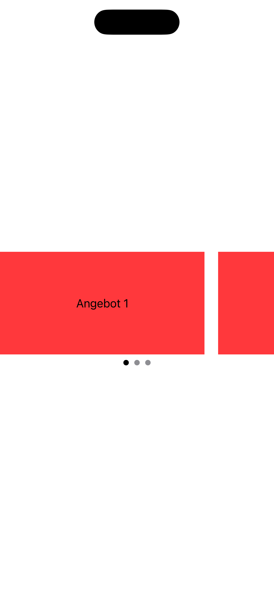

[← Zurück zur Übersicht](../README.md)

---

# 06: Karussel

Ausgewählte Sprache: Deutsch

Andere Sprachen: tbd

---

<details>
  <summary><b>Inhaltsverzeichnis Pattern</b> (Klicken zum Ausklappen)</summary>
  <br>

  * [Suche](01_search_de.md)
  * [Fußzeile & Kopfzeile](02_footer_header_de.md)
  * [Popup](03_modals_de.md)
  * [Tabs](04_tabs_de.md)
  * [Cards](05_cards_de.md)
  * Karussel <b>(Aktuell ausgewählt)</b>
  * [Gesten](07_gestures_de.md)
  * [Navigationsstruktur & Layout](08_navigation_layout_de.md)
  * [Filter](09_filtering_items_de.md)
  * [Eingabefehler](10_showing_input_error_de.md)

</details>

---

## 1. Kontext und Problemstellung

### Nutzungskontext
Karussele – z.B. als Image-Slider, Pager oder Banner-Rotator – präsentieren eine Reihe von Inhalten (meist Bilder, Teaser oder Cards) auf demselben visuellen Raum. Nutzende können sich sequenziell durch die Elemente wischen oder klicken. Da sich Inhalte hierbei teilweise außerhalb des sichtbaren Bildschirms befinden oder automatisch rotieren, bergen Karussele extrem hohe Barrieren, wenn sie nicht präzise für assistive Technologien optimiert werden.

### Typische Barrieren in der Praxis
* **Autoplay-Falle**: Automatisch rotierende Karussele, die sich nicht pausieren lassen, machen eine App für bestimmte Zielgruppen unbedienbar. Nutzende mit kognitiven Einschränkungen oder geringer Lesegeschwindigkeit werden gestresst, wenn der Text verschwindet, bevor sie ihn erfasst haben. Screenreader-Nutzende werden desorientiert, wenn sich der Inhalt unter ihrem Fokus plötzlich von alleine austauscht.
* **Unsichtbare Inhalte**: Befindet sich ein Element außerhalb des sichtbaren Bereichs, wird es von Screenreadern oft komplett ignoriert oder fälschlicherweise als fokussierbar erfasst, obwohl es visuell abgeschnitten ist. Ohne eine klare Ansage der Gesamtanzahl (z.B. „*Element 2 von 5*“) wissen blinde Nutzende nicht, dass weitere Inhalte existieren.
* **Unzugängliche Seitenindikatoren**: Die Page-Indicator-Punkte am unteren Rand eines Sliders werden oft als rein dekorative Elemente oder mit nicht-assistiven Custom-Views gebaut. Sie besitzen dann keine Rolle, kein Label und sind weder für Screenreader noch für externe Tastaturen ansteuerbar.
* **Wisch-Zwang**: Verlässt sich ein Karussel ausschließlich auf die Touch-Geste des horizontalen Wischens, schließt es Menschen mit motorischen Einschränkungen aus, die die App über Schaltersteuerung, Tastatur oder Eyetracker bedienen.

---

## 2. Relevante Richtlinien und Standards

Die folgende Tabelle zeigt den Zusammenhang zwischen technischen Erfolgskriterien der **WCAG 2.2** und der Regelung innerhalb von Kapitel 11 der **EN 301 549**.

| Barrierefreiheits-Anforderung | WCAG 2.2 Kriterium | EN 301 549 | Relevanz für das Karussel-Pattern |
| :--- | :--- | :--- | :--- |
| **Informationen & Beziehungen** | 1.3.1 Info and Relationships | 11.1.3.1 | Die Slider-Elemente müssen strukturell als zusammenhängende Gruppe oder Liste definiert sein. |
| **Automatisches Aktualisieren** | 2.2.2 Pause, Stop, Hide | 11.2.2.2 | Jedes Karussel, das automatisch startet und länger als 5 Sekunden rotiert, MUSS einen gut erreichbaren Pause-Button besitzen. |
| **Kontrast (Minimum)** | 1.4.3 Contrast (Minimum) | 11.1.4.3 | Der Text auf der Info muss sich vom Hintergrund abheben (mind. 4,5:1). Text auf Bild-Overlays benötigt oft schattierte Hintergründe. |
| **Text vergrößern** | 1.4.4 Resize Text | 11.1.4.4 | Karussele dürfen keine feste Höhe haben. Bei Dynamic Type muss das Karussel vertikal mitwachsen, ohne Text abzuschneiden oder zu überlagern. |
| **Nicht-Text-Kontrast** | 1.4.11 Non-Text Contrast | 11.1.4.11 | Der Kontrast der Rahmenlinien zum Hintergrund muss mindestens 3:1 betragen. |
| **Tastatur-Bedienbarkeit** | 2.1.1 Keyboard | 11.2.1.1 | Der Folienwechsel muss über Tastatur (z.B. Pfeiltasten oder explizite Vor-/Zurück-Buttons) möglich sein. |
| **Fokus-Reihenfolge** | 2.4.3 Focus Order | 11.2.4.3 | Elemente außerhalb des sichtbaren Bildschirms dürfen erst in die Fokus-Reihenfolge gelangen, wenn sie aktiv hineingescrollt wurden. |
| **Fokus sichtbar** | 2.4.7 Focus Visible | 11.2.4.7 | Beim Fokussieren eines Inhaltes per Tastatur muss diese  Info einen deutlich erkennbaren Fokusrahmen erhalten. |
| **Zeigergesten** | 2.5.1 Pointer Gestures | 11.2.5.1 | Wenn das Karussel eine Wisch-Geste unterstützt, muss das Vor- und Zurückblättern auch über eine einfache Zeigerinteraktion möglich sein. |
| **Zielgröße (Minimum)** | 2.5.8 Target Size (Min) | 11.2.5.8 | Visuelle Steuerungselemente (Pfeile, Punkte, Pause-Button) benötigen eine Touch-Fläche von mind. 44x44pt. |
| **Name, Rolle, Wert** | 4.1.2 Name, Role, Value | 11.4.1.2 | Der aktuelle Zustand (z.B. „Folie 1 von 4“) und die Steuerungsknöpfe müssen eindeutige Namen und Rollen besitzen. |

---

## 3. Design-Spezifikationen (UI/UX)

### Visuelle Gestaltung und Kontraste
* **Explizite Navigationselemente**: Nicht auf Gesten verlassen. Ein barrierefreies Karussel benötigt visuelle Vor- und Zurück-Buttons oder klar definierte, klickbare Seitenindikatoren, damit die Steuerung präzise und barrierefrei bleibt.
* **Kontrast der Indikatoren**: Die Page-Indicator-Punkte müssen einen Kontrast von mindestens 3:1 zum Hintergrund aufweisen. Der aktive Punkt muss sich zusätzlich durch Form, Größe oder einen deutlich stärkeren Kontrast (z.B. 4,5:1 beim Text-Label) von den inaktiven Punkten abheben.
* **Visueller Pause-Button**: Wenn Autoplay aktiv ist, muss ein dauerhaft sichtbarer Pause-Button angeboten werden. Alternativ muss die Rotation dauerhaft stoppen, sobald der Screenreader-Fokus das Karussel betritt oder ein Nutzer die Komponente berührt.

### Interaktionsdesign und Touch-Targets
* **Umgang mit Klickflächen**: Da die Indikator-Punkte visuell oft sehr klein designt werden (z.B. 8x8 pt), muss ihre physische Touch-Fläche im Code unsichtbar auf mindestens 44x44 pt vergrößert werden. Alternativ empfiehlt es sich, die Punkte rein dekorativ zu schalten und stattdessen größere Pfeiltasten zu verwenden.
* **Barrierefreies Scroll-Verhalten**: Beim manuellen Wischen sollte das Karussel präzise auf dem nächsten Element einrasten, damit Inhalte nicht halb abgeschnitten am Bildschirmrand stehen bleiben.

### Empfohlene Fokus-Reihenfolge (Screenreader / Tastatur)
* **Fokus 1 (Karussel als Ganzes):** Beim Betreten des Karussels kündigt der Screenreader das Element idealerweise als Gruppe an: „*Karussell, Highlight-Themen*“.
* **Fokus 2 (Inhalt):** Der Fokus springt direkt auf das aktuell sichtbare Inhaltselement (z.B. die aktive Card). Der Screenreader liest den Inhalt vor und fügt die Positionsangabe hinzu: „*[Inhalt], Element 1 von 3*“.
* **Fokus 3 & 4 (Weitere Interaktionselemente):** Danach folgen die Buttons „Nächstes Element“, „Vorheriges Element“ und der optionale „Pause“-Button.
* **Ignorieren inaktiver Elemente:** Elemente, die sich aktuell unsichtbar außerhalb des Bildschirms befinden, werden komplett vom Fokus-Fluss ausgeschlossen (`accessibilityHidden(true)`), bis sie aktiv hineingescrollt werden.

---

## 4. Implementierung (SwiftUI)

### Good Pattern (Positivbeispiel)
Dieses Beispiel zeigt eine barrierefreie Implementierung. Es nutzt eine TabView im Page-Stil. Unsichtbare Seiten werden nativ vor dem Screenreader verborgen. Zusätzlich sind explizite, ausreichend große Buttons zur Steuerung verbaut, und das gesamte Konstrukt ist für den Screenreader als logische Gruppe erkennbar.

<figure>
  
  <figcaption>Abb. 6.1: Barrierefreie Implementierung des Karussels</figcaption>
</figure>

#### SwiftUI-Code:

```swift
import SwiftUI

struct GoodCarouselView: View {
    let items = ["Angebot 1", "Angebot 2", "Angebot 3"]
    @State private var currentIndex = 0

    var body: some View {
        VStack(spacing: 16) {
            // Native Page-TabView: Regelt Barrierefreiheit für Folien-Zustände automatisch
            TabView(selection: $currentIndex) {
                ForEach(items.indices, id: \.self) { index in
                    Text(items[index])
                        .frame(maxWidth: .infinity, maxHeight: .infinity)
                        .background(Color.cyan)
                        .tag(index)
                }
            }
            .tabViewStyle(.page(indexDisplayMode: .always))
            .frame(height: 150)
            // Zusammenfassen zu einer barrierefreien Gruppe
            .accessibilityElement(children: .combine)
            .accessibilityLabel("Karussell, Highlight-Themen. \(items[currentIndex]), Element \(currentIndex + 1) von \(items.count)")
            
            // Alternative Steuerungselemente (Pfeiltasten)
            HStack(spacing: 40) {
                Button(action: { if currentIndex > 0 { currentIndex -= 1 } }) {
                    Image(systemName: "chevron.left")
                        .frame(width: 44, height: 44) // Mindest-Touch-Fläche
                }
                .accessibilityLabel("Vorheriges Element")
                .disabled(currentIndex == 0)

                Button(action: { if currentIndex < items.count - 1 { currentIndex += 1 } }) {
                    Image(systemName: "chevron.right")
                        .frame(width: 44, height: 44)
                }
                .accessibilityLabel("Nächstes Element")
                .disabled(currentIndex == items.count - 1)
            }
        }
        .padding()
    }
}
```


### Bad Pattern (Negativbeispiel)
Dieses Beispiel zeigt eine mangelhafte Implementierung mittels HStack-ScrollView. Es zwingt zum Wischen, versteckt unsichtbare Elemente nicht vor dem VoiceOver und nutzt sehr kleine Custom-Punkte zur Steuerung abseits der Wischgesten.

<figure>
  
  <figcaption>Abb. 6.2: Barrierebehaftete Implementierung des Karussels</figcaption>
</figure>

#### SwiftUI-Code:

```swift
import SwiftUI

struct BadCarouselView: View {
    let items = ["Angebot 1", "Angebot 2", "Angebot 3"]
    @State private var currentIndex = 0

    var body: some View {
        VStack {
            ScrollViewReader { proxy in
                // BARRIERE: ScrollView fängt Fokus für inaktive Elemente ein, kein Einrasten
                ScrollView(.horizontal, showsIndicators: false) {
                    HStack(spacing: 20) {
                        ForEach(items.indices, id: \.self) { index in
                            Text(items[index])
                                .frame(width: 300, height: 150)
                                .background(Color.red)  // BARRIERE: Schlechter Kontrast
                                .id(index)
                        }
                    }
                }
                .onChange(of: currentIndex) { newValue in
                    withAnimation {
                        proxy.scrollTo(newValue, anchor: .center)
                    }
                }
            }
            
            // BARRIERE: Custom Page Indicator Punkte mit einer viel zu kleinen Größe (8x8)
            HStack {
                ForEach(items.indices, id: \.self) { index in
                    Circle()
                        .fill(currentIndex == index ? Color.black : Color.gray)
                        .frame(width: 8, height: 8)
                        .onTapGesture { 
                            currentIndex = index // Ändert jetzt den Index beim Klicken
                        }
                }
            }
        }
    }
}
```

---

## 5. Implementierung (Kotlin)
Wird noch erstellt...

---

## 6. Quellen und weiterführende Links

* **Internationale Standards:**
  * [WCAG 2.2 Richtlinien (W3C)](https://www.w3.org/TR/WCAG2) – Web Content Accessibility Guidelines.
  * [EN 301 549 Standard (ETSI)](https://www.etsi.org/deliver/etsi_en/301500_301599/301549/03.02.01_60/en_301549v030201p.pdf) – Europäische Norm für Barrierefreiheitsanforderungen.

* **Apple Human Interface Guidelines (HIG):**
  * [Apple HIG – Accessibility](https://developer.apple.com/design/human-interface-guidelines/accessibility) – Grundlagen für inklusive und intuitive Plattform-Interaktionen.
  * [Apple HIG – Page controls](https://developer.apple.com/design/human-interface-guidelines/page-controls) – Richtlinien für die Verwendung und das barrierefreie Verhalten von Seitenindikatoren (Dots).
  * [Apple HIG – Scroll views](https://developer.apple.com/design/human-interface-guidelines/scroll-views) – Best Practices für die Handhabung von Inhalten außerhalb des sichtbaren Bereichs.
  * [Apple HIG - Gestures](https://developer.apple.com/design/human-interface-guidelines/gestures) - Richtlinien für den Einsatz von Gesten zur Bedienung von Elementen.

* **Pattern-Referenz:**
  * https://www.checklist.design - Hauptseite
  * https://www.checklist.design/design-system/carousel - Karussel Pattern
    
---

[← Zurück zur Übersicht](../README.md) | [↑ Nach oben springen](#01_suche)
