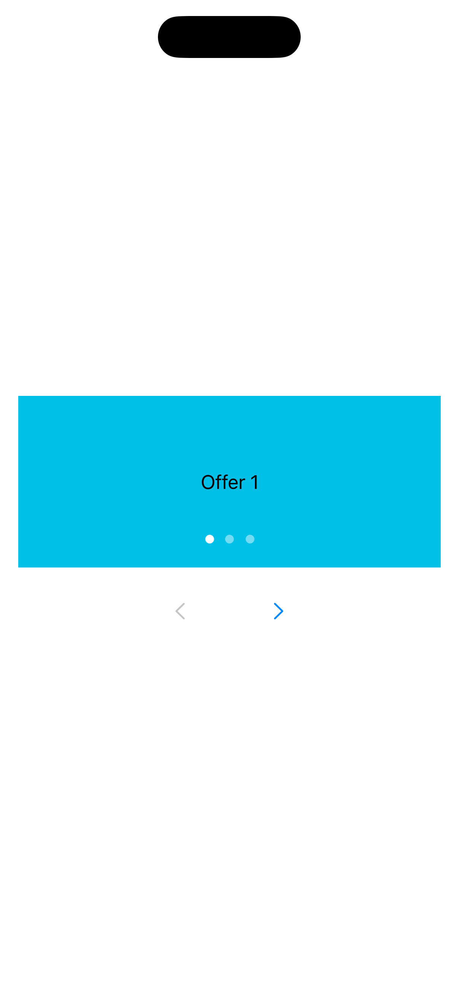
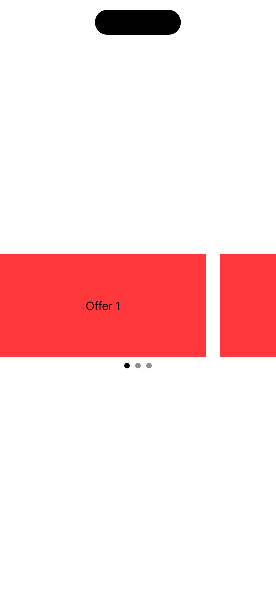

[← Back to overview](../README_en.md)

---

# 06: Carousel

Selected Language: English

Other Languages: [German](06_carousel_de.md)

---

<details>
  <summary><b>Pattern Table of Contents</b> (Click to expand)</summary>
  <br>

  * [Search](01_search_en.md)
  * [Footer & Header](02_footer_header_en.md)
  * [Popup](03_modals_en.md)
  * [Tabs](04_tabs_en.md)
  * [Cards](05_cards_en.md)
  * Carousel <b>(Currently selected)</b>
  * [Gestures](07_gestures_en.md)
  * [Navigation Structure & Layout](08_navigation_layout_en.md)
  * [Filtering](09_filtering_items_en.md)
  * [Input Errors](10_showing_input_error_en.md)

</details>

---

## 1. Context and Problem Statement

### Usage  Context
Carousels – e.g. as image sliders, pagers, or banner rotators – present a series of content items (mostly images, teasers, or cards) within the same visual space. Users can swipe or click sequentially through the elements. Because parts of the content reside off-screen or rotate automatically, carousels carry extremely high accessibility barriers unless they are precisely optimized for assistive technologies.

### Typical Practical Barriers
* **Autoplay Trap**: Automatically rotating carousels that cannot be paused render an app unusable for certain target groups. Users with cognitive impairments or lower reading speeds get stressed when text disappears before they can process it. Screen reader users become disoriented when content under their focus suddenly updates on its own.
* **Invisible Content**: When an element is located outside the visible viewport, screen readers often ignore it entirely or incorrectly treat it as focusable even though it is visually clipped. Without a clear announcement of the total count (e.g., "*Element 2 of 5*"), blind users are unaware that additional content exists.
* **Inaccessible Page Indicators**: The page indicator dots at the bottom of a slider are often built as purely decorative elements or using non-accessible custom views. Consequently, they lack proper roles, labels, and cannot be reached via screen readers or external keyboards.
* **Mandatory Swiping**: Relying exclusively on horizontal swipe touch gestures excludes individuals with motor impairments who operate the app via switch control, keyboard, or eye trackers.

---

## 2. Relevant Guidelines and Standards

The following table shows the relationship between technical success criteria of **WCAG 2.2** and the corresponding regulations in Chapter 11 of **EN 301 549**.

| Accessibility Requirement | WCAG 2.2 Criterion | EN 301 549 | Relevance for the Carousel Pattern |
| :--- | :--- | :--- | :--- |
| **Info and Relationships** | 1.3.1 Info and Relationships | 11.1.3.1 | Slider elements must be structurally defined as a cohesive group or list. |
| **Pause, Stop, Hide** | 2.2.2 Pause, Stop, Hide | 11.2.2.2 | Any carousel that starts automatically and rotates for longer than 5 seconds MUST provide an easily accessible pause button. |
| **Contrast (Minimum)** | 1.4.3 Contrast (Minimum) | 11.1.4.3 | Text on the item must contrast sufficiently with the background (at least 4.5:1). Text on image overlays often requires shaded backgrounds. |
| **Resize Text** | 1.4.4 Resize Text | 11.1.4.4 | Carousels must not have fixed heights. With Dynamic Type, the carousel must expand vertically without clipping or overlapping text. |
| **Non-Text Contrast** | 1.4.11 Non-Text Contrast | 11.1.4.11 | Border lines and graphical controls must maintain a contrast ratio of at least 3:1 against the background. |
| **Keyboard** | 2.1.1 Keyboard | 11.2.1.1 | Slide transitions must be operable via keyboard (e.g., arrow keys or explicit previous/next buttons). |
| **Focus Order** | 2.4.3 Focus Order | 11.2.4.3 | Off-screen elements must only enter the focus order once actively scrolled into view. |
| **Focus Visible** | 2.4.7 Focus Visible | 11.2.4.7 | When focusing an item via keyboard, the item must receive a clearly recognizable visual focus indicator. |
| **Pointer Gestures** | 2.5.1 Pointer Gestures | 11.2.5.1 | If the carousel supports a swipe gesture, forward and backward navigation must also be possible via simple pointer interaction. |
| **Target Size (Minimum)** | 2.5.8 Target Size (Min) | 11.2.5.8 | Visual controls (arrows, dots, pause button) require a minimum touch target size of at least 44x44 pt. |
| **Name, Role, Value** | 4.1.2 Name, Role, Value | 11.4.1.2 | The current state (e.g., "Slide 1 of 4") and control buttons must possess explicit names and roles. |

---

## 3. Design Specifications (UI/UX)

### Visual Design and Contrast
* **Explicit Navigation Controls**: Do not rely solely on gestures. An accessible carousel requires visual previous/next buttons or clearly defined, clickable page indicators to keep controls precise and accessible.
* **Indicator Contrast**: Page indicator dots must have a contrast ratio of at least 3:1 against the background. The active dot must additionally stand out from inactive dots through shape, size, or significantly higher contrast (e.g., 4.5:1 for text labels).
* **Visual Pause Button**: If autoplay is enabled, a permanently visible pause button must be offered. Alternatively, auto-rotation must stop permanently as soon as screen reader focus enters the carousel or a user interacts with the component.

### Interaction Design and Touch Targets
* **Touch Target Sizing**: Since indicator dots are often visually designed very small (e.g., 8x8 pt), their physical touch area must be extended invisibly in code to at least 44x44 pt. Alternatively, it is recommended to render dots as purely decorative and provide larger arrow buttons instead.
* **Accessible Scroll Behavior**: During manual swiping, the carousel should snap precisely onto the next element so that content is not left partially clipped at the screen boundary.

### Recommended Focus Order (Screen Reader / Keyboard)
* **Focus 1 (Carousel as a whole):** Upon entering the carousel, the screen reader ideally announces the element as a group: "*Carousel, Highlight topics*".
* **Focus 2 (Content):** Focus jumps directly to the currently visible content item (e.g., the active card). The screen reader reads out the content and adds positional context: "*[Content], Item 1 of 3*".
* **Focus 3 & 4 (Additional Controls):** Followed by the "Next item", "Previous item", and optional "Pause" buttons.
* **Ignore Inactive Items:** Elements currently positioned off-screen are entirely excluded from the focus order (`accessibilityHidden(true)`) until scrolled into view.

---

## 4. Implementation (SwiftUI)

### Good Pattern
This example demonstrates an accessible implementation. It utilizes a page-style `TabView`. Off-screen pages are natively hidden from the screen reader. In addition, explicit, sufficiently sized control buttons are implemented, and the entire component is exposed to the screen reader as a logical group.

<figure>
  
  <figcaption>Fig. 6.1: Accessible implementation of the carousel</figcaption>
</figure>

#### SwiftUI Code:

```swift
import SwiftUI

struct GoodCarouselView: View {
    let items = ["Offer 1", "Offer 2", "Offer 3"]
    @State private var currentIndex = 0

    var body: some View {
        VStack(spacing: 16) {
            // Native Page TabView: Handles accessibility for slide states automatically
            TabView(selection: $currentIndex) {
                ForEach(items.indices, id: \.self) { index in
                    Text(items[index])
                        .frame(maxWidth: .infinity, maxHeight: .infinity)
                        .background(Color.cyan)
                        .tag(index)
                }
            }
            .tabViewStyle(.page(indexDisplayMode: .always))
            .frame(height: 150)
            // Combine into an accessible group
            .accessibilityElement(children: .combine)
            .accessibilityLabel("Carousel, Highlight topics. \(items[currentIndex]), Item \(currentIndex + 1) of \(items.count)")
            
            // Alternative control elements (Arrow buttons)
            HStack(spacing: 40) {
                Button(action: { if currentIndex > 0 { currentIndex -= 1 } }) {
                    Image(systemName: "chevron.left")
                        .frame(width: 44, height: 44) // Minimum touch target size
                }
                .accessibilityLabel("Previous item")
                .disabled(currentIndex == 0)

                Button(action: { if currentIndex < items.count - 1 { currentIndex += 1 } }) {
                    Image(systemName: "chevron.right")
                        .frame(width: 44, height: 44)
                }
                .accessibilityLabel("Next item")
                .disabled(currentIndex == items.count - 1)
            }
        }
        .padding()
    }
}
```

### Bad Pattern
This example demonstrates a flawed implementation using an `HStack`-based `ScrollView`. It forces swiping, fails to hide off-screen elements from VoiceOver, and relies on undersized custom dots placed outside standard gesture patterns.

<figure>
  
  <figcaption>Fig. 6.2: Inaccessible implementation of the carousel</figcaption>
</figure>

#### SwiftUI Code:

```swift
import SwiftUI

struct BadCarouselView: View {
    let items = ["Offer 1", "Offer 2", "Offer 3"]
    @State private var currentIndex = 0

    var body: some View {
        VStack {
            ScrollViewReader { proxy in
                // BARRIER: ScrollView traps focus for inactive elements, no snapping
                ScrollView(.horizontal, showsIndicators: false) {
                    HStack(spacing: 20) {
                        ForEach(items.indices, id: \.self) { index in
                            Text(items[index])
                                .frame(width: 300, height: 150)
                                .background(Color.red)  // BARRIER: Poor contrast
                                .id(index)
                        }
                    }
                }
                .onChange(of: currentIndex) { newValue in
                    withAnimation {
                        proxy.scrollTo(newValue, anchor: .center)
                    }
                }
            }
            
            // BARRIER: Custom page indicator dots with an undersized frame (8x8)
            HStack {
                ForEach(items.indices, id: \.self) { index in
                    Circle()
                        .fill(currentIndex == index ? Color.black : Color.gray)
                        .frame(width: 8, height: 8)
                        .onTapGesture { 
                            currentIndex = index // Changes index on tap
                        }
                }
            }
        }
    }
}
```

---

## 5. Implementation (Kotlin)
To be created...

---

## 6. Sources and Further Reading

* **International Standards:**
  * [WCAG 2.2 Guidelines (W3C)](https://www.w3.org/TR/WCAG2) – Web Content Accessibility Guidelines.
  * [EN 301 549 Standard (ETSI)](https://www.etsi.org/deliver/etsi_en/301500_301599/301549/03.02.01_60/en_301549v030201p.pdf) – European norm for accessibility requirements for ICT products and services.

* **Apple Human Interface Guidelines (HIG):**
  * [Apple HIG – Accessibility](https://developer.apple.com/design/human-interface-guidelines/accessibility) – Fundamentals for inclusive and intuitive platform interactions.
  * [Apple HIG – Page controls](https://developer.apple.com/design/human-interface-guidelines/page-controls) – Guidelines for usage and accessible behavior of page indicators (dots).
  * [Apple HIG – Scroll views](https://developer.apple.com/design/human-interface-guidelines/scroll-views) – Best practices for managing off-screen content.
  * [Apple HIG – Gestures](https://developer.apple.com/design/human-interface-guidelines/gestures) – Guidelines for using gestures to operate interface elements.

* **Pattern References:**
  * https://www.checklist.design – Main page
  * https://www.checklist.design/design-system/carousel – Carousel Pattern

---

[← Back to overview](../README_en.md) | [↑ Back to top](#06-carousel)
