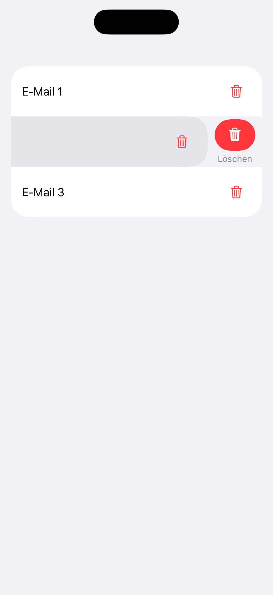
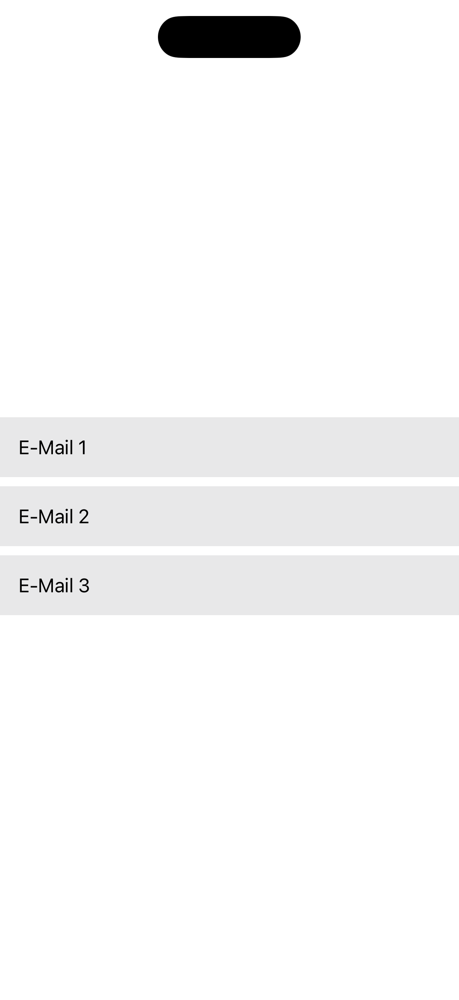

# 07: Gesten

[← Zurück zur Übersicht](../README.md)

Ausgewählte Sprache: Deutsch

Andere Sprachen: tbd

---

<details>
  <summary><b>Inhaltsverzeichnis Pattern</b> (Klicken zum Ausklappen)</summary>
  <br>

  * [Suche](01_search_de.md)
  * [Fußzeile & Kopfzeile](02_footer_header_de.md)
  * [Popup](03_modals_de.md)
  * [Tabs](04_tabs_de.md)
  * [Cards](05_cards_de.md)
  * [Karussel](06_carousel_de.md)
  * Gesten <b>(Aktuell ausgewählt)</b>
  * [Navigationsstruktur & Layout](08_navigation_layout_de.md)
  * [Filter](09_filtering_items_de.md)
  * [Eingabefehler](10_showing_input_error_de.md)

</details>

---

## 1. Kontext und Problemstellung

### Nutzungskontext
Moderne mobile Betriebssysteme und Anwendungen setzen stark auf Touch-Gesten, um die Bedienung intuitiver und flüssiger zu gestalten. Typische Beispiele sind das Wischen zum Löschen einer Tabellenzeile, das Auf- und Zuziehen bei Karten oder Bildern, langes Drücken für Kontextmenüs oder zweidimensionale Drag-and-Drop-Aktionen. Gesten bieten zwar Abkürzungen für erfahrene Nutzer, sie dürfen jedoch niemals der einzige Weg sein, um eine Funktion auszulösen. Für Menschen, die auf assistive Technologien oder physische Hilfsmittel angewiesen sind, stellen komplexe Gesten oft unüberwindbare Barrieren dar.

### Typische Barrieren in der Praxis
* **Gesten-Ausschluss**: Menschen mit motorischen Einschränkungen können komplexe Pfade, Mehrfinger-Gesten oder zeitkritische Interaktionen oft nicht präzise ausführen. Wenn das Löschen einer Mail ausschließlich per Swipe-Geste funktioniert, bleibt die Funktion für sie unerreichbar.
* **Gesten-Konflikte mit dem Screenreader**: Wenn der Screenreader aktiv ist, verändert das Betriebssystem die Standard-Gestenarchitektur. Ein Wischen nach links oder rechts navigiert nun den unsichtbaren Fokus von Element zu Element. Eigene, in der App programmierte Wisch-Gesten (z.B. um ein Menü hineinzuziehen) werden vom Screenreader „abgefangen“ und funktionieren nicht mehr.
* **Fehlender Abbruch-Mechanismus**: Wenn eine Aktion sofort beim ersten Kontakt (`Touch Down`) und nicht erst beim Loslassen (`Touch Up`) ausgelöst wird, kommt es bei motorisch eingeschränkten Nutzenden zu Fehlbedienungen. Es fehlt die Möglichkeit, den Finger vor dem Loslassen wegzuziehen, um die Aktion abzubrechen.
* **Unbeabsichtigtes Auslösen durch Schütteln**: Manche Apps bieten Funktionen wie „Schütteln zum Melden eines Fehlers“ oder „Schütteln zum Rückgängigmachen“. Nutzer, die ihr Smartphone in einer Rollstuhlhalterung fixiert haben oder starke unwillkürliche Muskelbewegungen aufweisen, lösen diese Funktionen unabsichtlich aus.

---

## 2. Relevante Richtlinien und Standards

Die folgende Tabelle zeigt den Zusammenhang zwischen technischen Erfolgskriterien der **WCAG 2.2** und der Regelung innerhalb von Kapitel 11 der **EN 301 549**.

| Barrierefreiheits-Anforderung | WCAG 2.2 Kriterium | EN 301 549 | Relevanz für das Gesten-Pattern |
| :--- | :--- | :--- | :--- |
| **Zeigergesten** | 2.5.1 Pointer Gestures | 11.2.5.1 | Multipoint- oder pfadbasierte Gesten müssen alternativ durch eine einfache Zeigerinteraktion (Tippen/Klicken) bedienbar sein. |
| **Zeigerunterbrechung** | 2.5.2 Pointer Cancellation | 11.2.5.2 | Interaktionen dürfen erst beim `Up`-Event (Loslassen) final ausgelöst werden. Ein Abbruch durch Wegziehen des Fingers muss möglich sein. |
| **Bewegungsaktivierung** | 2.5.4 Motion Actuation | 11.2.5.4 | Durch Geräteschütteln oder Neigen ausgelöste Funktionen müssen abschaltbar sein und alternativ über klassische UI-Buttons bereitstehen. |
| **Ziehbewegung** | 2.5.7 Dragging Movements | 11.2.5.7 | Jede Aktion, die eine Ziehbewegung erfordert, muss auch durch eine einfache Zeigerinteraktion möglich sein. |
| **Zielgröße (Minimum)** | 2.5.8 Target Size (Min) | 11.2.5.7 | Es muss eine Midestgröße von 24x24 CSS-Pixeln für Ziele aufgewiesen werden. |
| **Tastatur-Bedienbarkeit** | 2.1.1 Keyboard | 11.2.1.1 | Jede über eine Geste erreichbare Kernfunktion muss auch mit einer externen Tastatur oder einem Switch-Control-Gerät auslösbar sein. |
| **Name, Rolle, Wert** | 4.1.2 Name, Role, Value | 11.4.1.2 | Wenn Gesten Kontextmenüs oder Zustandsänderungen bewirken, müssen diese Änderungen sofort über die Accessibility-API gemeldet werden. |

---

## 3. Design-Spezifikationen (UI/UX)

### Visuelle Gestaltung und Alternativen
* **Zwei-Wege-Prinzip**: Für jede Geste, die über ein einfaches Tippen hinausgeht, muss es eine sichtbare, alternative Steuerungskomponente geben.
  * **Beispiel Swipe-to-Delete**: Die Zeile kann gewischt werden, besitzt aber zusätzlich ein permanent sichtbares „Drei-Punkte-Menü“, in dem sich die Aktion „Löschen“ barrierefrei per Klick auswählen lässt.
  * **Beispiel Drag-and-Drop**: Elemente in einer Liste können verschoben werden, besitzen aber zusätzlich Pfeiltasten nach oben/unten oder ein Menü „Nach oben verschieben“.
* **Deaktivierung von Bewegungssensoren**: Bietet die App Funktionalitäten via Geräteschütteln oder Kamera-Gesten, muss in den App-Einstellungen zwingend ein Schalter integriert werden, um diese Sensorik vollständig zu deaktivieren.

### Interaktionsdesign und Touch-Targets
* **Verwendung von Touch-Up-Events**: Interaktionen grundsätzlich so programmieren, dass das System die Aktion beim Loslassen des Fingers (`onTapGesture` oder `Touch Up Inside`) verarbeitet. Befindet sich der Finger beim Loslassen außerhalb der ursprünglichen Klickfläche, wird das Event verworfen.
* **Erweiterte Barrierefreiheits-Aktionen**: Für Screenreader-Nutzende müssen Gesten in die nativen „Accessibility Actions“ übersetzt werden. Anstatt auf einer Zeile zu wischen, führt ein Wischen mit dem Finger nach oben oder unten im Screenreader-Modus durch die verfügbaren Aktionen (z.B. „Aktivieren“, „Löschen“, „Bearbeiten“).

### Empfohlene Fokus-Reihenfolge (Screenreader / Tastatur)
* **Fokus 1 (Steuerelement):** Der Fokus landet auf dem Element, welches eine Geste unterstützt (z.B. eine Tabellenzeile).
* **Fokus 2 (Aktionen):** Der Screenreader kündigt dem Nutzer sofort akustisch an, dass alternative Aktionen verfügbar sind: *"[Inhalt der Zeile], Aktionen verfügbar. Wischen Sie nach oben oder unten, um eine Aktion auszuwählen."*
* **Fokus 3 (Auswahl ohne visuelle Geste):** Der blinde oder motorisch eingeschränkte Nutzer navigiert durch wiederholtes Wischen nach oben/unten durch die Optionen (z.B. „Löschen“) und löst diese mit einem einfachen Doppeltippen barrierefrei aus, ohne die physische Wisch-Geste jemals auszuführen.

---

## 4. Implementierung (SwiftUI)

### Good Pattern (Positivbeispiel)
Dieses Beispiel nutzt die nativen SwiftUI-Listenmechanismen. Dadurch wird die Wisch-Geste automatisch in eine barrierefreie VoiceOver-Aktion übersetzt. Zusätzlich wird das Zwei-Wege-Prinzip über einen dauerhaft sichtbaren, ausreichend großen Button bedient.

<figure>
  
  <figcaption>Abb. 7.1: Barrierefreie Implementierung von Gesten</figcaption>
</figure>

#### SwiftUI-Code:

```swift
import SwiftUI

struct GoodGestureView: View {
    @State private var items = ["E-Mail 1", "E-Mail 2", "E-Mail 3"]

    var body: some View {
        List {
            ForEach(items, id: \.self) { item in
                HStack {
                    Text(item)
                    Spacer()
                    
                    // Einfache Klick-Alternative zum Ziehen/Wischen
                    Button(action: { deleteItem(item) }) {
                        Image(systemName: "trash")
                            .foregroundColor(.red)
                            .frame(width: 44, height: 44) // WCAG 2.5.8: Erfüllt Mindest-Touch-Größe
                    }
                    .buttonStyle(.plain)
                    .accessibilityLabel("\(item) löschen") // WCAG 4.1.2: Eindeutiger Name
                }
                // Nativer Swipe: Übersetzt die Geste für VoiceOver automatisch in "Aktionen verfügbar"
                .swipeActions(edge: .trailing) {
                    Button(role: .destructive) {
                        deleteItem(item)
                    } label: {
                        Label("Löschen", systemImage: "trash")
                    }
                }
            }
        }
    }

    private func deleteItem(_ item: String) {
        items.removeAll { $0 == item }
    }
}
```


### Bad Pattern (Negativbeispiel)
Dieses Beispiel implementiert das Wischen über eine selbstgebaute Drag-Geste. Es zwingt motorisch eingeschränkte Nutzende zu einer komplexen Pfadbewegung, bricht bei aktivem VoiceOver komplett und löst fälschlicherweise sofort beim ersten Kontakt aus.

<figure>
  
  <figcaption>Abb. 7.2: Barrierebehaftete Implementierung von Gesten</figcaption>
</figure>

#### SwiftUI-Code:

```swift
import SwiftUI

struct BadGestureView: View {
    @State private var items = ["E-Mail 1", "E-Mail 2", "E-Mail 3"]
    @State private var dragOffset: CGFloat = 0

    var body: some View {
        VStack {
            ForEach(items, id: \.self) { item in
                HStack {
                    Text(item)
                    Spacer()
                }
                .frame(maxWidth: .infinity)
                .padding()
                .background(Color.gray.opacity(0.2))
                .offset(x: dragOffset)
                .gesture(
                    // BARRIERE: Komplexe Drag-Geste schließt motorisch eingeschränkte Menschen aus.
                    // BARRIERE: Funktioniert nicht mit VoiceOver, da Wischgesten vom Screenreader abgefangen werden.
                    DragGesture()
                        .onChanged { value in
                            // BARRIERE: Aktion reagiert sofort auf Bewegung statt auf das Loslassen.
                            if value.translation.width < -100 {
                                items.removeAll { $0 == item }
                            }
                        }
                )
            }
        }
    }
}
}
```

---

## 5. Implementierung (Kotlin)
Wird noch erstellt...

---

## 6. Quellen und weiterführende Links

* **Internationale Standards:**
  * [WCAG 2.2 Richtlinien (W3C)](https://www.w3.org/TR/WCAG2) – Web Content Accessibility Guidelines.
  * [EN 301 549 Standard (ETSI)](https://www.etsi.org/deliver/etsi_en/301500_301599/301549/03.02.01_60/en_301549v030201p.pdf) – Europäische Norm für Barrierefreiheitsanforderungen.

* **Apple Human Interface Guidelines (HIG):**
  * [Apple HIG – Accessibility](https://developer.apple.com/design/human-interface-guidelines/accessibility) – Grundlagen für inklusive und intuitive Plattform-Interaktionen.
  * [Apple HIG - Gestures](https://developer.apple.com/design/human-interface-guidelines/gestures) - Richtlinien für den Einsatz von Gesten zur Bedienung von Elementen.

---

[← Zurück zur Übersicht](../README.md) | [↑ Nach oben springen](#01_suche)
