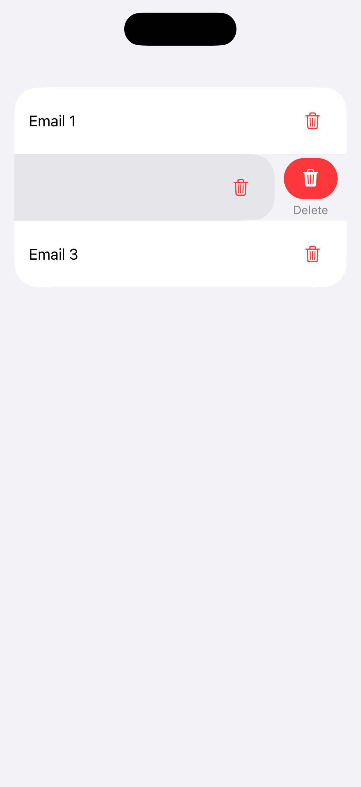
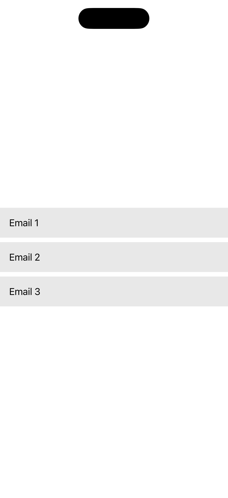

[← Back to Overview](../README_en.md)

---

# 07: Gestures

Selected Language: English

Other Languages: [German](07_gestures_de.md)

---

<details>
  <summary><b>Pattern Table of Contents</b> (Click to expand)</summary>
  <br>

  * [Search](01_search_en.md)
  * [Footer & Header](02_footer_header_en.md)
  * [Popup](03_modals_en.md)
  * [Tabs](04_tabs_en.md)
  * [Cards](05_cards_en.md)
  * [Carousel](06_carousel_en.md)
  * Gestures <b>(Currently Selected)</b>
  * [Navigation Structure & Layout](08_navigation_layout_en.md)
  * [Filter](09_filtering_items_en.md)
  * [Input Error](10_showing_input_error_en.md)

</details>

---

## 1. Context and Problem Statement

### Usage Context
Modern mobile operating systems and applications rely heavily on touch gestures to make interaction more intuitive and fluid. Typical examples include swiping to delete a table row, pinching to zoom on maps or images, long-pressing for context menus, or two-dimensional drag-and-drop actions. While gestures offer shortcuts for experienced users, they must never be the only way to trigger a function. For people who rely on assistive technologies or physical aids, complex gestures often present insurmountable barriers.

### Typical Practical Barriers
* **Gesture Exclusion**: People with motor impairments often cannot precisely perform complex paths, multi-finger gestures, or time-sensitive interactions. If deleting an email works exclusively via a swipe gesture, the function remains inaccessible to them.
* **Gesture Conflicts with the Screen Reader**: When a screen reader is active, the operating system changes the default gesture architecture. Swiping left or right now navigates the invisible focus from element to element. Custom swipe gestures programmed into the app (e.g., to slide in a menu) are intercepted by the screen reader and no longer work.
* **Lack of Cancellation Mechanism**: If an action is triggered immediately upon initial contact (`Touch Down`) rather than upon release (`Touch Up`), users with motor impairments experience accidental activations. There is no opportunity to drag the finger away before releasing to cancel the action.
* **Unintentional Activation through Shaking**: Some apps offer features such as "Shake to report a bug" or "Shake to undo". Users who have their smartphone secured in a wheelchair mount or who experience strong involuntary muscle movements trigger these functions unintentionally.

---

## 2. Relevant Guidelines and Standards

The following table shows the relationship between technical success criteria of **WCAG 2.2** and the regulations within Chapter 11 of **EN 301 549**.

| Accessibility Requirement | WCAG 2.2 Criterion | EN 301 549 | Relevance to the Gesture Pattern |
| :--- | :--- | :--- | :--- |
| **Pointer Gestures** | 2.5.1 Pointer Gestures | 11.2.5.1 | Multipoint or path-based gestures must be operably accessible through an alternative simple pointer interaction (tap/click). |
| **Pointer Cancellation** | 2.5.2 Pointer Cancellation | 11.2.5.2 | Interactions must only be finally triggered on the `Up` event (release). Aborting by dragging the finger away must be possible. |
| **Motion Actuation** | 2.5.4 Motion Actuation | 11.2.5.4 | Functions triggered by device shaking or tilting must be capable of being turned off and made available alternatively via classic UI buttons. |
| **Dragging Movements** | 2.5.7 Dragging Movements | 11.2.5.7 | Any action requiring a dragging movement must also be possible through a simple pointer interaction. |
| **Target Size (Minimum)** | 2.5.8 Target Size (Min) | 11.2.5.7 | Targets must have a minimum size of 24x24 CSS pixels. |
| **Keyboard Accessibility** | 2.1.1 Keyboard | 11.2.1.1 | Every core function reachable via a gesture must also be triggerable with an external keyboard or switch control device. |
| **Name, Role, Value** | 4.1.2 Name, Role, Value | 11.4.1.2 | If gestures trigger context menus or state changes, these changes must be reported immediately via the Accessibility API. |

---

## 3. Design Specifications (UI/UX)

### Visual Design and Alternatives
* **Two-Way Principle**: For every gesture beyond simple tapping, there must be a visible, alternative control component.
  * **Swipe-to-Delete Example**: The row can be swiped, but additionally features a permanently visible "three-dot menu" where the "Delete" action can be selected accessibly via click.
  * **Drag-and-Drop Example**: Items in a list can be moved, but additionally feature up/down arrow buttons or a "Move Up" menu option.
* **Deactivation of Motion Sensors**: If the app provides functionality via device shaking or camera gestures, a toggle must be integrated in the app settings to completely disable these sensors.

### Interaction Design and Touch Targets
* **Use of Touch-Up Events**: Program interactions so that the system processes the action upon releasing the finger (`onTapGesture` or `Touch Up Inside`). If the finger is outside the original click area upon release, the event is discarded.
* **Custom Accessibility Actions**: For screen reader users, gestures must be translated into native "Accessibility Actions". Instead of swiping on a row, swiping up or down with a finger in screen reader mode cycles through the available actions (e.g., "Activate", "Delete", "Edit").

### Recommended Focus Order (Screen Reader / Keyboard)
* **Focus 1 (Control Element):** Focus lands on the element that supports a gesture (e.g., a table row).
* **Focus 2 (Actions):** The screen reader immediately announces audibly that alternative actions are available: *"[Row content], actions available. Swipe up or down to select an action."*
* **Focus 3 (Selection without Visual Gesture):** The blind or motor-impaired user navigates through repeated up/down swipes through the options (e.g., "Delete") and triggers them accessibly with a simple double-tap, without ever executing the physical swipe gesture.

---

## 4. Implementation (SwiftUI)

### Good Pattern
This example uses native SwiftUI list mechanisms. As a result, the swipe gesture is automatically translated into an accessible VoiceOver action. Additionally, the two-way principle is served via a permanently visible, sufficiently sized button.

<figure>
  
  <figcaption>Fig. 7.1: Accessible implementation of gestures</figcaption>
</figure>

#### SwiftUI Code:

```swift
import SwiftUI

struct GoodGestureView: View {
    @State private var items = ["Email 1", "Email 2", "Email 3"]

    var body: some View {
        List {
            ForEach(items, id: \.self) { item in
                HStack {
                    Text(item)
                    Spacer()
                    
                    // Simple click alternative to dragging/swiping
                    Button(action: { deleteItem(item) }) {
                        Image(systemName: "trash")
                            .foregroundColor(.red)
                            .frame(width: 44, height: 44) // WCAG 2.5.8: Meets minimum touch size
                    }
                    .buttonStyle(.plain)
                    .accessibilityLabel("Delete \(item)") // WCAG 4.1.2: Clear name
                }
                // Native swipe: Automatically translates the gesture for VoiceOver into "actions available"
                .swipeActions(edge: .trailing) {
                    Button(role: .destructive) {
                        deleteItem(item)
                    } label: {
                        Label("Delete", systemImage: "trash")
                    }
                }
            }
        }
    }

    private func deleteItem(_ item: String) {
        items.removeAll { $0 == item }
    }
}
```


### Bad Pattern
This example implements swiping via a custom-built drag gesture. It forces motor-impaired users to perform a complex path movement, fails completely when VoiceOver is active, and incorrectly triggers immediately upon initial contact.

<figure>
  
  <figcaption>Fig. 7.2: Inaccessible implementation of gestures</figcaption>
</figure>

#### SwiftUI Code:

```swift
import SwiftUI

struct BadGestureView: View {
    @State private var items = ["Email 1", "Email 2", "Email 3"]
    @State private var dragOffset: CGFloat = 0

    var body: some View {
        VStack {
            ForEach(items, id: \.self) { item in
                HStack {
                    Text(item)
                    Spacer()
                }
                .frame(maxWidth: .infinity)
                .padding()
                .background(Color.gray.opacity(0.2))
                .offset(x: dragOffset)
                .gesture(
                    // BARRIER: Complex drag gesture excludes people with motor impairments.
                    // BARRIER: Does not work with VoiceOver because swipe gestures are intercepted by the screen reader.
                    DragGesture()
                        .onChanged { value in
                            // BARRIER: Action reacts immediately to movement instead of on release.
                            if value.translation.width < -100 {
                                items.removeAll { $0 == item }
                            }
                        }
                )
            }
        }
    }
}
```

---

## 5. Implementation (Kotlin)
To be created...

---

## 6. Sources and Further Links

* **International Standards:**
  * [WCAG 2.2 Guidelines (W3C)](https://www.w3.org/TR/WCAG2) – Web Content Accessibility Guidelines
  * [EN 301 549 Standard (ETSI)](https://www.etsi.org/deliver/etsi_en/301500_301599/301549/03.02.01_60/en_301549v030201p.pdf) – European standard for accessibility requirements

* **Apple Human Interface Guidelines (HIG):**
  * [Apple HIG – Accessibility](https://developer.apple.com/design/human-interface-guidelines/accessibility) – Fundamentals for inclusive and intuitive platform interactions
  * [Apple HIG - Gestures](https://developer.apple.com/design/human-interface-guidelines/gestures) - Guidelines for using gestures to interact with elements

* **Pattern Reference:**
  * https://www.checklist.design - Main site
  * https://www.checklist.design/mobile/gesture-navigation - Gesture Pattern
    
---

[← Back to Overview](../README_en.md) | [↑ Jump to top](#07-gestures)
