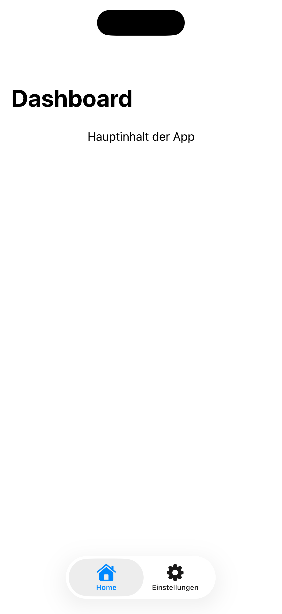
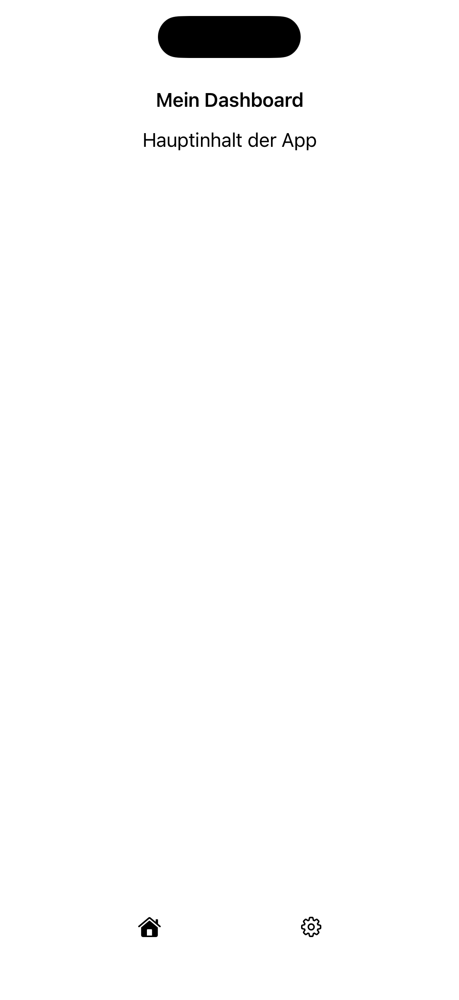

[← Zurück zur Übersicht](../README.md)

---

# 08: Navigationsstruktur & Layout

Ausgewählte Sprache: Deutsch

Andere Sprachen: tbd

---

<details>
  <summary><b>Inhaltsverzeichnis Pattern</b> (Klicken zum Ausklappen)</summary>
  <br>

  * [Suche](01_search_de.md)
  * [Fußzeile & Kopfzeile](02_footer_header_de.md)
  * [Popup](03_modals_de.md)
  * [Tabs](04_tabs_de.md)
  * [Cards](05_cards_de.md)
  * [Karussel](06_carousel_de.md)
  * [Gesten](07_gestures_de.md)
  * Navigationsstruktur & Layout <b>(Aktuell ausgewählt)</b>
  * [Filter](09_filtering_items_de.md)
  * [Eingabefehler](10_showing_input_error_de.md)

</details>

---

## 1. Kontext und Problemstellung

### Nutzungskontext
Eine konsistente Navigationsstruktur und ein logisches, vorhersehbares Seitenlayout bilden das Grundgerüst jeder barrierefreien Anwendung. Sie ermöglichen es Nutzenden, eine Karte der App oder Website aufzubauen, Inhalte schnell zu lokalisieren und effizient zwischen Sektionen zu wechseln. Ein sauberes Layout ordnet Elemente hierarchisch an (z.B. primäre Navigation, Hauptinhalt, sekundäre Seitenbereiche, Footer). Da Menschen mit Sehbehinderungen oder kognitiven Einschränkungen oft stark auf eine gleichbleibende Orientierung angewiesen sind, dürfen sich grundlegende Layout- und Navigationsmechanismen innerhalb einer Anwendung niemals unerwartet verändern.

### Typische Barrieren in der Praxis
* **Mangelnde Orientierung**: Wenn das Navigationsmenü auf der Startseite oben platziert ist, auf Unterseiten jedoch in einem Burger-Menü versteckt wird oder sich die Reihenfolge der Menüpunkte permanent ändert, desorientiert dies Menschen mit kognitiven Einschränkungen. Auch Screenreader-Nutzende verlieren die Orientierung, wenn wiederkehrende Layout-Blöcke jedes Mal anders angeordnet sind.
* **Mangelhafte Navigationseffizienz für Tastaturnutzende**: Für Personen, die eine Anwendung ausschließlich mit der Tastatur oder einem Switch-Control-Gerät bedienen, ist eine große, kopfzeilenbasierte Navigation mit vielen Unterpunkten ein Hindernis. Ohne sogenannte „Sprunglinks“ müssen sie bei jedem Seitenwechsel mühsam oft die Tab-Taste drücken, nur um am Menü vorbei zum eigentlichen Hauptinhalt der Seite zu gelangen.
* **Fehlende semantische Regionen**: Wenn ein Layout visuell zwar klar in Kopfzeile, Hauptbereich und Fußzeile unterteilt ist, diese Bereiche im Code aber nicht semantisch als Regionen deklariert sind, ist die Seite für Screenreader strukturlos. Blinde Nutzende können dann nicht gezielt per Tastaturbefehl direkt zum Hauptinhalt springen.
* **Layout-Bruch bei responsiver Skalierung**: Wenn die Bildschirmausrichtung wechselt (Querformat/Landscape) oder die Schriftgröße über Dynamic Type erhöht wird, kollabieren starre Layouts oft. Navigationselemente überlagern dann den Text, Buttons rutschen aus dem klickbaren Bereich oder wichtige Navigationspfade verschwinden komplett, ohne dass ein alternatives Scrollen möglich ist.

---

## 2. Relevante Richtlinien und Standards

Die folgende Tabelle zeigt den Zusammenhang zwischen technischen Erfolgskriterien der **WCAG 2.2** und der Regelung innerhalb von Kapitel 11 der **EN 301 549**.

| Barrierefreiheits-Anforderung | WCAG 2.2 Kriterium | EN 301 549 | Relevanz für das Navigations-Pattern |
| :--- | :--- | :--- | :--- |
| **Informationen & Beziehungen** | 1.3.1 Info and Relationships | 11.1.3.1 | Layout-Bereiche müssen durch semantische Regionen (Kopfzeile, Navigation, Hauptinhalt, Fußzeile) ausgezeichnet sein. |
| **Bedeutungsvolle Reihenfolge** | 1.3.2 Meaningful Sequence | 11.1.3.2 | Die programmatische Fokus- und Lesereihenfolge (Code-Struktur) muss exakt der visuellen Leserichtung von oben nach unten, links nach rechts entsprechen. |
| **Ausrichtung** | 1.3.4 Orientation | 11.1.3.4 | Die App darf die Anzeige nicht starr auf Hoch- oder Querformat sperren, es sei denn, es ist technisch zwingend erforderlich. |
| **Reflow (Anpassbarer Inhalt)** | 1.4.10 Reflow | 11.1.4.10 | Das Layout muss bis zu einer extremen Vergrößerung bzw. in Hoch- und Querformat funktionieren, ohne dass Inhalte verloren gehen oder horizontal gescrollt werden muss (außer bei Tabellen/Karten). |
| **Blöcke überspringen** | 2.4.1 Bypass Blocks | 11.2.4.1 | Es müssen Mechanismen (z.B. Skip-to-Content-Links) bereitgestellt werden, um wiederkehrende Navigationsblöcke direkt zu überspringen. |
| **Seite mit Titel** | 2.4.2 Page Titled | 11.2.4.2 | Jede Seite/Ansicht muss einen eindeutigen, aussagekräftigen Titel haben. |
| **Mehrere Wege** | 2.4.5 Multiple Ways | 11.2.4.5 | Inhalte müssen über mehr als einen Weg auffindbar sein (z.B. Kombination aus globaler Navigation, Suchfunktion und einer Sitemap/Footer-Übersicht). |
| **Standort** | 2.4.8 Location | 11.2.4.8 | Informationen über den aktuellen Standort innerhalb einer Reihe von Seiten müssen verfügbar sein. |
| **Konsistente Navigation** | 3.2.3 Consistent Navigation | 11.3.2.3 | Navigationsmechanismen, die sich über mehrere Seiten wiederholen, müssen bei jedem Auftreten an derselben relativen Position stehen. |
| **Konsistente Identifikation** | 3.2.4 Consistent Identification | 11.3.2.4 | Komponenten mit derselben Funktionalität (z.B. das Einstellungs-Icon oder der Home-Button) müssen app-weit identisch benannt und gestaltet sein. |

---

## 3. Design-Spezifikationen (UI/UX)

### Visuelle Gestaltung und Kontraste
* **Visuelle Hierarchie durch klare Zonen**: Das Layout muss stabile, wiederkehrende Zonen besitzen. Die primäre Navigation (z.B. Tab-Bar am unteren Bildschirmrand des Screens) bleibt stets an derselben Stelle.
* **Orientierungs-Indikatoren**: Das aktuell aktive Element innerhalb der Navigation muss visuell unmissverständlich hervorgehoben sein (z.B. durch eine Kombination aus kontraststarker Farbe, dicker Unterstreichung und einer Textänderung wie „*[Name], aktiv*“ im nicht-visuellen Kontext).
* **Verlustfreie Ausrichtung**: Die Anwendung darf die Bildschirmausrichtung nicht starr auf Hoch- oder Querformat sperren (außer bei technisch zwingenden Ausnahmen). Das Layout muss flexibel sein, wenn Nutzende ihr Gerät (z.B. am Rollstuhl montiert) im Querformat betreiben.

### Interaktionsdesign und Touch-Targets
* **Erreichbarkeit von Navigationselementen**: Navigationsmenüs müssen für Einhandbedienung optimiert sein. Es empfiehlt sich daher eine primäre Navigation am unteren Bildschirmrand, da die oberen Ecken für Menschen mit motorischen Einschränkungen schwer zu erreichen sind.
* **Tastatur-Navigation**: Die Appstruktur muss so implementiert sein, dass Nutzende assistiver Technologien mithilfe von Schnelltasten direkt zu Sektionen springen können (z.B. direkt zum Hauptinhalt oder direkt zur Suche).

### Empfohlene Fokus-Reihenfolge (Screenreader / Tastatur)
* **Fokus 1 (Sprunglink):** Beim ersten Druck auf die `Tab`-Taste erscheint ganz oben ein visuell eingeblendeter Button „Direkt zum Hauptinhalt springen“. Wird dieser aktiviert, überspringt der Fokus die komplette Navigation.
* **Fokus 2 (Kopfzeile):** Wird der Sprunglink übergangen, wandert der Fokus logisch in die Kopfzeile. Screenreader kündigen die Zone an: „*Banner / Kopfzeile, Gruppe*“.
* **Fokus 3 (Navigationsbereich):** Der Fokus arbeitet sich sequenziell durch die Menüpunkte der primären Navigation.
* **Fokus 4 (Hauptinhalt):** Der Fokus verlässt die Navigation und betritt den Kerninhalt der aktuellen Seite. Screenreader sagen an: „*Hauptinhalt, Region*“.
* **Fokus 5 (Fußzeile):** Schließlich werden die ergänzenden Links im Footer angesteuert.

---

## 4. Implementierung (SwiftUI)

### Good Pattern (Positivbeispiel)
Dieses Beispiel nutzt die nativen Komponenten NavigationStack und TabView. Dadurch werden die Bereiche für Screenreader automatisch korrekt übersetzt, der Seitentitel wird dynamisch mitgeteilt, und das Layout bricht bei großen Schriften oder im Querformat nicht zusammen.

<figure>
  
  <figcaption>Abb. 8.1: Barrierefreie Implementierung der Navigationsstruktur und des Layouts.</figcaption>
</figure>

#### SwiftUI-Code:

```swift
import SwiftUI

struct GoodNavigationView: View {
    var body: some View {
        // Native TabView: Liefert konsistente Struktur
        TabView {
            NavigationStack { // Nativer Stack: Regelt Fokus-Reihenfolge und Navigation
                ScrollView {
                    VStack(alignment: .leading, spacing: 16) {
                        Text("Hauptinhalt der App")
                            .font(.body)
                    }
                    .padding()
                }
                // WCAG 2.4.2: Jede Ansicht erhält einen eindeutigen, programmatischen Titel
                .navigationTitle("Dashboard")
            }
            .tabItem {
                // Konsistente Identifikation und Text-Labels für Steuerelemente
                Label("Home", systemImage: "house.fill")
            }
            
            Text("Einstellungen")
                .tabItem {
                    Label("Einstellungen", systemImage: "gearshape")
                }
        }
        // Kein Sperren der Orientierung, Layout fließt flexibel in Landscape und Portrait
    }
}
```


### Bad Pattern (Negativbeispiel)
Dieses Beispiel erzwingt starre Höhen, wodurch Text bei großen Schriften (Dynamic Type) abgeschnitten wird. Es sperrt die App künstlich per Code in das Hochformat und ignoriert native, konsistente Navigationselemente zugunsten einer unbeschrifteten Custom-Leiste.

<figure>
  
  <figcaption>Abb. 8.2: Barrierebehaftete Implementierung der Navigationsstruktur und des Layouts.</figcaption>
</figure>

#### SwiftUI-Code:

```swift
import SwiftUI

struct BadNavigationView: View {
    var body: some View {
        VStack(spacing: 0) {
            // BARRIERE: Starre Höhe schneidet Text bei Dynamic Type / Skalierung ab.
            HStack {
                Text("Mein Dashboard")
                    .font(.headline)
            }
            .frame(height: 50)
            
            ScrollView {
                VStack {
                    Text("Hauptinhalt der App")
                }
            }
            
            // BARRIERE: Selbstgebaute Tab-Leiste ohne semantische Navigation-Rolle.
            // BARRIERE: Icons besitzen keine Text-Labels oder Barrierefreiheits-Namen.
            HStack {
                Spacer()
                Image(systemName: "house.fill")
                Spacer()
                Image(systemName: "gearshape")
                Spacer()
            }
            .frame(height: 60) // BARRIERE: Fixe Höhe verhindert vertikales Mitwachsen
        }
        // BARRIERE: Starr erzwungene Orientierung.
        .onAppear {
            UIDevice.current.setValue(UIInterfaceOrientation.portrait.rawValue, forKey: "orientation")
        }
    }
}
```

---

## 5. Implementierung (Kotlin)
Wird noch erstellt...
# 07: Gesten

Ausgewählte Sprache: Deutsch

Andere Sprachen: tbd

---

<details>
  <summary><b>Inhaltsverzeichnis Pattern</b> (Klicken zum Ausklappen)</summary>
  <br>

  * [Suche](01_search_de.md)
  * [Fußzeile & Kopfzeile](02_footer_header_de.md)
  * [Popup](03_modals_de.md)
  * [Tabs](04_tabs_de.md)
  * [Cards](05_cards_de.md)
  * [Karussel](06_carousel_de.md)
  * Gesten <b>(Aktuell ausgewählt)</b>
  * [Navigationsstruktur & Layout](08_navigation_layout_de.md)
  * [Filter](09_filtering_items_de.md)
  * [Eingabefehler](10_showing_input_error_de.md)

</details>

---

## 1. Kontext und Problemstellung

### Nutzungskontext
Moderne mobile Betriebssysteme und Anwendungen setzen stark auf Touch-Gesten, um die Bedienung intuitiver und flüssiger zu gestalten. Typische Beispiele sind das Wischen zum Löschen einer Tabellenzeile, das Auf- und Zuziehen bei Karten oder Bildern, langes Drücken für Kontextmenüs oder zweidimensionale Drag-and-Drop-Aktionen. Gesten bieten zwar Abkürzungen für erfahrene Nutzer, sie dürfen jedoch niemals der einzige Weg sein, um eine Funktion auszulösen. Für Menschen, die auf assistive Technologien oder physische Hilfsmittel angewiesen sind, stellen komplexe Gesten oft unüberwindbare Barrieren dar.

### Typische Barrieren in der Praxis
* **Gesten-Ausschluss**: Menschen mit motorischen Einschränkungen (z.B. Zittern/Tremor, Spastiken oder Arthritis) können komplexe Pfade, Mehrfinger-Gesten oder zeitkritische Interaktionen oft nicht präzise ausführen. Wenn das Löschen einer Mail ausschließlich per Swipe-Geste funktioniert, bleibt die Funktion für sie unerreichbar.
* **Gesten-Konflikte mit dem Screenreader**: Wenn der Screenreader aktiv ist, verändert das Betriebssystem die Standard-Gestenarchitektur fundamental. Ein Wischen nach links oder rechts navigiert nun den unsichtbaren Fokus von Element zu Element. Eigene, in der App programmierte Wisch-Gesten (z.B. um ein Menü hineinzuziehen) werden vom Screenreader „abgefangen“ und funktionieren nicht mehr.
* **Fehlender Abbruch-Mechanismus**: Wenn eine Aktion sofort beim ersten Kontakt (`Touch Down`) und nicht erst beim Loslassen (`Touch Up`) ausgelöst wird, kommt es bei motorisch eingeschränkten Nutzenden zu massiven Fehlbedienungen. Es fehlt die Möglichkeit, den Finger vor dem Loslassen wegzuziehen, um die Aktion abzubrechen.
* **Unbeabsichtigtes Auslösen durch Schütteln**: Manche Apps bieten Funktionen wie „Schütteln zum Melden eines Fehlers“ oder „Schütteln zum Rückgängigmachen“. Nutzer, die ihr Smartphone in einer Rollstuhlhalterung fixiert haben oder starke unwillkürliche Muskelbewegungen aufweisen, lösen diese Funktionen unabsichtlich aus.

---

## 2. Relevante Richtlinien und Standards

Die folgende Tabelle zeigt den Zusammenhang zwischen technischen Erfolgskriterien der **WCAG 2.2** und der Regelung innerhalb von Kapitel 11 der **EN 301 549**.

| Barrierefreiheits-Anforderung | WCAG 2.2 Kriterium | EN 301 549 | Relevanz für das Gesten-Pattern |
| :--- | :--- | :--- | :--- |
| **Zeigergesten** | 2.5.1 Pointer Gestures | 11.2.5.1 | Multipoint- oder pfadbasierte Gesten müssen alternativ durch eine einfache Zeigerinteraktion (Tippen/Klicken) bedienbar sein. |
| **Zeigerunterbrechung** | 2.5.2 Pointer Cancellation | 11.2.5.2 | Interaktionen dürfen erst beim `Up`-Event (Loslassen) final ausgelöst werden. Ein Abbruch durch Wegziehen des Fingers muss möglich sein. |
| **Bewegungsaktivierung** | 2.5.4 Motion Actuation | 11.2.5.4 | Durch Geräteschütteln oder Neigen ausgelöste Funktionen müssen abschaltbar sein und alternativ über klassische UI-Buttons bereitstehen. |
| **Ziehbewegung** | 2.5.7 Dragging Movements | 11.2.5.7 | Jede Aktion, die eine Ziehbewegung erfordert, muss auch durch eine einfache Zeigerinteraktion möglich sein. |
| **Zielgröße (Minimum)** | 2.5.8 Target Size (Min) | 11.2.5.7 | Es muss eine Midestgröße von 24x24 CSS-Pixeln für Ziele aufgewiesen werden. |
| **Tastatur-Bedienbarkeit** | 2.1.1 Keyboard | 11.2.1.1 | Jede über eine Geste erreichbare Kernfunktion muss auch mit einer externen Tastatur oder einem Switch-Control-Gerät auslösbar sein. |
| **Name, Rolle, Wert** | 4.1.2 Name, Role, Value | 11.4.1.2 | Wenn Gesten Kontextmenüs oder Zustandsänderungen bewirken, müssen diese Änderungen sofort über die Accessibility-API gemeldet werden. |

---

## 3. Design-Spezifikationen (UI/UX)

### Visuelle Gestaltung und Alternativen
* **Zwei-Wege-Prinzip**: Für jede Geste, die über ein einfaches Tippen (Tap) hinausgeht, muss es eine sichtbare, alternative Steuerungskomponente geben.
  * **Beispiel Swipe-to-Delete**: Die Zeile kann gewischt werden, besitzt aber zusätzlich ein permanent sichtbares „Drei-Punkte-Menü“, in dem sich die Aktion „Löschen“ barrierefrei per Klick auswählen lässt.
  * **Beispiel Drag-and-Drop**: Elemente in einer Liste können verschoben werden, besitzen aber zusätzlich Pfeiltasten nach oben/unten oder ein Menü „Nach oben verschieben“.
* **Deaktivierung von Bewegungssensoren**: Bietet die App Funktionalitäten via Geräteschütteln oder Kamera-Gesten, muss in den App-Einstellungen zwingend ein Schalter integriert werden, um diese Sensorik vollständig zu deaktivieren.

### Interaktionsdesign und Touch-Targets
* **Verwendung von Touch-Up-Events**: Interaktionen grundsätzlich so programmieren, dass das System die Aktion beim Loslassen des Fingers (`onTapGesture` oder `Touch Up Inside`) verarbeitet. Befindet sich der Finger beim Loslassen außerhalb der ursprünglichen Klickfläche, wird das Event verworfen.
* **Erweiterte Barrierefreiheits-Aktionen**: Für Screenreader-Nutzende müssen Gesten in die nativen „Accessibility Actions“ übersetzt werden. Anstatt auf einer Zeile zu wischen, führt ein Wischen mit dem Finger nach oben oder unten im Screenreader-Modus durch die verfügbaren Aktionen (z.B. „Aktivieren“, „Löschen“, „Bearbeiten“).

### Empfohlene Fokus-Reihenfolge (Screenreader / Tastatur)
* **Fokus 1 (Steuerelement):** Der Fokus landet auf dem Element, welches eine Geste unterstützt (z.B. eine Tabellenzeile).
* **Fokus 2 (Aktionen):** Der Screenreader kündigt dem Nutzer sofort akustisch an, dass alternative Aktionen verfügbar sind: *"[Inhalt der Zeile], Aktionen verfügbar. Wischen Sie nach oben oder unten, um eine Aktion auszuwählen."*
* **Fokus 3 (Auswahl ohne visuelle Geste):** Der blinde oder motorisch eingeschränkte Nutzer navigiert durch wiederholtes Wischen nach oben/unten durch die Optionen (z.B. „Löschen“) und löst diese mit einem einfachen Doppeltippen barrierefrei aus, ohne die physische Wisch-Geste jemals auszuführen.

---

## 4. Implementierung (SwiftUI)

### Good Pattern (Positivbeispiel)
Dieses Beispiel nutzt die nativen SwiftUI-Listenmechanismen. Dadurch wird die Wisch-Geste automatisch in eine barrierefreie VoiceOver-Aktion übersetzt. Zusätzlich wird das Zwei-Wege-Prinzip über einen dauerhaft sichtbaren, ausreichend großen Button bedient.
```swift
import SwiftUI

struct GoodGestureView: View {
    @State private var items = ["E-Mail 1", "E-Mail 2", "E-Mail 3"]

    var body: some View {
        List {
            ForEach(items, id: \.self) { item in
                HStack {
                    Text(item)
                    Spacer()
                    
                    // Einfache Klick-Alternative zum Ziehen/Wischen
                    Button(action: { deleteItem(item) }) {
                        Image(systemName: "trash")
                            .foregroundColor(.red)
                            .frame(width: 44, height: 44) // WCAG 2.5.8: Erfüllt Mindest-Touch-Größe
                    }
                    .buttonStyle(.plain)
                    .accessibilityLabel("\(item) löschen") // WCAG 4.1.2: Eindeutiger Name
                }
                // Nativer Swipe: Übersetzt die Geste für VoiceOver automatisch in "Aktionen verfügbar"
                .swipeActions(edge: .trailing) {
                    Button(role: .destructive) {
                        deleteItem(item)
                    } label: {
                        Label("Löschen", systemImage: "trash")
                    }
                }
            }
        }
    }

    private func deleteItem(_ item: String) {
        items.removeAll { $0 == item }
    }
}
```


### Bad Pattern (Negativbeispiel)
Dieses Beispiel implementiert das Wischen über eine selbstgebaute Drag-Geste. Es zwingt motorisch eingeschränkte Nutzende zu einer komplexen Pfadbewegung, bricht bei aktivem VoiceOver komplett und löst fälschlicherweise sofort beim ersten Kontakt aus.
```swift
import SwiftUI

struct BadGestureView: View {
    @State private var items = ["E-Mail 1", "E-Mail 2", "E-Mail 3"]
    @State private var dragOffset: CGFloat = 0

    var body: some View {
        VStack {
            ForEach(items, id: \.self) { item in
                HStack {
                    Text(item)
                    Spacer()
                }
                .frame(maxWidth: .infinity)
                .padding()
                .background(Color.gray.opacity(0.2))
                .offset(x: dragOffset)
                .gesture(
                    // BARRIERE: Komplexe Drag-Geste schließt motorisch eingeschränkte Menschen aus.
                    // BARRIERE: Funktioniert nicht mit VoiceOver, da Wischgesten vom Screenreader abgefangen werden.
                    DragGesture()
                        .onChanged { value in
                            // BARRIERE: Aktion reagiert sofort auf Bewegung statt auf das Loslassen.
                            if value.translation.width < -100 {
                                items.removeAll { $0 == item }
                            }
                        }
                )
            }
        }
    }
}
}
```

---

## 5. Implementierung (Kotlin)
Wird noch erstellt...

---

## 6. Quellen und weiterführende Links

* **Internationale Standards:**
  * [WCAG 2.2 Richtlinien (W3C)](https://www.w3.org/TR/WCAG2) – Web Content Accessibility Guidelines.
  * [EN 301 549 Standard (ETSI)](https://www.etsi.org/deliver/etsi_en/301500_301599/301549/03.02.01_60/en_301549v030201p.pdf) – Europäische Norm für Barrierefreiheitsanforderungen.

* **Apple Human Interface Guidelines (HIG):**
  * [Apple HIG – Accessibility](https://developer.apple.com/design/human-interface-guidelines/accessibility) – Grundlagen für inklusive und intuitive Plattform-Interaktionen.
  * [Apple HIG – Navigation & Search](https://developer.apple.com/design/human-interface-guidelines/navigation-and-search) – Best Practices für verschiedene Navigationsstrukturen.
  * [Apple HIG – Layout](https://developer.apple.com/design/human-interface-guidelines/layout) – Richtlinien für adaptive, orientierungsunabhängige Layoutzonen.

* **Pattern-Referenz:**
  * https://www.checklist.design - Hauptseite
  * https://www.checklist.design/components/navigation  - Navigation Pattern
    
---

[← Zurück zur Übersicht](../README.md) | [↑ Nach oben springen](#01_suche)
