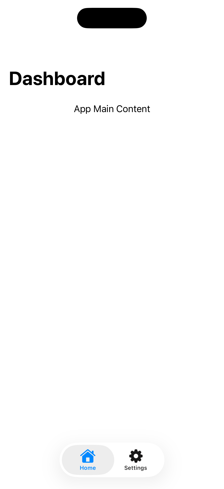
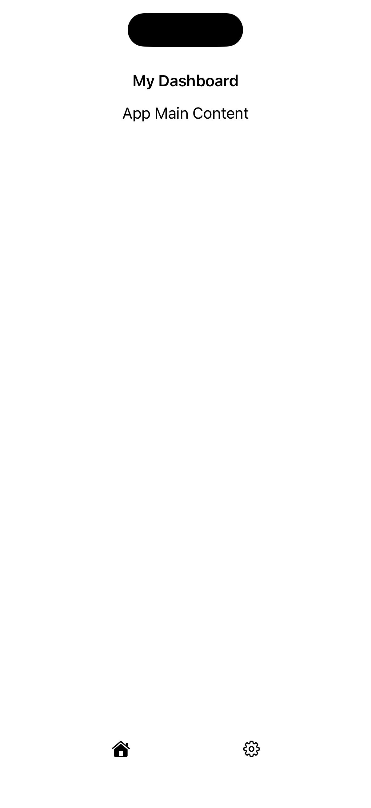

[← Back to Overview](../README_en.md)

---

# 08: Navigation Structure & Layout

Selected Language: English

Other Languages: [German](08_navigation_layout_de.md)

---

<details>
  <summary><b>Table of Contents Pattern</b> (Click to expand)</summary>
  <br>

  * [Search](01_search_en.md)
  * [Footer & Header](02_footer_header_en.md)
  * [Popup](03_modals_en.md)
  * [Tabs](04_tabs_en.md)
  * [Cards](05_cards_en.md)
  * [Carousel](06_carousel_en.md)
  * [Gestures](07_gestures_en.md)
  * Navigation Structure & Layout <b>(Currently Selected)</b>
  * [Filtering](09_filtering_items_en.md)
  * [Input Errors](10_showing_input_error_en.md)

</details>

---

## 1. Context and Problem Statement

### Usage Context
A consistent navigation structure and a logical, predictable page layout form the foundation of any accessible application. They enable users to build a mental map of the app or website, locate content quickly, and switch efficiently between sections. A clean layout arranges elements hierarchically (e.g., primary navigation, main content, secondary page areas, footer). Because people with visual impairments or cognitive limitations often rely heavily on consistent orientation, fundamental layout and navigation mechanisms within an application must never change unexpectedly.

### Typical Barriers in Practice
* **Lack of Orientation**: When the navigation menu is placed at the top of the homepage but hidden in a burger menu on subpages, or when the order of menu items constantly changes, this disorients users with cognitive impairments. Screen reader users also lose orientation when recurring layout blocks are arranged differently each time.
* **Poor Navigation Efficiency for Keyboard Users**: For individuals operating an application exclusively using a keyboard or a switch control device, a large header-based navigation with many sub-items is an obstacle. Without so-called "skip links", they must painstakingly press the Tab key repeatedly upon every page change just to bypass the menu and reach the actual main content of the page.
* **Missing Semantic Regions**: If a layout is visually split clearly into header, main area, and footer, but these areas are not semantically declared as regions in the code, the page lacks structure for screen readers. Blind users are then unable to jump directly to the main content using keyboard shortcuts.
* **Layout Breakdown during Responsive Scaling**: When the screen orientation changes (landscape mode) or the text size is increased via Dynamic Type, rigid layouts often collapse. Navigation elements then overlap text, buttons slide out of the clickable area, or critical navigation paths disappear completely without an alternative scroll option.

---

## 2. Relevant Guidelines and Standards

The following table shows the relationship between technical WCAG 2.2 success criteria and the provisions within Chapter 11 of EN 301 549.

| Accessibility Requirement | WCAG 2.2 Criterion | EN 301 549 | Relevance for Navigation Pattern |
| :--- | :--- | :--- | :--- |
| **Info and Relationships** | 1.3.1 Info and Relationships | 11.1.3.1 | Layout areas must be declared using semantic regions (header, navigation, main content, footer). |
| **Meaningful Sequence** | 1.3.2 Meaningful Sequence | 11.1.3.2 | The programmatic focus and reading order (code structure) must exactly match the visual reading direction from top to bottom, left to right. |
| **Orientation** | 1.3.4 Orientation | 11.1.3.4 | The app must not rigidly lock the display to portrait or landscape orientation unless technically essential. |
| **Reflow** | 1.4.10 Reflow | 11.1.4.10 | The layout must work up to extreme magnification and in portrait and landscape modes without loss of content or requiring horizontal scrolling (except for tables/maps). |
| **Bypass Blocks** | 2.4.1 Bypass Blocks | 11.2.4.1 | Mechanisms (e.g., skip-to-content links) must be provided to directly bypass repeated navigation blocks. |
| **Page Titled** | 2.4.2 Page Titled | 11.2.4.2 | Each page/view must have a unique, descriptive title. |
| **Multiple Ways** | 2.4.5 Multiple Ways | 11.2.4.5 | Content must be findable in more than one way (e.g., combination of global navigation, search function, and a sitemap/footer overview). |
| **Location** | 2.4.8 Location | 11.2.4.8 | Information about the current location within a set of pages must be available. |
| **Consistent Navigation** | 3.2.3 Consistent Navigation | 11.3.2.3 | Navigation mechanisms that recur across multiple pages must occur in the same relative order each time they present. |
| **Consistent Identification** | 3.2.4 Consistent Identification | 11.3.2.4 | Components with the same functionality (e.g., the settings icon or home button) must be named and designed consistently throughout the app. |

---

## 3. Design Specifications (UI/UX)

### Visual Design and Contrasts
* **Visual Hierarchy through Clear Zones**: The layout must feature stable, recurring zones. The primary navigation (e.g., tab bar at the bottom edge of the screen) always remains in the same position.
* **Orientation Indicators**: The currently active element within the navigation must be visually and unambiguously highlighted (e.g., through a combination of a high-contrast color, a thick underline, and a text modification like "*[Name], active*" in non-visual contexts).
* **Lossless Orientation**: The application must not rigidly lock screen orientation to portrait or landscape mode (except for essential technical exceptions). The layout must remain flexible when users operate their device in landscape mode (e.g., mounted on a wheelchair).

### Interaction Design and Touch Targets
* **Reachability of Navigation Elements**: Navigation menus must be optimized for single-handed operation. A primary navigation bar at the bottom of the screen is therefore recommended, as upper corners are difficult to reach for individuals with motor impairments.
* **Keyboard Navigation**: The app structure must be implemented so that users of assistive technologies can jump directly to sections using shortcuts (e.g., directly to main content or directly to search).

### Recommended Focus Order (Screen Reader / Keyboard)
* **Focus 1 (Skip Link):** Upon the first press of the `Tab` key, a visually displayed button "Skip to main content" appears at the top. When activated, focus bypasses the entire navigation.
* **Focus 2 (Header):** If the skip link is bypassed, focus moves logically into the header. Screen readers announce the zone: "*Banner / Header, group*".
* **Focus 3 (Navigation Area):** Focus works sequentially through the primary navigation menu items.
* **Focus 4 (Main Content):** Focus leaves navigation and enters the core content of the current page. Screen readers announce: "*Main content, region*".
* **Focus 5 (Footer):** Finally, supplementary links in the footer are reached.

---

## 4. Implementation (SwiftUI)

### Good Pattern
This example uses native components NavigationStack and TabView. As a result, regions are automatically translated correctly for screen readers, the page title is communicated dynamically, and the layout does not collapse with large text sizes or in landscape mode.

<figure>
  
  <figcaption>Fig. 8.1: Accessible implementation of navigation structure and layout.</figcaption>
</figure>

#### SwiftUI Code:

```swift
import SwiftUI

struct GoodNavigationView: View {
    var body: some View {
        // Native TabView: Provides consistent structure
        TabView {
            NavigationStack { // Native Stack: Manages focus order and navigation
                ScrollView {
                    VStack(alignment: .leading, spacing: 16) {
                        Text("App Main Content")
                            .font(.body)
                    }
                    .padding()
                }
                // WCAG 2.4.2: Each view receives a unique, programmatic title
                .navigationTitle("Dashboard")
            }
            .tabItem {
                // Consistent identification and text labels for controls
                Label("Home", systemImage: "house.fill")
            }
            
            Text("Settings")
                .tabItem {
                    Label("Settings", systemImage: "gearshape")
                }
        }
        // No orientation lock; layout flows flexibly in landscape and portrait
    }
}
```


### Bad Pattern
This example enforces fixed heights, which clips text with large fonts (Dynamic Type). It artificially locks the app into portrait mode via code and ignores native, consistent navigation elements in favor of an unlabeled custom bar.

<figure>
  
  <figcaption>Fig. 8.2: Inaccessible implementation of navigation structure and layout.</figcaption>
</figure>

#### SwiftUI Code:

```swift
import SwiftUI

struct BadNavigationView: View {
    var body: some View {
        VStack(spacing: 0) {
            // BARRIER: Fixed height clips text during Dynamic Type / scaling.
            HStack {
                Text("My Dashboard")
                    .font(.headline)
            }
            .frame(height: 50)
            
            ScrollView {
                VStack {
                    Text("App Main Content")
                }
            }
            
            // BARRIER: Custom-built tab bar lacking semantic navigation role.
            // BARRIER: Icons have no text labels or accessibility names.
            HStack {
                Spacer()
                Image(systemName: "house.fill")
                Spacer()
                Image(systemName: "gearshape")
                Spacer()
            }
            .frame(height: 60) // BARRIER: Fixed height prevents vertical growth
        }
        // BARRIER: Rigidly forced orientation.
        .onAppear {
            UIDevice.current.setValue(UIInterfaceOrientation.portrait.rawValue, forKey: "orientation")
        }
    }
}
```

---

## 5. Implementation (Kotlin)
To be created...

---

## 6. Sources and Further Reading

* **International Standards:**
  * [WCAG 2.2 Guidelines (W3C)](https://www.w3.org/TR/WCAG2) – Web Content Accessibility Guidelines.
  * [EN 301 549 Standard (ETSI)](https://www.etsi.org/deliver/etsi_en/301500_301599/301549/03.02.01_60/en_301549v030201p.pdf) – European Standard for accessibility requirements for ICT products and services.

* **Apple Human Interface Guidelines (HIG):**
  * [Apple HIG – Accessibility](https://developer.apple.com/design/human-interface-guidelines/accessibility) – Fundamentals for inclusive and intuitive platform interactions.
  * [Apple HIG – Navigation & Search](https://developer.apple.com/design/human-interface-guidelines/navigation-and-search) – Best practices for various navigation structures.
  * [Apple HIG – Layout](https://developer.apple.com/design/human-interface-guidelines/layout) – Guidelines for adaptive, orientation-independent layout zones.

* **Pattern Reference:**
  * https://www.checklist.design - Main site
  * https://www.checklist.design/components/navigation - Navigation Pattern

---

[← Back to Overview](../README_en.md) | [↑ Jump to top](#08-navigation-structure--layout)
