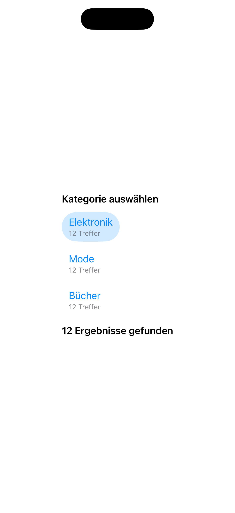
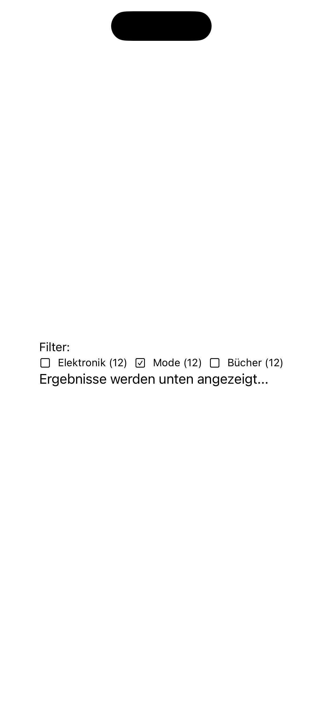

[← Zurück zur Übersicht](../README.md)

---

# 09: Filter

Ausgewählte Sprache: Deutsch

Andere Sprachen: tbd

---

<details>
  <summary><b>Inhaltsverzeichnis Pattern</b> (Klicken zum Ausklappen)</summary>
  <br>

  * [Suche](01_search_de.md)
  * [Fußzeile & Kopfzeile](02_footer_header_de.md)
  * [Popup](03_modals_de.md)
  * [Tabs](04_tabs_de.md)
  * [Cards](05_cards_de.md)
  * [Karussel](06_carousel_de.md)
  * [Gesten](07_gestures_de.md)
  * [Navigationsstruktur & Layout](08_navigation_layout_de.md)
  * Filter <b>(Aktuell ausgewählt)</b>
  * [Eingabefehler](10_showing_input_error_de.md)

</details>

---

## 1. Kontext und Problemstellung

### Nutzungskontext
Filter- und Sortierfunktionen sind essenziell, um große Datenmengen – wie Produktlisten in Onlineshops, Suchergebnisse oder Buchungsportale – handhabbar zu machen. Sie bestehen meist aus einer Kombination verschiedener UI-Elemente: Checkboxen für Kategorien, native oder Custom-Dropdowns für Sortierungen (z.B. "Preis aufsteigend"), Schiebereglern für Preisspannen und "Filter löschen"-Buttons. Da das Aktivieren eines Filters die darunterliegende Datenstruktur direkt manipuliert und Einträge dynamisch hinzufügt oder entfernt, müssen diese Änderungen für assistive Technologien in Echtzeit nachvollziehbar sein.

### Typische Barrieren in der Praxis
* **asynchrone Desorientierung**: In modernen Apps filtert sich die Liste im Hintergrund oft automatisch, sobald eine Checkbox angewählt wird. Ein Screenreader-Nutzer bekommt davon jedoch nichts mit. Er verbleibt starr auf der Checkbox, während sich die Anzahl der Suchergebnisse unbemerkt ändert.
* **Fokus-Verlust-Falle**: Wird nach dem Klick auf einen Filter ein asynchrones Neuladen der gesamten Liste erzwungen, springt der Fokus oft an den Seitenanfang zurück. Der Nutzer verliert seine Position und muss sich wieder zurück zum Filterbereich navigieren.
* **Unzugängliche Filter-Zähler**: Neben Filtern steht häufig die Anzahl der Treffer in Klammern (z.B. *„Elektronik (12)“*). Werden diese Zahlen als reiner Text ohne Kontext aneinandergehängt, liest ein Screenreader vor: *„Elektronik, Kontrollkästchen nicht markiert, zwölf“*. Es bleibt unklar, ob „zwölf“ die Anzahl, eine Artikelnummer oder eine ID ist.
* **Tastatur-Sackgassen in komplexen Menüs**: Filter-Panels werden auf Mobilgeräten oft als modale Overlays oder ausklappbare Akkordeons dargestellt. Wenn diese visuell einblenden, der Tastaturfokus aber im Hintergrund der App gefangen bleibt, sind die Filter für alternative Eingabemethoden physisch nicht erreichbar.

---

## 2. Relevante Richtlinien und Standards

Die folgende Tabelle zeigt den Zusammenhang zwischen technischen Erfolgskriterien der **WCAG 2.2** und der Regelung innerhalb von Kapitel 11 der **EN 301 549**.

| Barrierefreiheits-Anforderung | WCAG 2.2 Kriterium | EN 301 549 | Relevanz für das Filter-Pattern |
| :--- | :--- | :--- | :--- |
| **Informationen & Beziehungen** | 1.3.1 Info and Relationships | 11.1.3.1 | Zusammengehörige Filter (z.B. alle Farb-Optionen) müssen programmatisch gruppiert sein (z.B. via `Group`-Trait oder `<fieldset>`). |
| **Kontrast (Minimum)** | 1.4.3 Contrast (Minimum) | 11.1.4.3 | Ausgewählte Filter-Tags (Chips) und Zähler benötigen ausreichenden Kontrast (mind. 4,5:1 für Text, 3:1 für die Chip-Begrenzung). |
| **Tastatur-Bedienbarkeit** | 2.1.1 Keyboard | 11.2.1.1 | Jedes Filterelement muss vollständig per Tastatur/Switch-Control bedienbar sein. |
| **Keine Tastatur-Falle** | 2.1.2 No Keyboard Trap | 11.2.1.2 | Wird ein Filter-Panel geöffnet, darf der Tastaturfokus beim Schließen nicht darin gefangen bleiben. |
| **Fokus-Reihenfolge** | 2.4.3 Focus Order | 11.2.4.3 | Nach dem Filtern oder Schließen des Panels muss der Fokus logisch beim nächsten logischen Element landen. |
| **Zielgröße (Minimum)** | 2.5.8 Target Size (Min) | 11.2.5.8 | Die Checkboxen und die „X“-Icons zum Löschen des Filters müssen die Mindestgröße einhalten, um Fehlklicks zu vermeiden. |
| **Keine unerwartete Kontextänderung** | 3.2.1 On Focus / 3.2.2 On Input | 11.3.2.1 / .2 | Das Auswählen eines Filters darf niemals automatisch den Fokus versetzen oder ein unerwartetes modales Fenster öffnen. |
| **Statusmeldungen** | 4.1.3 Status Messages | 11.4.1.3 | Aktualisierungen der Ergebnisliste durch Filterung müssen über eine Live-Region (`AccessibilityNotification` oder `accessibilityLiveRegion`) angekündigt werden. |
| **Name, Rolle, Wert** | 4.1.2 Name, Role, Value | 11.4.1.2 | Jedes Steuerelement (z.B. ein einklappbares Filter-Akkordeon) muss seinen Zustand („erweitert“ / „reduziert“) und seine Rolle korrekt mitsenden. |

---

## 3. Design-Spezifikationen (UI/UX)

### Visuelle Gestaltung und Kontraste
* **Permanente Statusanzeige**: Welche Filter aktuell aktiv sind, darf nicht nur innerhalb eines versteckten Menüs ersichtlich sein. Aktive Filter müssen oberhalb der Ergebnisliste als visuelle "Chips" oder "Tags" dargestellt werden. Jeder dieser Chips benötigt ein integriertes "X"-Symbol zum schnellen Löschen.
* **Eindeutige Treffer-Anzeigen**: Der Zähler für die Gesamtergebnisse muss visuell prominent platziert sein. Ändert sich der Wert, sollte die Zahl kurzzeitig visuell hervorgehoben werden, um kognitiv eingeschränkten Nutzenden die Änderung zu signalisieren.
* **Barrierefreie Slider**: Wenn Schieberegler für numerische Werte verwendet werden, müssen zusätzlich zwei klassische Eingabefelder als Textfelder bereitgestellt werden, da Schieberegler motorisch schwer präzise einzustellen sind.

### Interaktionsdesign und Touch-Targets
* **Bestätigung der Filter**: Verwende ein "Explizites Commit-Modell". Der Nutzer wählt in Ruhe seine Filter aus. Erst ein Klick auf einen fixierten Button am unteren Rand (*„3 Filter anwenden – 12 Ergebnisse anzeigen“*) schließt das Menü und filtert die Liste. Das verhindert permanente asynchrone Einbrüche.
* **Touch-Targets bei Checkboxen**: Da Filterlisten oft eng beschrieben sind, muss die gesamte Zeile (Text + Checkbox) als Klickfläche fungieren. Das Touch-Target muss die Mindestgröße von 44x44 pt pro Option erfüllen.

### Empfohlene Fokus-Reihenfolge (Screenreader / Tastatur)
* **Fokus 1 (Filter-Steuerung):** Der Nutzer bewegt sich durch die Kontrollkästchen. Der Screenreader liest den erweiterten Kontext vor: *„Kategorie, Mode. Kontrollkästchen nicht markiert, 15 Treffer“*. 
* **Fokus 2 (Statusmeldung):** Sobald ein Filter aktiviert wird, startet im Hintergrund eine barrierefreie Ankündigung. Ohne den Fokus des Nutzers zu bewegen, spricht der Screenreader im Hintergrund: *„Liste aktualisiert. 3 Ergebnisse verfügbar.“*
* **Fokus 3 (Filter-Chips):** Nach Verlassen des Filter-Panels erreicht der Tastaturfokus die aktiven Filter-Tags, um diese bei Bedarf einzeln zu entfernen (*„Filter Mode löschen, Schaltfläche“*).
* **Fokus 4 (Listeneinstieg):** Der Fokus wandert direkt zur Überschrift der Ergebnisliste, um das sequenzielle Auslesen der gefilterten Daten zu ermöglichen.

---

## 4. Implementierung (SwiftUI)

### Good Pattern (Positivbeispiel)
Dieses Beispiel nutzt native Toggle-Komponenten, die zu einer Gruppe zusammengefasst sind. Die Trefferzahl wird barrierefrei übersprochen und die Statusänderung wird via AccessibilityNotification direkt an den Screenreader gemeldet.

<figure>
  
  <figcaption>Abb. 9.1: Barrierefreie Implementierung von Filtern.</figcaption>
</figure>

#### SwiftUI-Code:

```swift
import SwiftUI

struct GoodFilteringView: View {
    let categories = ["Elektronik", "Mode", "Bücher"]
    @State private var selectedCategory: String? = nil
    @State private var resultCount = 42
    
    var body: some View {
        VStack(alignment: .leading, spacing: 16) {
            // Programmatische Gruppierung der zusammengehörigen Filterelemente
            VStack(alignment: .leading, spacing: 12) {
                Text("Kategorie auswählen")
                    .font(.headline)
                
                ForEach(categories, id: \.self) { category in
                    let isSelected = selectedCategory == category
                    
                    // Natives Steuerelement liefert korrekte Rolle und Zustand
                    Toggle(isOn: Binding(
                        get: { isSelected },
                        set: { _ in applyFilter(category) }
                    )) {
                        VStack(alignment: .leading) {
                            Text(category)
                            Text("12 Treffer") // Visuell sauber getrennt
                                .font(.caption)
                                .foregroundColor(.secondary)
                        }
                    }
                    .toggleStyle(.button) // Macht das gesamte Element zur barrierefreien Klickfläche
                    .frame(minHeight: 44) // Garantiert die Mindest-Touch-Größe
                    .accessibilityLabel("\(category), 12 verfügbare Ergebnisse") // Verhindert das Vorlesen fragmentierter Zahlen
                }
            }
            .accessibilityElement(children: .contain)
            .accessibilityLabel("Filteroptionen")
            
            Text("\(resultCount) Ergebnisse gefunden")
                .font(.body)
                .bold()
        }
        .padding()
    }
    
    private func applyFilter(_ category: String) {
        if selectedCategory == category {
            selectedCategory = nil
            resultCount = 42
        } else {
            selectedCategory = category
            resultCount = 12
        }
        
        // Teilt dem Screenreader die Änderung asynchron mit, ohne den Fokus zu klauen
        AccessibilityNotification.Announcement("Liste aktualisiert. \(resultCount) Ergebnisse verfügbar.")
            .post()
    }
}
```


### Bad Pattern (Negativbeispiel)
Dieses Beispiel filtert die Liste im Hintergrund, ohne dass blinde Nutzer es bemerken. Die Trefferzahl ist unvollständig beschriftet, die Touch-Fläche ist viel zu klein und die starre Anordnung führt bei großen Schriften zu Layoutfehlern.

<figure>
  
  <figcaption>Abb. 9.2: Barrierebehaftete Implementierung von Filtern.</figcaption>
</figure>

#### SwiftUI-Code:

Swift
```swift
import SwiftUI

struct BadFilteringView: View {
    let categories = ["Elektronik", "Mode", "Bücher"]
    @State private var selectedCategory: String? = nil
    
    var body: some View {
        VStack(alignment: .leading) {
            Text("Filter:")
                .font(.subheadline)
            
            HStack {
                ForEach(categories, id: \.self) { category in
                    HStack {
                        // BARRIERE: Kein nativer Button/Toggle, für Tastatur/VoiceOver unsichtbar.
                        Image(systemName: selectedCategory == category ? "checkmark.square" : "square")
                        
                        // BARRIERE: Trefferzahl ("(12)") ohne Kontext an Text angehängt.
                        Text("\(category) (12)") 
                    }
                    .font(.footnote) // BARRIERE: Zu kleine Schrift, bricht bei Skalierung.
                    .onTapGesture {
                        // BARRIERE: Löst Live-Filterung ohne jede Screenreader-Rückmeldung aus.
                        selectedCategory = (selectedCategory == category) ? nil : category
                    }
                    // BARRIERE: Kein Padding, Touch-Target liegt weit unter 44x44 pt.
                }
            }
            
            Text("Ergebnisse werden unten angezeigt...")
        }
    }
}
```

---

## 5. Implementierung (Kotlin)
Wird noch erstellt...

---

## 6. Quellen und weiterführende Links

* **Internationale Standards:**
  * [WCAG 2.2 Richtlinien (W3C)](https://www.w3.org/TR/WCAG2) – Web Content Accessibility Guidelines.
  * [EN 301 549 Standard (ETSI)](https://www.etsi.org/deliver/etsi_en/301500_301599/301549/03.02.01_60/en_301549v030201p.pdf) – Europäische Norm für Barrierefreiheitsanforderungen.

* **Apple Human Interface Guidelines (HIG):**
  * [Apple HIG – Accessibility](https://developer.apple.com/design/human-interface-guidelines/accessibility) – Grundlagen für inklusive und intuitive Plattform-Interaktionen.
  * [Apple HIG – Lists and tables](https://developer.apple.com/design/human-interface-guidelines/lists-and-tables) – Best Practices für die Organisation komplexer Daten- und Filterstrukturen.
  * [Apple HIG – Sliders](https://developer.apple.com/design/human-interface-guidelines/sliders) – Vorgaben zur Zugänglichkeit und präzisen Steuerung von Schiebereglern.
  * [Apple HIG – Toggles](https://developer.apple.com/design/human-interface-guidelines/toggles) – Best Practices für Schalter, die Zustände umschalten.
  * [Apple HIG – Segmented controls](https://developer.apple.com/design/human-interface-guidelines/segmented-controls) – Vorgaben für eine Umschaltung zwischen Segmenten.

---

[← Zurück zur Übersicht](../README.md) | [↑ Nach oben springen](#01_suche)
