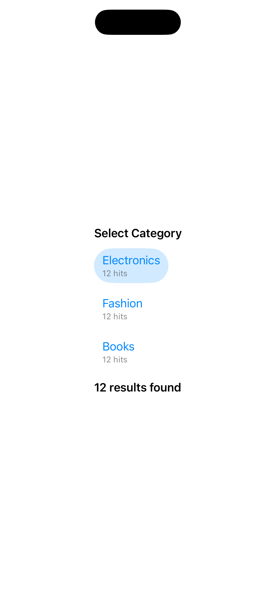
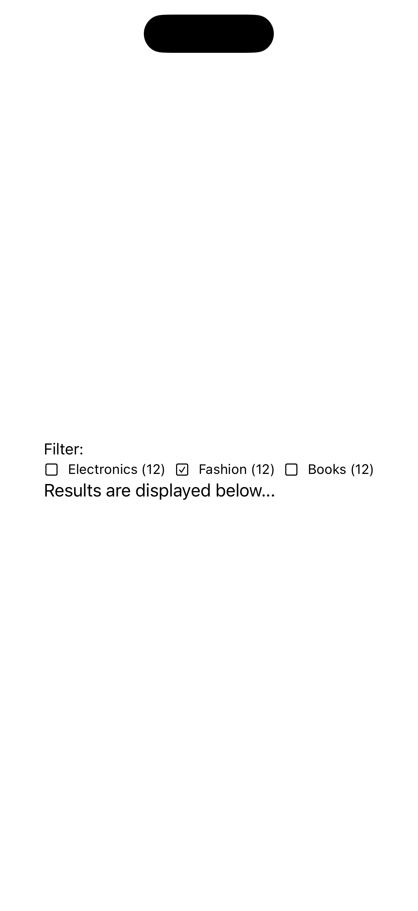

[← Back to Overview](../README_en.md)

---

# 09: Filter

Selected Language: English

Other Languages: [German](09_filtering_items_de.md)

---

<details>
  <summary><b>Table of Contents Pattern</b> (Click to expand)</summary>
  <br>

  * [Search](01_search_en.md)
  * [Footer & Header](02_footer_header_en.md)
  * [Popup](03_modals_en.md)
  * [Tabs](04_tabs_en.md)
  * [Cards](05_cards_en.md)
  * [Carousel](06_carousel_en.md)
  * [Gestures](07_gestures_en.md)
  * [Navigation Structure & Layout](08_navigation_layout_en.md)
  * Filter <b>(Currently selected)</b>
  * [Input Error](10_showing_input_error_en.md)

</details>

---

## 1. Context and Problem Statement

### Usage Context
Filtering and sorting functions are essential for making large datasets—such as product lists in online shops, search results, or booking portals—manageable. They usually consist of a combination of various UI elements: checkboxes for categories, native or custom dropdowns for sorting (e.g., "Price ascending"), sliders for price ranges, and "Clear filters" buttons. Because activating a filter directly manipulates the underlying data structure and dynamically adds or removes entries, these changes must be traceable in real time for assistive technologies.

### Typical Accessibility Barriers in Practice
* **Asynchronous Disorientation**: In modern apps, the list often filters automatically in the background as soon as a checkbox is selected. However, a screen reader user is completely unaware of this. They remain static on the checkbox while the number of search results changes unannounced.
* **Focus Loss Trap**: If an asynchronous reload of the entire list is forced after clicking a filter, focus often jumps back to the top of the page. The user loses their position and has to navigate all the way back to the filter area.
* **Inaccessible Filter Counters**: Next to filters, the number of results is often placed in parentheses (e.g., *"Electronics (12)"*). If these numbers are appended as plain text without context, a screen reader reads out: *"Electronics, checkbox unchecked, twelve"*. It remains unclear whether "twelve" is the result count, an item number, or an ID.
* **Keyboard Dead Ends in Complex Menus**: On mobile devices, filter panels are often displayed as modal overlays or expandable accordions. If these appear visually while keyboard focus remains trapped behind the app's main view, the filters are physically unreachable for alternative input methods.

---

## 2. Relevant Guidelines and Standards

The following table shows the relationship between technical success criteria of **WCAG 2.2** and the regulations within Chapter 11 of **EN 301 549**.

| Accessibility Requirement | WCAG 2.2 Criterion | EN 301 549 | Relevance for the Filter Pattern |
| :--- | :--- | :--- | :--- |
| **Info and Relationships** | 1.3.1 Info and Relationships | 11.1.3.1 | Related filters (e.g., all color options) must be programmatically grouped (e.g., via `Group` trait or `<fieldset>`). |
| **Contrast (Minimum)** | 1.4.3 Contrast (Minimum) | 11.1.4.3 | Selected filter tags (chips) and counters require sufficient contrast (at least 4.5:1 for text, 3:1 for chip borders). |
| **Keyboard** | 2.1.1 Keyboard | 11.2.1.1 | Every filter element must be fully operable via keyboard/switch control. |
| **No Keyboard Trap** | 2.1.2 No Keyboard Trap | 11.2.1.2 | When opening a filter panel, keyboard focus must not be trapped inside it upon closing. |
| **Focus Order** | 2.4.3 Focus Order | 11.2.4.3 | After filtering or closing the panel, focus must land logically on the next appropriate element. |
| **Target Size (Minimum)** | 2.5.8 Target Size (Min) | 11.2.5.8 | Checkboxes and the "X" icons for deleting filters must meet the minimum size to prevent misclicks. |
| **On Focus / On Input** | 3.2.1 On Focus / 3.2.2 On Input | 11.3.2.1 / .2 | Selecting a filter must never automatically shift focus or open an unexpected modal window. |
| **Status Messages** | 4.1.3 Status Messages | 11.4.1.3 | Updates to the results list caused by filtering must be announced via a live region (`AccessibilityNotification` or `accessibilityLiveRegion`). |
| **Name, Role, Value** | 4.1.2 Name, Role, Value | 11.4.1.2 | Each control element (e.g., a collapsible filter accordion) must correctly communicate its state ("expanded" / "collapsed") and role. |

---

## 3. Design Specifications (UI/UX)

### Visual Design and Contrasts
* **Permanent Status Display**: Active filters should not only be visible inside a hidden menu. Active filters must be displayed above the results list as visual "chips" or "tags". Each of these chips requires an integrated "X" icon for quick removal.
* **Clear Hit Counters**: The counter for total results must be visually prominent. When the value changes, the number should briefly highlight visually to signal the change to cognitively impaired users.
* **Accessible Sliders**: When sliders are used for numerical values, two classic text input fields must additionally be provided, as sliders can be motorically difficult to adjust precisely.

### Interaction Design and Touch Targets
* **Filter Confirmation**: Use an "Explicit Commit Model". The user selects their filters at their own pace. Only a click on a sticky button at the bottom (*"Apply 3 filters – Show 12 results"*) closes the menu and filters the list. This prevents constant asynchronous disruptions.
* **Touch Targets for Checkboxes**: Since filter lists are often densely populated, the entire row (text + checkbox) must act as a clickable area. The touch target must satisfy the minimum size of 44x44 pt per option.

### Recommended Focus Order (Screen Reader / Keyboard)
* **Focus 1 (Filter Controls):** The user moves through the checkboxes. The screen reader reads out the expanded context: *"Category, Fashion. Checkbox unchecked, 15 hits"*. 
* **Focus 2 (Status Message):** As soon as a filter is activated, an accessible announcement starts in the background. Without moving the user's focus, the screen reader announces in the background: *"List updated. 3 results available."*
* **Focus 3 (Filter Chips):** Upon exiting the filter panel, keyboard focus reaches the active filter tags to individually remove them if needed (*"Remove Fashion filter, button"*).
* **Focus 4 (List Entry Point):** Focus moves directly to the heading of the results list to allow sequential reading of the filtered data.

---

## 4. Implementation (SwiftUI)

### Good Pattern
This example uses native toggle components grouped together. The hit count is read out accessibly, and state changes are reported directly to the screen reader via AccessibilityNotification.

<figure>
  
  <figcaption>Fig. 9.1: Accessible implementation of filters.</figcaption>
</figure>

#### SwiftUI Code:

```swift
import SwiftUI

struct GoodFilteringView: View {
    let categories = ["Electronics", "Fashion", "Books"]
    @State private var selectedCategory: String? = nil
    @State private var resultCount = 42
    
    var body: some View {
        VStack(alignment: .leading, spacing: 16) {
            // Programmatic grouping of related filter elements
            VStack(alignment: .leading, spacing: 12) {
                Text("Select Category")
                    .font(.headline)
                
                ForEach(categories, id: \.self) { category in
                    let isSelected = selectedCategory == category
                    
                    // Native control element provides correct role and state
                    Toggle(isOn: Binding(
                        get: { isSelected },
                        set: { _ in applyFilter(category) }
                    )) {
                        VStack(alignment: .leading) {
                            Text(category)
                            Text("12 hits") // Visually clean separation
                                .font(.caption)
                                .foregroundColor(.secondary)
                        }
                    }
                    .toggleStyle(.button) // Makes the entire element an accessible tap target
                    .frame(minHeight: 44) // Guarantees minimum touch size
                    .accessibilityLabel("\(category), 12 available results") // Prevents reading fragmented numbers
                }
            }
            .accessibilityElement(children: .contain)
            .accessibilityLabel("Filter Options")
            
            Text("\(resultCount) results found")
                .font(.body)
                .bold()
        }
        .padding()
    }
    
    private func applyFilter(_ category: String) {
        if selectedCategory == category {
            selectedCategory = nil
            resultCount = 42
        } else {
            selectedCategory = category
            resultCount = 12
        }
        
        // Asynchronously notifies the screen reader of the change without stealing focus
        AccessibilityNotification.Announcement("List updated. \(resultCount) results available.")
            .post()
    }
}
```


### Bad Pattern
This example filters the list in the background without blind users noticing. The hit count is incompletely labeled, the touch area is far too small, and the rigid layout leads to layout errors with larger text sizes.

<figure>
  
  <figcaption>Fig. 9.2: Filter implementation with accessibility barriers.</figcaption>
</figure>

#### SwiftUI Code:

```swift
import SwiftUI

struct BadFilteringView: View {
    let categories = ["Electronics", "Fashion", "Books"]
    @State private var selectedCategory: String? = nil
    
    var body: some View {
        VStack(alignment: .leading) {
            Text("Filter:")
                .font(.subheadline)
            
            HStack {
                ForEach(categories, id: \.self) { category in
                    HStack {
                        // BARRIER: No native button/toggle, invisible to keyboard/VoiceOver.
                        Image(systemName: selectedCategory == category ? "checkmark.square" : "square")
                        
                        // BARRIER: Hit count ("(12)") appended to text without context.
                        Text("\(category) (12)") 
                    }
                    .font(.footnote) // BARRIER: Font size too small, breaks when scaled.
                    .onTapGesture {
                        // BARRIER: Triggers live filtering without any screen reader feedback.
                        selectedCategory = (selectedCategory == category) ? nil : category
                    }
                    // BARRIER: No padding, touch target is far below 44x44 pt.
                }
            }
            
            Text("Results are displayed below...")
        }
    }
}
```

---

## 5. Implementation (Kotlin)
To be created...

---

## 6. Sources and Further Reading

* **International Standards:**
  * [WCAG 2.2 Guidelines (W3C)](https://www.w3.org/TR/WCAG2) – Web Content Accessibility Guidelines
  * [EN 301 549 Standard (ETSI)](https://www.etsi.org/deliver/etsi_en/301500_301599/301549/03.02.01_60/en_301549v030201p.pdf) – European standard for accessibility requirements for ICT products and services

* **Apple Human Interface Guidelines (HIG):**
  * [Apple HIG – Accessibility](https://developer.apple.com/design/human-interface-guidelines/accessibility) – Fundamentals for inclusive and intuitive platform interactions
  * [Apple HIG – Lists and tables](https://developer.apple.com/design/human-interface-guidelines/lists-and-tables) – Best practices for organizing complex data and filter structures
  * [Apple HIG – Sliders](https://developer.apple.com/design/human-interface-guidelines/sliders) – Guidelines for accessibility and precise slider control
  * [Apple HIG – Toggles](https://developer.apple.com/design/human-interface-guidelines/toggles) – Best practices for switches that toggle states
  * [Apple HIG – Segmented controls](https://developer.apple.com/design/human-interface-guidelines/segmented-controls) – Guidelines for switching between segments

* **Pattern Reference:**
  * https://www.checklist.design - Main page
  * https://www.checklist.design/flows/filtering-items - Filter Pattern
    
---

[← Back to Overview](../README_en.md) | [↑ Jump to top](#09-filter)
