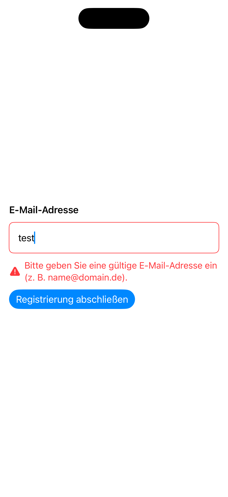
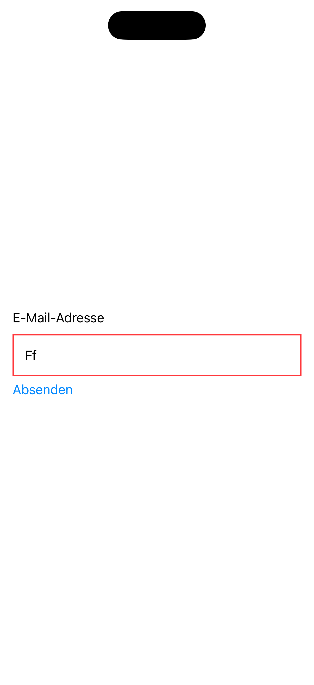

[← Zurück zur Übersicht](../README.md)

---

# 10: Eingabefehler

Ausgewählte Sprache: Deutsch

Andere Sprachen: [Englisch](10_showing_input_error_en.md)

---

<details>
  <summary><b>Inhaltsverzeichnis Pattern</b> (Klicken zum Ausklappen)</summary>
  <br>

  * [Suche](01_search_de.md)
  * [Fußzeile & Kopfzeile](02_footer_header_de.md)
  * [Popup](03_modals_de.md)
  * [Tabs](04_tabs_de.md)
  * [Cards](05_cards_de.md)
  * [Karussel](06_carousel_de.md)
  * [Gesten](07_gestures_de.md)
  * [Navigationsstruktur & Layout](08_navigation_layout_de.md)
  * [Filter](09_filtering_items_de.md)
  * Eingabefehler <b>(Aktuell ausgewählt)</b>

</details>

---

## 1. Kontext und Problemstellung

### Nutzungskontext
Eingabemasken und Formulare (z.B. bei der Registrierung, beim Checkout oder bei Kontaktdaten) sind anfällige Interaktionspunkte in fast jeder Applikation. Fehler bei der Dateneingabe treten regelmäßig auf – sei es durch Tippfehler, ein falsches Format (z.B. bei E-Mail-Adressen) oder das Übersehen eines Pflichtfeldes. Das barrierefreie Anzeigen von Fehlermeldungen sorgt dafür, dass Nutzende sofort erkennen, dass ein Fehler aufgetreten ist, wo er sich befindet und wie er behoben werden kann. Da Fehlersituationen oft zu Frustration führen, ist eine kognitiv einfache und assistiv zugängliche Fehlerführung unerlässlich.

### Typische Barrieren in der Praxis
* **Reine Farbsignalisierung**: Ein Fehler in der Praxis ist es, ein fehlerhaftes Eingabefeld lediglich mit einem roten Rahmen zu versehen. Für farbblinde, fehlsichtige oder blinde Nutzende ist diese visuelle Änderung unsichtbar. Ohne begleitenden Text oder ein eindeutiges Icon bleibt der Fehler unbemerkt.
* **Kryptische Fehlermeldungen**: Meldungen wie *„Ungültige Eingabe“* oder *„Fehlercode 403“* helfen Nutzenden nicht weiter. Besonders Menschen mit kognitiven Einschränkungen oder geringer digitaler Erfahrung werden dadurch blockiert. Die Meldung muss konkret beschreiben, was fehlt (z.B. *„Das Passwort muss mindestens 8 Zeichen lang sein“*).
* **Verbleiben des Fokus**: Klickt eine blinde Person auf „Absenden“ und das Formular lädt aufgrund von Validierungsfehlern asynchron nicht ab, bleibt der Screenreader oft starr auf dem Absende-Button. Die Person merkt nicht, dass weiter oben auf der Seite Fehlermeldungen aufgetaucht sind, und geht davon aus, dass die Aktion erfolgreich war.
* **Zugänglichkeits-Lücke zwischen Label und Text**: Wenn eine Fehlermeldung visuell unter einem Textfeld platziert wird, liest ein Screenreader beim Fokussieren des Feldes standardmäßig nur den Namen des Feldes vor (z.B. *„E-Mail-Adresse, Textfeld“*). Die darunterstehende Fehlermeldung wird übersprungen, da sie programmatisch nicht mit dem Eingabefeld verknüpft wurde.

---

## 2. Relevante Richtlinien und Standards

Die folgende Tabelle zeigt den Zusammenhang zwischen technischen Erfolgskriterien der **WCAG 2.2** und der Regelung innerhalb von Kapitel 11 der **EN 301 549**.

| Barrierefreiheits-Anforderung | WCAG 2.2 Kriterium | EN 301 549 | Relevanz für das Eingabefehler-Pattern |
| :--- | :--- | :--- | :--- |
| **Nutzung von Farbe** | 1.4.1 Use of Color | 11.1.4.1 | Fehler dürfen niemals ausschließlich über einen Farbwechsel (z.B. roter Rahmen) signalisiert werden. |
| **Fokus-Reihenfolge** | 2.4.3 Focus Order | 11.2.4.3 | Wird der Fokus nach dem Absenden manipuliert (z.B. zur Fehlerbox verschoben), muss diese Reihenfolge logisch sein. |
| **Beschriftungen** | 2.4.6 Headings and Labels | 11.2.4.6 | Beschriftungen von Feldern sowie Fehlermeldungen selbst müssen hinreichend klar, präzise und beschreibend sein. |
| **Fehlererkennung** | 3.3.1 Error Identification | 11.3.3.1 | Wenn ein Fehler erkannt wird, muss das fehlerhafte Element identifiziert und der Fehler dem Nutzer in Textform beschrieben werden. |
| **Beschriftungen/Anweisungen** | 3.3.2 Labels or Instructions | 11.3.3.2 | Pflichtfelder oder erforderliche Formate (z.B. Passwort-Regeln) müssen vor der Eingabe klar deklariert sein, um Fehler im Vorfeld zu minimieren. |
| **Fehlerkorrektur (Hilfe)** | 3.3.3 Error Suggestion | 11.3.3.3 | Wenn ein Fehler erkannt wird und Vorschläge zur Korrektur bekannt sind, müssen diese dem Nutzer verständlich bereitgestellt werden. |
| **Fehlervermeidung (Rechtliche/Finanzielle Daten)** | 3.3.4 Error Prevention (Legal, Financial, Data) | 11.3.3.4 | Bei Verträgen, Käufen oder Datenlöschungen müssen Eingaben überprüfbar, korrigierbar oder widerrufbar sein. |
| **Hilfe** | 3.3.5 Help | - | Kontextbezogene Hilfe für die Fehlermeldung muss vorhanden sein. |
| **Fehlervermeidung (Alle Daten)** | 3.3.6 Error Prevention (All) | - | Es muss Möglichkeiten bieten, Daten vor dem finalen Absenden grundsätzlich zu prüfen und korrigieren zu können. |
| **Name, Rolle, Wert** | 4.1.2 Name, Role, Value | 11.4.1.2 | Das Eingabefeld muss seinen Zustand als „ungültig“ programmatisch übertragen. |
| **Statusmeldungen** | 4.1.3 Status Messages | 11.4.1.3 | Beim Absenden auftretende Fehler müssen dynamisch so angekündigt werden, dass assistive Technologien sie sofort wahrnehmen. |

---

## 3. Design-Spezifikationen (UI/UX)

### Visuelle Gestaltung und Kontraste
* **Mehrkanalanzeige**: Jede Fehlermeldung muss mindestens zwei visuelle Kanäle nutzen. Die Kombination aus Text (Fehlerbeschreibung), Farbe (z.B. Rot mit einem Kontrast von mind. 4,5:1 zum Hintergrund) und einem Icon (z.B. ein Warnsdreieck) ist Standard.
* **Platzierung der Meldung**: Fehlermeldungen sollten vorzugsweise direkt oberhalb oder direkt unterhalb des betroffenen Eingabefeldes platziert werden, um eine klare visuelle Nähe zu wahren.
* **Fehler-Sammelbox**: Bei längeren Formularen muss nach dem Absenden ganz oben auf der Seite eine prägnante Zusammenfassung aller aufgetretenen Fehler eingeblendet werden. Diese Box listet die Fehler als Link-Liste auf, sodass Nutzende per Klick direkt zum fehlerhaften Feld springen können.

### Interaktionsdesign und Touch-Targets
* **Fokus-Überführung bei Absendefehlern**: Schlägt das Absenden des Formulars fehl, muss der Fokus automatisch entweder auf die Fehler-Sammelbox am Seitenanfang oder direkt in das erste fehlerhafte Eingabefeld versetzt werden. Der Screenreader liest die Fehlermeldung dadurch sofort als Erstes vor.
* **Keine voreilige Validierung**: Eingabefelder sollten während des Tippens nicht sofort Fehler anzeigen (z.B. während der Nutzer noch dabei ist, seine E-Mail-Adresse einzutippen). Die Validierung darf erst erfolgen, wenn das Feld verlassen wird (`Blur`-Event / Fokusverlust) oder das Formular abgesendet wird.
* **Erweiterte Verknüpfung**: Technisch muss das Eingabefeld so programmiert sein, dass die Fehlermeldung als Beschreibungstext des Feldes hinterlegt ist.

### Empfohlene Fokus-Reihenfolge (Screenreader / Tastatur)
* **Fokus 1 (Nach Klick auf Absenden):** Das Formular bricht ab, der Fokus springt an den Anfang der Fehler-Sammelbox. Der Screenreader liest vor: *„Das Formular konnte nicht gesendet werden. 2 Fehler enthalten. Liste mit 2 Einträgen. Erstens: Passwort zu kurz, Link. Zweitens...“*
* **Fokus 2 (Sprung zum Feld):** Der Nutzer aktiviert den ersten Link in der Fehlerbox. Der Fokus springt direkt in das fehlerhafte Textfeld.
* **Fokus 3 (Das fehlerhafte Feld):** Da das Feld mit der Fehlermeldung verknüpft ist, liest der Screenreader sofort die Rolle und den Fehler in einem Stück vor: *„Passwort, sicheres Textfeld, fehlerhafte Eingabe. Das Passwort muss mindestens 8 Zeichen lang sein.“*

---

## 4. Implementierung (SwiftUI)

### Good Pattern (Positivbeispiel)
Dieses Beispiel nutzt die Mehrkanalanzeige (Farbe + Icon + Text). Die Fehlermeldung ist präzise formuliert, wird über .accessibilityInputLabels und .accessibilityHint fest an das Eingabefeld gekoppelt und bei Fehlereintritt direkt via Screenreader-Ankündigung gemeldet.

<figure>
  
  <figcaption>Abb. 10.1: Barrierefreie Implementierung von Eingabefehlern</figcaption>
</figure>

#### SwiftUI-Code:

```swift
import SwiftUI

struct GoodErrorView: View {
    @State private var email = ""
    @State private var errorMessage: String? = nil
    
    // Fokus-Steuerung vorbereiten, um den Nutzer gezielt zum Fehler zu leiten
    @FocusState private var isEmailFieldFocused: Bool

    var body: some View {
        VStack(alignment: .leading, spacing: 12) {
            Text("E-Mail-Adresse")
                .font(.headline)
            
            TextField("beispiel@domain.de", text: $email)
              .keyboardType(.emailAddress)
              .autocapitalization(.none)
              .padding()
              .overlay(
                  RoundedRectangle(cornerRadius: 8)
                      .stroke(errorMessage != nil ? Color.red : Color.secondary)
              )
              // Fügt das Wort "Fehler" direkt an das Label an
              .accessibilityLabel(errorMessage != nil ? "Fehler: E-Mail-Adresse" : "E-Mail-Adresse")
              // Verknüpft die konkrete Fehlermeldung direkt als akustischen Hinweis für das Feld
              .accessibilityHint(errorMessage ?? "")
              .focused($isEmailFieldFocused)
            
            // Mehrkanalanzeige (Icon + Text) und konkreter Korrekturhinweis
            if let error = errorMessage {
                HStack(spacing: 6) {
                    Image(systemName: "exclamationmark.triangle.fill")
                        .foregroundColor(.red)
                    Text(error)
                        .foregroundColor(.red)
                        .font(.callout)
                }
                .accessibilityHidden(true) // Da der Text bereits im Hint des TextFields liegt
            }
            
            Button("Registrierung abschließen") {
                validateForm()
            }
            .buttonStyle(.borderedProminent)
        }
        .padding()
    }
    
    private func validateForm() {
        if !email.contains("@") || email.count < 5 {
            // Präzise Fehlerbeschreibung mit konkreter Hilfestellung
            errorMessage = "Bitte geben Sie eine gültige E-Mail-Adresse ein (z.B. name@domain.de)."
            
            // Versetzt den Fokus automatisch in das fehlerhafte Feld
            // VoiceOver liest dadurch sofort: "E-Mail-Adresse, Textfeld, fehlerhafte Eingabe. Bitte geben Sie..."
            isEmailFieldFocused = true
            
            // Zusätzliches haptisches & akustisches Signal für die Barrierefreiheit absenden
            AccessibilityNotification.Announcement("Formular konnte nicht gesendet werden. Bitte prüfen Sie die Eingabe.")
                .post()
        } else {
            errorMessage = nil
            // Formular erfolgreich absenden...
        }
    }
}
```


### Bad Pattern (Negativbeispiel)
Dieses Beispiel verlässt sich ausschließlich auf die Farbe Rot, um den Fehler anzuzeigen. Zudem wird die Fehlermeldung programmatisch nicht mit dem Eingabefeld verknüpft, und der Screenreader erhält beim Absenden keinerlei Rückmeldung über das Scheitern.

<figure>
  
  <figcaption>Abb. 10.2: Barrierebehaftete Implementierung von Eingabefehlern</figcaption>
</figure>

#### SwiftUI-Code:

```swift
import SwiftUI

struct BadErrorView: View {
    @State private var email = ""
    @State private var hasError = false

    var body: some View {
        VStack(alignment: .leading) {
            Text("E-Mail-Adresse")
            
            // BARRIERE: Fehler wird ausschließlich über die Farbe Rot signalisiert. Für farbblinde oder blinde Nutzende ist dieser Zustand komplett unsichtbar.
            TextField("", text: $email)
                .padding()
                .border(hasError ? Color.red : Color.gray, width: 2)
            
            Button("Absenden") {
                if !email.contains("@") {
                    // BARRIERE: Statusänderung wird asynchron nicht angesagt. Der Fokus bleibt auf dem Button, blinde Nutzer merken nichts.
                    hasError = true
                }
            }
        }
        .padding()
    }
}

#Preview {
    BadErrorView()
}
```

---

## 5. Implementierung (Kotlin)
Wird noch erstellt...

---

## 6. Quellen und weiterführende Links

* **Internationale Standards:**
  * [WCAG 2.2 Richtlinien (W3C)](https://www.w3.org/TR/WCAG2) – Web Content Accessibility Guidelines.
  * [EN 301 549 Standard (ETSI)](https://www.etsi.org/deliver/etsi_en/301500_301599/301549/03.02.01_60/en_301549v030201p.pdf) – Europäische Norm für Barrierefreiheitsanforderungen.

* **Apple Human Interface Guidelines (HIG):**
  * [Apple HIG – Accessibility](https://developer.apple.com/design/human-interface-guidelines/accessibility) – Grundlagen für inklusive und intuitive Plattform-Interaktionen.
  * [Apple HIG - Text Fields](https://developer.apple.com/design/human-interface-guidelines/text-fields) - Richtlinien für die Darstellung von Eingabefeldern.
  * [Apple HIG – Feedback](https://developer.apple.com/design/human-interface-guidelines/feedback) – Vorgaben für die Bereitstellung von klaren Rückmeldungen an den Nutzer.
  * [Apple HIG - Entering data](https://developer.apple.com/design/human-interface-guidelines/entering-data) - Best Practice für die Verarbeitung von Daten bei Eingabe.

* **Pattern-Referenz:**
  * https://www.checklist.design - Hauptseite
  * https://www.checklist.design/flows/showing-input-error - Eingabefehler Pattern
    
---

[← Zurück zur Übersicht](../README.md) | [↑ Nach oben springen](#01_suche)
