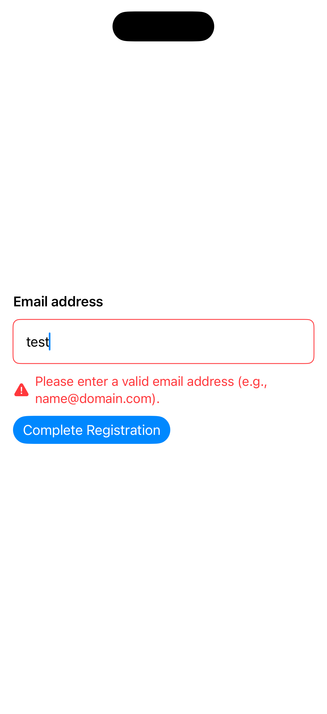
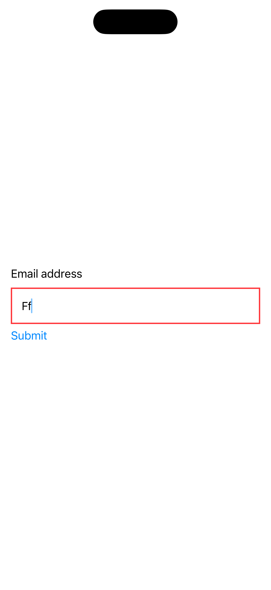

[← Back to overview](../README_en.md)

---

# 10: Input Errors

Selected Language: English

Other Languages: [German](10_showing_input_error_de.md)

---

<details>
  <summary><b>Pattern Table of Contents</b> (Click to expand)</summary>
  <br>

  * [Search](01_search_en.md)
  * [Footer & Header](02_footer_header_en.md)
  * [Popup](03_modals_en.md)
  * [Tabs](04_tabs_en.md)
  * [Cards](05_cards_en.md)
  * [Carousel](06_carousel_en.md)
  * [Gestures](07_gestures_en.md)
  * [Navigation Structure & Layout](08_navigation_layout_en.md)
  * [Filtering](09_filtering_items_en.md)
  * Input Errors <b>(Currently selected)</b>

</details>

---

## 1. Context and Problem Statement

### Usage Context
Input forms and fields (e.g., during registration, checkout, or contact details) are vulnerable interaction points in almost every application. Data entry errors occur regularly—whether due to typos, an incorrect format (e.g., in email addresses), or missing a required field. Accessible display of error messages ensures that users immediately recognize that an error has occurred, where it is located, and how it can be resolved. Since error situations often lead to frustration, cognitively simple and assistively accessible error guidance is essential.

### Typical Accessibility Barriers in Practice
* **Color-Only Signaling**: A common flaw in practice is marking an erroneous input field solely with a red border. For colorblind, visually impaired, or blind users, this visual change is invisible. Without accompanying text or a clear icon, the error goes unnoticed.
* **Cryptic Error Messages**: Messages such as *"Invalid input"* or *"Error code 403"* do not help users. Particularly people with cognitive impairments or low digital literacy are blocked by this. The message must specifically describe what is missing or wrong (e.g., *"Password must be at least 8 characters long"*).
* **Focus Retention**: If a blind person clicks "Submit" and the form fails to submit asynchronously due to validation errors, the screen reader often remains statically focused on the submit button. The user does not realize that error messages have appeared higher up on the page and assumes the action was successful.
* **Accessibility Gap Between Label and Text**: When an error message is visually placed beneath a text field, a screen reader by default reads only the name of the field when focusing it (e.g., *"Email address, text field"*). The error message underneath is skipped because it has not been programmatically linked to the input field.

---

## 2. Relevant Guidelines and Standards

The following table shows the connection between technical success criteria of **WCAG 2.2** and the regulations within Chapter 11 of **EN 301 549**.

| Accessibility Requirement | WCAG 2.2 Criterion | EN 301 549 | Relevance for the Input Error Pattern |
| :--- | :--- | :--- | :--- |
| **Use of Color** | 1.4.1 Use of Color | 11.1.4.1 | Errors must never be signaled exclusively via a change in color (e.g., a red border). |
| **Focus Order** | 2.4.3 Focus Order | 11.2.4.3 | If focus is manipulated after submission (e.g., moved to an error summary box), this order must be logical. |
| **Headings and Labels** | 2.4.6 Headings and Labels | 11.2.4.6 | Labels of fields as well as error messages themselves must be sufficiently clear, precise, and descriptive. |
| **Error Identification** | 3.3.1 Error Identification | 11.3.3.1 | If an error is detected, the item in error must be identified and the error described to the user in text. |
| **Labels or Instructions** | 3.3.2 Labels or Instructions | 11.3.3.2 | Required fields or required formats (e.g., password rules) must be clearly declared prior to input to minimize errors upfront. |
| **Error Suggestion** | 3.3.3 Error Suggestion | 11.3.3.3 | If an error is detected and suggestions for correction are known, they must be provided understandably to the user. |
| **Error Prevention (Legal, Financial, Data)** | 3.3.4 Error Prevention (Legal, Financial, Data) | 11.3.3.4 | For contracts, purchases, or data deletions, inputs must be reviewable, correctable, or reversible. |
| **Help** | 3.3.5 Help | - | Contextual help for error prevention/correction must be available. |
| **Error Prevention (All)** | 3.3.6 Error Prevention (All) | - | Provides options to generally check and correct data prior to final submission. |
| **Name, Role, Value** | 4.1.2 Name, Role, Value | 11.4.1.2 | The input field must programmatically convey its state as "invalid". |
| **Status Messages** | 4.1.3 Status Messages | 11.4.1.3 | Errors occurring upon submission must be dynamically announced so that assistive technologies perceive them immediately. |

---

## 3. Design Specifications (UI/UX)

### Visual Design and Contrasts
* **Multi-Channel Display**: Every error message must use at least two visual channels. A combination of text (error description), color (e.g., red with a contrast ratio of at least 4.5:1 against the background), and an icon (e.g., a warning triangle) is standard.
* **Message Placement**: Error messages should preferably be placed directly above or directly below the affected input field to maintain close visual proximity.
* **Error Summary Box**: For longer forms, a concise summary of all occurred errors must be displayed at the top of the page after submission. This box lists errors as a link list, allowing users to jump directly to the erroneous field with a click.

### Interaction Design and Touch Targets
* **Focus Transfer on Submission Errors**: If form submission fails, focus must automatically move either to the error summary box at the top of the page or directly into the first erroneous input field. The screen reader will thereby read the error message immediately as the first item.
* **No Premature Validation**: Input fields should not display errors immediately while typing (e.g., while the user is still in the middle of entering their email address). Validation should only occur when leaving the field (`Blur` event / loss of focus) or when submitting the form.
* **Extended Programmatic Association**: Technologically, the input field must be programmed such that the error message is attached as the field's descriptive text.

### Recommended Focus Order (Screen Reader / Keyboard)
* **Focus 1 (After clicking Submit):** Form submission halts, and focus jumps to the top of the error summary box. The screen reader announces: *"Form could not be sent. 2 errors contained. List with 2 items. First: Password too short, link. Second..."*
* **Focus 2 (Jump to field):** The user activates the first link in the error summary box. Focus moves directly into the erroneous text field.
* **Focus 3 (The erroneous field):** Because the field is linked with the error message, the screen reader immediately reads out the role and the error in one go: *"Password, secure text field, invalid input. Password must be at least 8 characters long."*

---

## 4. Implementation (SwiftUI)

### Good Pattern
This example uses a multi-channel display (color + icon + text). The error message is precisely phrased, strictly coupled to the input field via `.accessibilityLabel` and `.accessibilityHint`, and directly announced via screen reader announcements when an error occurs.

<figure>
  
  <figcaption>Fig. 10.1: Accessible implementation of input errors</figcaption>
</figure>

#### SwiftUI Code:

```swift
import SwiftUI

struct GoodErrorView: View {
    @State private var email = ""
    @State private var errorMessage: String? = nil
    
    // Prepare focus management to target and lead the user directly to the error
    @FocusState private var isEmailFieldFocused: Bool

    var body: some View {
        VStack(alignment: .leading, spacing: 12) {
            Text("Email address")
                .font(.headline)
            
            TextField("example@domain.com", text: $email)
              .keyboardType(.emailAddress)
              .autocapitalization(.none)
              .padding()
              .overlay(
                  RoundedRectangle(cornerRadius: 8)
                      .stroke(errorMessage != nil ? Color.red : Color.secondary)
              )
              // Appends the word "Error" directly to the label
              .accessibilityLabel(errorMessage != nil ? "Error: Email address" : "Email address")
              // Links the concrete error message directly as an auditory hint for the field
              .accessibilityHint(errorMessage ?? "")
              .focused($isEmailFieldFocused)
            
            // Multi-channel indication (Icon + Text) and concrete correction guidance
            if let error = errorMessage {
                HStack(spacing: 6) {
                    Image(systemName: "exclamationmark.triangle.fill")
                        .foregroundColor(.red)
                    Text(error)
                        .foregroundColor(.red)
                        .font(.callout)
                }
                .accessibilityHidden(true) // Since the text is already included in the TextField hint
            }
            
            Button("Complete Registration") {
                validateForm()
            }
            .buttonStyle(.borderedProminent)
        }
        .padding()
    }
    
    private func validateForm() {
        if !email.contains("@") || email.count < 5 {
            // Precise error description with actionable assistance
            errorMessage = "Please enter a valid email address (e.g., name@domain.com)."
            
            // Automatically moves focus into the erroneous field
            // VoiceOver reads immediately: "Email address, text field, invalid input. Please enter..."
            isEmailFieldFocused = true
            
            // Post additional haptic & auditory signal for accessibility
            AccessibilityNotification.Announcement("Form could not be submitted. Please check your entry.")
                .post()
        } else {
            errorMessage = nil
            // Submit form successfully...
        }
    }
}
```


### Bad Pattern
This example relies exclusively on the color red to indicate an error. In addition, the error message is not programmatically associated with the input field, and the screen reader receives no feedback upon submission failure.

<figure>
  
  <figcaption>Fig. 10.2: Inaccessible implementation of input errors</figcaption>
</figure>

#### SwiftUI Code:

```swift
import SwiftUI

struct BadErrorView: View {
    @State private var email = ""
    @State private var hasError = false

    var body: some View {
        VStack(alignment: .leading) {
            Text("Email address")
            
            // ACCESSIBILITY BARRIER: Error is signaled exclusively via the color red. For colorblind or blind users, this state is completely invisible.
            TextField("", text: $email)
                .padding()
                .border(hasError ? Color.red : Color.gray, width: 2)
            
            Button("Submit") {
                if !email.contains("@") {
                    // ACCESSIBILITY BARRIER: Asynchronous status change is not announced. Focus remains on the button, blind users notice nothing.
                    hasError = true
                }
            }
        }
        .padding()
    }
}

#Preview {
    BadErrorView()
}
```

---

## 5. Implementation (Kotlin)
To be created...

---

## 6. Sources and Further Reading

* **International Standards:**
  * [WCAG 2.2 Guidelines (W3C)](https://www.w3.org/TR/WCAG2) – Web Content Accessibility Guidelines
  * [EN 301 549 Standard (ETSI)](https://www.etsi.org/deliver/etsi_en/301500_301599/301549/03.02.01_60/en_301549v030201p.pdf) – European standard for digital accessibility requirements

* **Apple Human Interface Guidelines (HIG):**
  * [Apple HIG – Accessibility](https://developer.apple.com/design/human-interface-guidelines/accessibility) – Foundations for inclusive and intuitive platform interactions
  * [Apple HIG - Text Fields](https://developer.apple.com/design/human-interface-guidelines/text-fields) - Guidelines for presenting text entry fields
  * [Apple HIG – Feedback](https://developer.apple.com/design/human-interface-guidelines/feedback) – Guidelines for providing clear feedback to the user
  * [Apple HIG - Entering data](https://developer.apple.com/design/human-interface-guidelines/entering-data) - Best practices for processing input data

* **Pattern Reference:**
  * https://www.checklist.design - Main site
  * https://www.checklist.design/flows/showing-input-error - Input Error Pattern
    
---

[← Back to overview](../README_en.md) | [↑ Jump to top](#10-input-errors)
